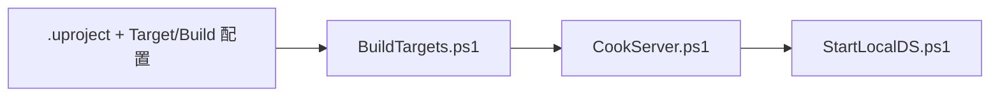

# M01 工程与构建基础设计文档

**状态：** Approved
**负责人：** `12456df`
**最后更新：** 2026-07-23

## Problem Statement

ScifiWorlds 需要在实现任何 Gameplay Framework 或 GAS 功能前，建立可追溯的 UE 5.7 源码构建、统一的 Game/Editor/Server Target 和可重复的 Dedicated Server 验证入口。缺少这些基础会使后续多人功能无法在真实的服务器权威环境中验收。

## Requirements

### Functional

- FR-01：技术工程名、主模块和三个 Target 必须统一为 `PolygonScifiWorlds`。
- FR-02：项目必须显式启用 GameplayAbilities 与 EnhancedInput，并保持 Runtime 与 Editor-only 依赖隔离。
- FR-03：Development Editor、Game、Server Target 必须均能通过构建。
- FR-04：Cook/Stage 后的 Dedicated Server 必须加载 `Demo_BlackMarket` 并监听指定端口。

### Non-Functional

- NFR-01：构建与启动入口必须参数化，不得把个人机器的引擎绝对路径提交到仓库。
- NFR-02：构建失败、无效路径、端口占用或 Server 启动失败必须返回非零结果，不能产生成功假象。
- NFR-03：日志与构建产物只能写入 Git 忽略目录或仓库外目录。

### Edge Cases

- EC-01：无效引擎根目录或不支持 Server Target 的引擎必须在构建阶段失败。
- EC-02：不存在的地图、未 Cook 内容或端口占用必须阻止 DS 验收通过。
- EC-03：Editor-only 插件不得成为 Game/Server Runtime 依赖。

### Out of Scope

- M02 的 Gameplay Framework、M03 的 GAS 类型、M04 的输入/移动、会话匹配及部署服务。
- 正式登录、分队、生成、重生、晚加入和客户端功能验收。

## Subsystem Map

| 子系统 | 单一职责 | 依赖 | 拥有的数据 | 产生事件 | 消费事件 |
|---|---|---|---|---|---|
| 项目清单 | 声明模块、插件和引擎关联 | UE 项目描述 | `.uproject`、Target/Build 配置 | UBT 构建输入 | 无 |
| BuildTargets 脚本 | 顺序构建三类 Target | 调用方提供的源码引擎 | 构建日志 | 成功/失败退出码 | 项目清单 |
| CookServer 脚本 | 生成可运行 Server 产物 | RunUAT、已通过的 Target | 仓库外产物 | 成功/失败退出码 | 项目配置 |
| StartLocalDS 脚本 | 启动并检测 headless Server | staged Server 可执行文件 | 启动日志 | 进程对象/失败退出码 | Cook/Stage 产物 |

## Contracts

### BuildTargets.ps1

| API/事件 | 输入 | 输出 | 副作用 | 前置条件 | 后置条件 |
|---|---|---|---|---|---|
| 脚本执行 | `EngineRoot`、可选 ProjectFile | 非零/零退出码 | 在 `Saved/Logs/Build` 写日志 | 引擎与项目存在、Editor 未运行 | Editor → Game → Server 全部成功或在首个失败处停止 |

### StartLocalDS.ps1

| API/事件 | 输入 | 输出 | 副作用 | 前置条件 | 后置条件 |
|---|---|---|---|---|---|
| 脚本执行 | staged Server 可执行文件、地图、端口 | Server PID 或非零退出码 | 启动无窗口进程并写日志 | Cook/Stage 产物存在，端口空闲 | 进程存活；选择等待时端口已监听 |

## Data Flow

配置文件仅被 UBT、RunUAT 和 Server 只读消费；构建脚本不写入项目配置。构建结果按单向路径由 UBT 交给 RunUAT，再交给启动脚本，不存在跨系统写入或循环依赖。

## Implementation Order

| 优先级 | 文件/资产 | 依赖 | 测试 | 集成点 |
|---:|---|---|---|---|
| 1 | `.uproject`、Build.cs、三个 Target | 源码引擎 | UBT 解析 | 项目模块 |
| 2 | `DefaultEngine.ini` | 有效地图资产 | Server 默认地图 | Cook |
| 3 | `Scripts/Build/BuildTargets.ps1` | Build.bat | 三 Target 构建 | CI/本地 |
| 4 | RunUAT 命令与 `StartLocalDS.ps1` | staged Server | Cook、监听端口 | DS 验收 |
| 5 | 清单、上下文和路线图 | 验证记录 | 差异审计 | M01 交付 |

## Requirement Traceability

| 需求 | 子系统/API | 测试 | 状态 |
|---|---|---|---|
| FR-01 | 项目清单 | UBT Target 解析 | Passed |
| FR-02 | 项目清单 | 插件/依赖审计 | Passed |
| FR-03 | BuildTargets.ps1 | 三 Target Development 构建 | In Progress |
| FR-04 | CookServer.ps1、StartLocalDS.ps1 | Cook/Stage、地图与端口日志 | In Progress |
| NFR-01 | 两个脚本 | 参数化路径审计 | In Progress |
| NFR-02 | 两个脚本 | 失败退出码、端口检测 | In Progress |
| NFR-03 | 两个脚本 | Git 忽略规则审计 | In Progress |

## Validation

- [x] 每项 FR 都能追踪到子系统、契约和测试
- [x] 每项 NFR 都有可测量指标
- [x] 每个边界情况都有明确规则
- [x] 依赖图不存在循环依赖
- [x] 每份状态数据只有一个所有者
- [x] 每个事件只有一个生产者且至少有一个消费者
- [x] 实现顺序符合依赖关系
- [x] 所有可调参数均通过脚本参数或项目配置提供

## Execution Evidence (2026-07-23)

- `PolygonScifiWorldsEditor`, `PolygonScifiWorlds`, and `PolygonScifiWorldsServer` all built successfully in `Development Win64` using the UE 5.7.4 source build.
- Server `BuildCookRun` completed successfully with `-server -noclient -serverplatform=Win64 -serverconfig=Development -cook -stage -pak -archive` and explicitly cooked `/Game/PolygonSciFiWorlds/Maps/Demo_BlackMarket`.
- The archived WindowsServer output contained the server executable and `PolygonScifiWorlds-WindowsServer.pak`; the archive directory was outside the repository.
- The staged server started headlessly with `-port=7777 -log -unattended -NoSound`, loaded `Demo_BlackMarket`, and listened on UDP port 7777.
- A local PIE client completed the handshake and travel to `127.0.0.1:7777`; its log included `Welcomed by server` and `UPendingNetGame::TravelCompleted`.
- `StartLocalDS.ps1` validates UDP rather than TCP, returns the actual listener PID, rejects an occupied port before launch, and terminates the launcher process tree on startup timeout.
- `BuildTargets.ps1` rejects an invalid engine root before starting a build. `CookServer.ps1` now validates that its `/Game/...` map resolves to an existing project `.umap`, preventing UE's permissive cook behavior from producing a false-success archive for a missing map.
