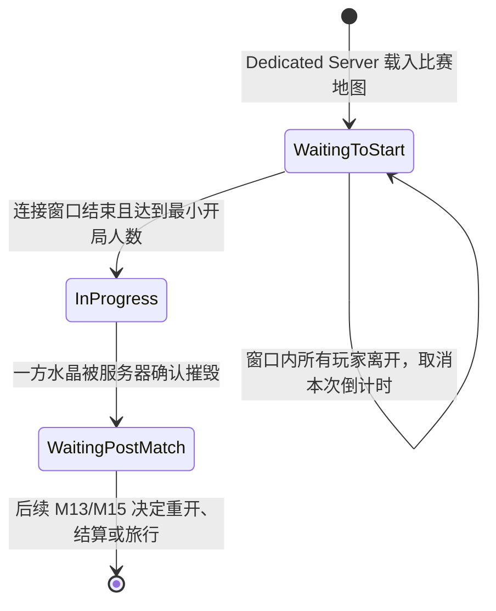
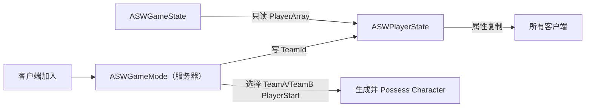

# M02 多人 Gameplay Framework 设计文档

**状态：** Approved
**负责人：** `12456df`
**最后更新：** 2026-07-24
**建议分支：** `feature/m02-multiplayer-framework`
**建议提交：** `feat: establish multiplayer gameplay framework`

> **规则校正（2026-07-24，优先级最高）：** 本节是当前 M02 的确认事实；如与后文旧草案冲突，以本节为准。M02 必须建立最小比赛状态、30 秒连接窗口、双队人数上限与全局比赛计分。防御塔、小兵、三条路的具体规则和实现仍不属于 M02。

## 已确认的比赛规则与 GameMode 设计

### 玩家可见流程

- 比赛地图载入后处于 UE 内建 `MatchState::WaitingToStart`。
- **第一名有效玩家加入时**，服务器开启 30 秒连接窗口，并在完成分队后立即生成该玩家的 Pawn；这避免空 Dedicated Server 自行开始一场无人对局，同时允许玩家在准备期内移动和验证联机状态。
- 在打包 Game/DS 中，窗口期间玩家必须在连接地址中提交 `?Team=TeamA` 或 `?Team=TeamB`。服务器仅验证所选队伍有效且未满 5 人，不自动平衡、替换或修改玩家的选择；两队都满时不再接受对局玩家。仅编辑器 `PIE` 世界为快速验证而自动按当前人数平衡分配 TeamA/TeamB，不读取 URL 参数。
- 窗口结束时，若达到 `MinimumPlayersToStart`，服务器调用 `StartMatch()` 进入 `MatchState::InProgress`；M02 本地验证值为 `1`，正式对局的最小人数留为可配置的 **TBD**，不得硬编码。
- 若 30 秒内所有玩家都离开，服务器取消该次倒计时，等待下一名有效玩家重新开启窗口。
- 打包 Game/DS 在开始后默认不再接受新的对局玩家（M02 的明确规则）；完整晚加入、观战与重连策略留给 M15。仅编辑器 `PIE` 世界放宽此限制，以避免多客户端启动时序影响开发验证。
- 比赛正式开始后，UI 显示从 `MatchStartServerTime` 起算的**正计时**。客户端使用 `GameState::GetServerWorldTimeSeconds()` 本地计算显示，不每秒复制一个倒计时变量。
- 任意一方水晶被服务器确认摧毁时，对方获胜，比赛转为 `MatchState::WaitingPostMatch`。防御塔和水晶的实体、受击与销毁事件在 M12 实现；M02 只预留服务器权威的报告契约。

### 责任、数据所有权与复制

| 状态或规则 | 唯一权威所有者 | 客户端可见方式 | 说明 |
|---|---|---|---|
| 准备/开始/结束状态迁移、入场批准、分队、出生、胜负裁决 | `ASWGameMode`（仅服务器） | 由 `ASWGameState` 的内建 `MatchState` 和自定义只读状态呈现 | 客户端永不访问或写入 GameMode 实例。 |
| 30 秒窗口结束时刻、正式开局服务器时刻、胜方 | `ASWGameState`（服务器写入） | 复制给所有客户端 | 时间显示以同步服务器时间计算；不添加逐帧/逐秒复制。 |
| Team A/B 的击杀数、推塔数 | `ASWGameState`（服务器写入） | 复制给所有客户端 | 它们是全局公开比赛状态，而非某位玩家私有数据。 |
| 每位玩家的阵营 | `ASWPlayerState`（服务器写入） | `TeamId` 复制给所有客户端 | PlayerState 跨 Pawn 更替稳定；不在 Character 保存阵营真值。 |
| 未来每位玩家个人击杀/死亡/助攻 | `ASWPlayerState` | 复制给所有客户端 | M05 再定义；M02 仅定义队伍聚合计分。 |
| A/B 出生点 | 地图中的 `APlayerStart` 标签 | 仅服务器按标签选择 | 使用 `TeamA` / `TeamB` 标签；客户端不能指定出生点。 |
| 三条路、周期出兵、防御塔和水晶 Actor | **TBD，后续 M10/M12** | 后续各自复制策略 | M02 不创建这些 Actor，也不把它们塞进 GameMode。 |

### 最小公开契约

| 所有者 | 契约 | 前置条件 | 后置条件 |
|---|---|---|---|
| `ASWGameMode` | `InitNewPlayer` | 已创建 Controller 与 PlayerState；打包 Game/DS 的连接地址含 `Team` 参数 | 打包 Game/DS 验证阶段、所选阵营与容量；PIE 由服务器按人数自动分队；随后服务器将 `TeamId` 写入 PlayerState，再进入后续出生流程。 |
| `ASWGameMode` | `HandleStartingNewPlayer_Implementation` | PlayerState 已有有效 `TeamId` | 准备期内服务器显式 `RestartPlayer`，使玩家在对应 `PlayerStart` 生成并被 Possess；正式开局仅重启尚无 Pawn 的玩家，避免重复生成。 |
| `ASWGameMode` | `ReadyToStartMatch_Implementation` | 状态为 WaitingToStart | 只在倒计时到期且人数满足配置时返回 true。 |
| `ASWGameMode` | `ChoosePlayerStart_Implementation` | Controller 已有有效 TeamId | 从对应 `PlayerStartTag` 选择出生点；缺失时记录错误并使 M02 验收失败。 |
| `ASWGameMode` | `ReportTeamKill` / `ReportTowerDestroyed` | 服务器、状态为 InProgress、事件来自未来受信任的战斗/结构系统 | 更新对应队伍聚合计分；M02 不向客户端暴露可伪造 RPC。 |
| `ASWGameMode` | `ReportCrystalDestroyed` | 服务器、状态为 InProgress、被摧毁阵营有效 | 只结算一次；设置胜方并调用 `EndMatch()`。 |
| `ASWGameState` | `GetWarmupSecondsRemaining` | 任意端 | 基于服务器同步时间返回只读值，不修改状态。 |
| `ASWGameState` | `GetMatchElapsedSeconds` | 任意端、状态为 InProgress | 基于 `MatchStartServerTime` 返回只读值。 |
| `ASWGameState` | `GetTeamMatchStats` | 任意端 | 返回对应队伍的复制快照（击杀、推塔）。 |

### 配置与未决项

- `WarmupDurationSeconds = 60`、每队 `MaxPlayersPerTeam = 5`、`MinimumPlayersToStart`、开始后是否允许观战，必须放在可编辑的比赛规则配置中，而不是散落在 C++ 常量中。
- M02 的临时选队入口为连接 URL 参数 `?Team=TeamA` 或 `?Team=TeamB`，用于打包 Game/DS 的本地 Dedicated Server 验证；正式大厅/选队 UI 的提交方式留给 M15，服务器的验证规则保持不变。编辑器 `PIE` 的自动平衡分队仅为开发入口，不进入打包版本的对局规则。
- 本局没有定义时限；水晶是唯一已确认的胜利条件。
- M12/M13 已确定：水晶毁灭报告由服务器聚合至下一 Tick 再统一裁决；两个水晶在同一次裁决窗口内均被摧毁时结果为平局。结果提交必须幂等，详见 [M13 完整比赛流程](M13_AuthoritativeMatchFlow.md)。
- 退出后的队伍人数继续由 `GameState::PlayerArray` 派生；GameMode 不维护第二份 roster。

## 1. 目标与边界

M02 为后续 GAS、战斗、兵线和比赛流程提供最小的服务器权威多人骨架：客户端加入 Dedicated Server 时选择队伍，由服务器验证选择、生成并控制角色；所有客户端都能读取玩家及队伍归属；玩家退出后不会留下活动玩家状态。

### 必须完成

- FR-01：项目使用自定义 GameMode、GameState、PlayerController、PlayerState 和现有 `ASWCharacter_Base`。
- FR-02：打包 Game/DS 中玩家通过连接 URL 选择 Team A 或 Team B；服务器仅在比赛处于准备期且所选队伍未满时接受选择并写入 `TeamId`。编辑器 PIE 中由服务器自动平衡分队，供快速验证使用。
- FR-03：队伍归属由 PlayerState 唯一持有并复制给所有客户端。
- FR-04：服务器根据队伍选择出生点、生成 Character 并完成 Possess。
- FR-05：GameState 能从引擎维护的 `PlayerArray` 查询活动玩家和队伍人数，不维护第二份名单。
- FR-06：玩家退出后，其他客户端最终不再把该玩家计入活动玩家和队伍人数。

### 质量要求

- NFR-01：队伍分配、生成和 Possess 只由服务器执行。
- NFR-02：RepNotify 和队伍变化通知可重复执行，不因晚加入或重新相关产生重复副作用。
- NFR-03：使用 Dedicated Server + 两个客户端完成加入、分队、生成和退出验证。
- NFR-04：M02 不新增 Tick、轮询 Manager、全局单例或重复复制状态。

### 明确不做

- GAS、ASC、AttributeSet 和 Gameplay Tags（M03）。
- 输入、移动配置、镜头和瞄准（M04）。
- 伤害、死亡、重生和临时无敌（M05）。
- Session、Lobby、Matchmaking、认证和完整断线重连（M15）。
- 完整比赛阶段、胜负和地图 Travel（M13/M15）。

## 2. 核心决策

| 决策 | 结论 | 理由 |
|---|---|---|
| GameMode 基类 | `AGameMode` | 项目最终是有明确比赛阶段的对局，避免 M13 再更换基类 |
| 队伍所有者 | `ASWPlayerState` | 对所有客户端可见，并跨 Pawn 更换保持稳定 |
| 队伍名单 | 不单独存储 | `AGameState::PlayerArray` 已维护活动 PlayerState，队伍人数按需计算 |
| 分队规则 | 玩家选择 Team A 或 Team B；服务器验证阶段与容量 | 保留玩家的选队意图，同时服务器仍是唯一可信裁判 |
| 出生点配置 | 使用 `APlayerStart::PlayerStartTag` 的 `TeamA` / `TeamB` | 复用引擎能力，避免为两个标签增加额外 Actor 类型 |
| PlayerController | 仅建立稳定类型与连接边界 | M02 没有需要自定义 RPC 的玩家意图 |
| Character | 复用 `ASWCharacter_Base` | M02 只验证生成、复制和 Possess，不提前实现 M04 |

## 3. 职责与数据所有权

| 类型 | 存在位置 | 单一职责 | 拥有/写入的数据 |
|---|---|---|---|
| `ASWGameMode` | 仅服务器 | 配置 Framework 类、验证玩家选队、选择出生点、驱动初次生成 | 不持久保存玩家或队伍名单 |
| `ASWGameState` | 服务器与所有客户端 | 提供活动玩家与队伍人数的只读查询 | 使用引擎维护的 `PlayerArray` |
| `ASWPlayerController` | 服务器与所属客户端 | 建立玩家连接、控制权和未来 RPC 的稳定边界 | M02 无自定义复制状态 |
| `ASWPlayerState` | 服务器与所有客户端 | 唯一持有玩家队伍归属 | `TeamId`，仅服务器可写 |
| `ASWCharacter_Base` | 服务器与相关客户端 | 作为可生成、可 Possess 的玩家世界实体 | Pawn/Character 原生复制状态 |

依赖方向为：`GameMode → GameState / PlayerState / Character`。GameState 和 Character 不反向依赖 GameMode。

## 4. 最小契约

### `ESWTeamId`

- 值：`None`、`TeamA`、`TeamB`。
- `None` 表示尚未完成服务器分配，不是可参与对局的队伍。
- M02 固定为两队；队伍显示名、颜色和阵营关系留给后续数据资产或系统。

### `ASWPlayerState`

| 契约 | 规则 |
|---|---|
| `GetTeamId()` | 任意端只读访问当前复制值 |
| `SetTeamId(NewTeamId)` | 仅服务器调用；拒绝 `None` 以外的非法值；值改变时触发一次通知 |
| `OnRep_TeamId(PreviousTeamId)` | 客户端收到复制后触发同一队伍变化通知；必须幂等 |

`TeamId` 不允许由蓝图直接写入。蓝图只能读取，并订阅队伍变化用于后续表现。

### `ASWGameState`

| 契约 | 规则 |
|---|---|
| `GetTeamPlayerCount(TeamId)` | 只读遍历 `PlayerArray`；忽略空指针、Inactive 和 `None` |

不复制 `TeamACount`、`TeamBCount` 或自建 Roster，避免与 `PlayerArray` 产生双数据源。

### `ASWGameMode`

| 生命周期/API | 规则 |
|---|---|
| 构造函数 | 指定 GameState、PlayerController、PlayerState 和 DefaultPawn 类 |
| `HandleStartingNewPlayer_Implementation` | 先调用 `Super` 执行引擎生命周期；若仍处于准备期且玩家尚无 Pawn，则在确认 PlayerState 已有有效队伍后显式 `RestartPlayer` |
| `ChoosePlayerStart_Implementation` | 在队伍 Tag 匹配项中优先选择未被阻挡的出生点，其次选择可调整位置的出生点；无匹配项时记录警告并回退引擎默认选择 |
| `Logout` | 不维护自有名单；调用 `Super`，由引擎生命周期移除活动 PlayerState |

UE 5.7 源码中 `PostLogin` 最终调用 `HandleStartingNewPlayer`，后者再进入 `RestartPlayer → ChoosePlayerStart → SpawnDefaultPawnFor → Possess`。因此队伍分配必须发生在 `HandleStartingNewPlayer_Implementation` 调用 `Super` 之前。

## 5. 边界规则

- PlayerState 缺失：记录错误且不生成 Pawn；不能生成一个无队伍玩家。
- 地图缺少对应队伍出生点：允许回退默认 PlayerStart 以便诊断，但 M02 验收判定失败。
- 连续或近同时加入：GameMode 在服务器游戏线程顺序处理，每次都基于当前 PlayerArray 重新计数。
- 晚加入：打包 Game/DS 仍由比赛状态拒绝；编辑器 PIE 为开发验证而允许加入。已加入客户端通过现有 PlayerState 复制获得当前玩家和队伍，不依赖历史 RPC。
- 玩家退出：不手动修改 GameState 的 `PlayerArray`，避免与引擎 `APlayerState::Destroyed` 生命周期竞争。
- 重复队伍值：不重复广播变化事件。

## 6. 实现顺序

| 顺序 | 工作 | 主要文件 |
|---:|---|---|
| 1 | 建立队伍类型与 PlayerState 复制契约 | `SWTeamTypes.h`、`SWPlayerState.h/.cpp` |
| 2 | 建立 GameState 查询与空 PlayerController 类型 | `SWGameState.h/.cpp`、`SWPlayerController.h/.cpp` |
| 3 | 实现服务器分队、出生点选择与 Framework 类配置 | `SWGameMode.h/.cpp`、`DefaultEngine.ini` |
| 4 | 精简现有 Character 的空 Tick，并在地图配置 TeamA/TeamB PlayerStart | `SWCharacter_Base.*`、`Demo_BlackMarket.umap` |
| 5 | 编译、Cook，并完成 DS + 两客户端验证 | 复用 M01 脚本与日志 |
| 6 | 同步 TDD、项目上下文和路线图 | `Docs/03_TDD.md`、`.agents/ue-project-context.md`、`Docs/07_DevelopmentRoadmap.md` |

M02 不建立第二份执行清单；本节和下方验收表就是完整实施入口。

## 7. 验收

| 需求 | 可复核结果 | 状态 |
|---|---|---|
| FR-01 | DS 日志显示使用 SW Framework 类，两个客户端均获得 SW PlayerController/PlayerState/Character | Passed（2026-07-24） |
| FR-02 | 两个客户端分别获得 Team A 与 Team B | Passed（2026-07-24） |
| FR-03 | 两端客户端都能读取两名玩家的正确 TeamId | Passed（2026-07-24） |
| FR-04 | 两名玩家在对应 Tag 的 PlayerStart 生成并被各自 Controller Possess | Passed（2026-07-24） |
| FR-05 | DS 与客户端查询的活动玩家数为 2，两个队伍人数各为 1 | Passed（2026-07-24） |
| FR-06 | 一个客户端退出后，剩余端最终查询活动玩家数为 1 | Passed（2026-07-24） |
| NFR-01/02 | 客户端不能写 TeamId；晚加入/重复通知不产生重复副作用 | Passed（2026-07-24） |
| NFR-03/04 | Editor、Game、Server 构建通过；DS + 两客户端测试通过；无新增无意义 Tick/Manager | Passed（2026-07-24） |

### 完成门槛

- [x] 设计文档经确认后状态为 `Approved`
- [x] Editor、Game、Server Development 构建通过
- [x] Dedicated Server Cook/Stage 通过
- [x] 两客户端加入、分队、生成、复制和退出测试通过
- [x] 无新增未登记技术债务或双数据源
- [x] SSOT 与路线图同步
- [x] M02 提交和 `milestone/m02` 已创建
