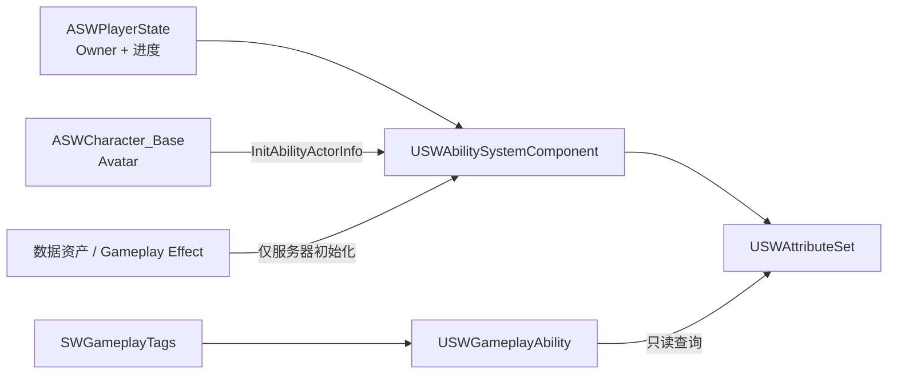

# M03 GAS 核心框架设计文档

**状态：** Approved
**负责人：** `12456df`
**最后更新：** 2026-07-25
**关联 ADR：** [ADR-0002：玩家 ASC 归属 PlayerState](../ADR/ADR-0002-PlayerStateOwnsPlayerASC.md)

## 问题与目标

项目需要一套服务器权威、可复制并可跨重生保留的 GAS 基础。装备会改变技能效果，因此技能不能把范围、持续时间和冷却修正写死在自身资产中；它必须从拥有者的属性读取最终修正。玩家还需要跨 Pawn 生命周期保留等级、经验和技能点。

M03 只建立 GAS 契约与基础运行时类型，不制作具体伤害、技能、装备、UI 或升级界面。

## 需求与边界

### 功能需求

- FR-01：每位玩家拥有一个跨重生存活的 ASC；服务器和客户端均在正确时机完成 Owner/Avatar 绑定。
- FR-02：提供一个可复制的 `USWAttributeSet`，包含资源、攻击、防御、穿透、暴击、生存、回复与技能修正属性。
- FR-03：技能可只读查询拥有者的范围、持续时间和冷却修正，并按统一公式取得有效值。
- FR-04：提供 `USWGameplayAbility`、`USWGameplayEffect` 与原生 `SWGameplayTags` 基础，不允许散落的字符串 Tag。
- FR-05：`ASWPlayerState` 服务器权威地保存并复制 `Level`、`Experience`、`AbilityPoints`；这些状态不因 Pawn 重生丢失。
- FR-06：所有初始数值、等级阈值、每级奖励与最终上下限均由数据资产或 Gameplay Effect 配置；不得在 C++ 中散落平衡数值。

### 非功能需求

- 服务器是属性、等级、经验、技能点和能力授予的唯一写入者；客户端只发起意图并读取复制结果。
- 玩家 ASC 使用 `Mixed` 复制模式；未来 AI ASC 由 AI 自身持有并使用 `Minimal`，不在本模块实现。
- 重复绑定、重连、晚加入与 Pawn 更换必须幂等；不会重复授予能力或重复施加初始效果。
- Runtime 代码不得引入 Editor-only 依赖；Dedicated Server 不依赖本地玩家、HUD 或视口。

### 明确不做

- M03 不实现具体主动/被动技能、输入、目标选择、伤害、死亡、重生规则、Gameplay Cue、装备、技能点分配界面或存档。
- M03 不定义英雄数值、等级曲线、属性上限、装备公式或具体 Tag 子项；这些平衡数据在对应内容模块落地前保持 `TBD`。
- 物理/法术伤害结算、穿透、韧性、吸血和暴击的最终公式属于 M05/M06；M03 仅定义属性与读取契约。

## 架构与数据所有权

| 子系统 | 单一职责 | 所有者/权威 | 依赖 |
|---|---|---|---|
| `ASWPlayerState` | 玩家 ASC、进度状态与服务器端变更入口 | 服务器；复制给相关客户端 | Gameplay Framework、GAS |
| `USWAbilitySystemComponent` | 能力、效果、Tag 和属性聚合 | `ASWPlayerState` | GAS |
| `USWAttributeSet` | 战斗和技能修正属性、属性不变量 | ASC；服务器写入、GAS 复制 | GAS |
| `ASWCharacter_Base` | 当前 Pawn 作为 ASC Avatar，触发重绑定 | 不拥有持久属性 | PlayerState、ASC |
| `USWGameplayAbility` / `USWGameplayEffect` | 后续能力与效果内容的 C++ 基础契约 | C++ 类型定义 | ASC、AttributeSet、Tags |
| `SWGameplayTags` | 代码可引用的原生 Tag 唯一声明处 | C++ 静态定义 | GameplayTags |
| 进度/初始属性配置 | 可调初始值、经验阈值与等级奖励 | 数据资产/GE；服务器应用 | 后续内容资产 |

### ASC 生命周期

- 玩家 ASC 和 `USWAttributeSet` 由 `ASWPlayerState` 的默认子对象创建；`ASWPlayerState` 实现 `IAbilitySystemInterface`。
- `ASWCharacter_Base` 也提供 `IAbilitySystemInterface` 查询入口，但只转发到 PlayerState 的 ASC，不能缓存或创建第二个 ASC。
- 服务器在 `PossessedBy` 后以 `InitAbilityActorInfo(PlayerState, Character)` 绑定；拥有者客户端在 `OnRep_PlayerState` 后执行同一绑定。实现可多次调用，Avatar 改变时只更新绑定。
- 只有服务器在首次有效绑定后授予基础能力并应用初始化 Gameplay Effect；必须有显式的“已初始化”保护，晚加入和重绑不得叠加。
- Pawn 销毁或重生时，旧 Avatar 相关能力状态应结束/清理；PlayerState、ASC、属性和进度继续存在，下一 Pawn 重新绑定。

## 属性契约

所有属性使用 `FGameplayAttributeData`、访问器宏、`ReplicatedUsing` 与 `GAMEPLAYATTRIBUTE_REPNOTIFY`。当前值与最大值的约束在 `PreAttributeChange` 和 `PostGameplayEffectExecute` 中统一维护；死亡等游戏规则不在本模块触发。

| 分组 | C++ 属性名 | 含义与约束 |
|---|---|---|
| 资源 | `Health`, `MaxHealth` | 当前/最大生命；`Health` 限制在 `[0, MaxHealth]`。 |
| 资源 | `Mana`, `MaxMana` | 当前/最大蓝量；`Mana` 限制在 `[0, MaxMana]`。 |
| 攻击 | `AttackPower`, `SpellPower` | 物理/法术技能的基础进攻属性。 |
| 防御 | `PhysicalArmor`, `MagicalArmor` | 物理/法术承伤结算输入。 |
| 穿透 | `PhysicalPenetration`, `MagicalPenetration` | 攻击方结算输入；不直接改写目标护甲。 |
| 暴击 | `CriticalChance`, `CriticalDamage` | 暴击概率与暴击伤害结算输入。 |
| 生存 | `Tenacity`, `PhysicalLifesteal` | 控制时长与物理伤害吸血的结算输入。 |
| 回复 | `ManaRegeneration`, `HealthRegeneration` | 蓝量/生命自然回复速率输入。 |
| 技能修正 | `AbilityRangeMultiplier` | 0 表示无修正；`有效范围 = 基础范围 × (1 + 修正值)`。 |
| 技能修正 | `AbilityDurationMultiplier` | 0 表示无修正；`有效持续时间 = 基础持续时间 × (1 + 修正值)`。 |
| 技能修正 | `CooldownReductionMultiplier` | 0 表示无修正；`有效冷却 = 基础冷却 × (1 - 修正值)`。 |
| 资源 | `Stamina`, `MaxStamina` | 疾跑等行为的当前体力与上限；初始值、消耗和恢复由后续 GE 数据驱动。 |
| 武器修正 | `MagazineCapacityBonusPercent` | 0 表示无修正；`有效弹匣容量 = floor(基础容量 × (1 + 修正值))`，最小为 1。 |
| 武器修正 | `FireIntervalReductionPercent` | 0 表示无修正；`有效射击间隔 = 基础间隔 × (1 - 修正值)`，服务器保留最小安全间隔。 |
| Meta | `IncomingDamage` | 不复制；GE 写入后结算为生命减少并立即清零。 |
| Meta | `IncomingXP` | 不复制；GE 写入后转交 PlayerState 增加经验并立即清零。 |

属性百分比的合法范围、最大值变化时当前资源的保持策略，以及每项属性的初始值均为数据驱动配置；具体上限与数值保持 `TBD`。M03 不把修正值直接写入某个技能实例：后续能力在提交冷却、创建效果 Spec 或计算目标数据时读取快照。已生效的持续效果和已启动的冷却不回溯重算，除非对应能力明确设计为动态更新。

## 原生 Gameplay Tag 契约

新增 `GameplayTags/SWGameplayTags.h/.cpp`，以 `UE_DECLARE_GAMEPLAY_TAG_EXTERN` / `UE_DEFINE_GAMEPLAY_TAG_COMMENT` 集中声明原生 Tag。命名空间为 `SWGameplayTags`；代码禁止用 `RequestGameplayTag(TEXT("..."))` 取得项目内固定 Tag。

M03 仅注册下列稳定根 Tag，避免为未来内容预先制造空分类：

| Tag | 用途 |
|---|---|
| `Ability` | 技能身份、状态与输入 Tag 的根。 |
| `Cooldown` | 技能冷却阻塞 Tag 的根。 |
| `State` | 角色可被查询的 Gameplay 状态根。 |
| `Event` | Gameplay Event 路由根。 |
| `SetByCaller` | 运行时效果幅值键的根。 |
| `GameplayCue` | 仅表现用途 Cue 的根。 |

具体叶子 Tag 只在首次被某个已设计模块消费时加入，并同时写入该模块设计文档。Tag 不承载可写持久状态；需要复制且有生命周期的状态优先通过 Gameplay Effect 授予，临时 Loose Tag 必须明确复制策略。

## PlayerState 进度契约

| 字段 | 类型 | 写入者 | 复制与用途 |
|---|---|---|---|
| `Level` | `int32` | 服务器 | 所有客户端可读；最小值为 1。 |
| `Experience` | `int32` | 服务器 | 所有客户端可读；非负。 |
| `AbilityPoints` | `int32` | 服务器 | 所有客户端可读；非负。 |

- `ASWPlayerState` 对外提供服务器权威的 `AddExperience`、`SetLevel`/内部升级流程、`GrantAbilityPoints` 与受校验的 `SpendAbilityPoint` 契约；客户端不得直接设置字段。
- 等级阈值和每级技能点奖励来自进度数据资产；一次经验变更可跨越多级，按数据顺序逐级结算。缺失或非法配置时服务器拒绝变更并记录可诊断日志。
- 能力授予与技能等级升级的具体规则留给 M07；M03 只保证技能点跨重生复制并可被后续模块安全消费。

## 实现顺序与验证

| 顺序 | 交付 | 验收要点 |
|---:|---|---|
| 1 | `USWAbilitySystemComponent`、`USWAttributeSet` 与属性复制 | Editor/Game/Server 编译；每项属性在拥有者与观察客户端一致。 |
| 2 | PlayerState 持有 ASC、Character 双端绑定与重生重绑 | DS + 两客户端；重生后 Owner/Avatar 正确且不重复初始化。 |
| 3 | `USWGameplayAbility`、`USWGameplayEffect`、`SWGameplayTags` | 原生 Tag 可由 C++ 和蓝图使用；无散落字符串 Tag。 |
| 4 | 进度字段和数据驱动初始/等级配置 | DS + 两客户端；经验、等级、技能点复制，Pawn 替换后保持。 |
| 5 | 自动化/可重复验证与 SSOT 同步 | 三个 Development Target 构建；记录 DS 验证结果。 |

## 验收追踪

| 需求 | 实现责任 | 验证 |
|---|---|---|
| FR-01 | PlayerState ASC、Character 生命周期绑定 | DS 两客户端、重生/晚加入检查。 |
| FR-02 | AttributeSet 与属性复制回调 | 属性 GE 修改后比较服务器、拥有者和观察者。 |
| FR-03 | Ability 基类的属性快照查询 | 自动化或可重复测试：三个修正公式的输入/输出。 |
| FR-04 | Native Tag 文件与 Ability/Effect 基类 | C++/蓝图引用编译，Tag 层级查询测试。 |
| FR-05 | PlayerState 进度字段与 OnRep | 两客户端观察升级、技能点变化和 Pawn 更换。 |
| FR-06 | 初始值与进度配置资产 | 审查无魔法数；更换配置后服务器结果一致。 |

## 完成验证记录（2026-07-25）

- `PolygonScifiWorldsEditor`、`PolygonScifiWorlds` 与 `PolygonScifiWorldsServer` 的 `Development Win64` Target 均构建成功。
- 已完成 Staged Dedicated Server 加两个客户端的验证：客户端携带队伍参数加入后，服务器在准备期生成并 Possess 对应 Pawn；两个客户端均可通过 `showdebug AbilitySystem` 确认本地 `USWAbilitySystemComponent`、`USWAttributeSet` 与 PlayerState Owner / Character Avatar 绑定。
- `AbilitySystem.DebugAttribute` 已显示资源、战斗与技能修正属性；编辑器 Gameplay Tag 选择器可见六个 M03 原生根 Tag。
- M03 没有初始属性 GE、经验生产者或实际技能，因此属性/进度的动态写入与三个技能修正公式的端到端验证，在 M05/M07 首次引入相应玩法生产者时完成；此项不是 M03 的虚构测试数据。

## 风险与待确认

- 具体属性上限、等级曲线、回复 Tick 周期、暴击/护甲/穿透/韧性/吸血公式由后续战斗与内容设计确定，统一标记为 `TBD`。
- 若未来需要断线后跨会话保留等级和经验，必须新增持久化边界设计；M03 只覆盖单局和重生生命周期。
- 若某类技能需要装备变化后实时改变已开始的持续效果或冷却，需在该技能设计中明确动态刷新规则，不能默认依赖属性聚合器的隐式行为。
