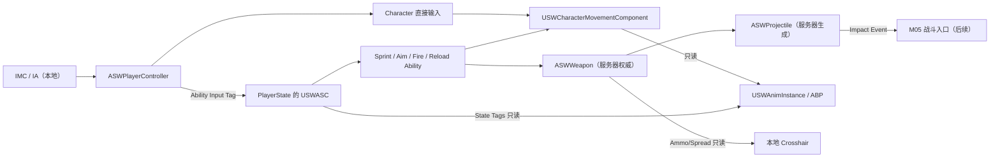
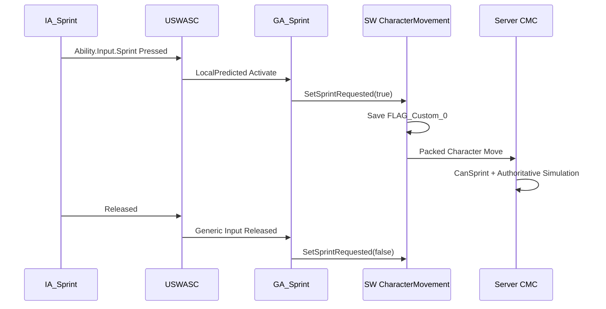
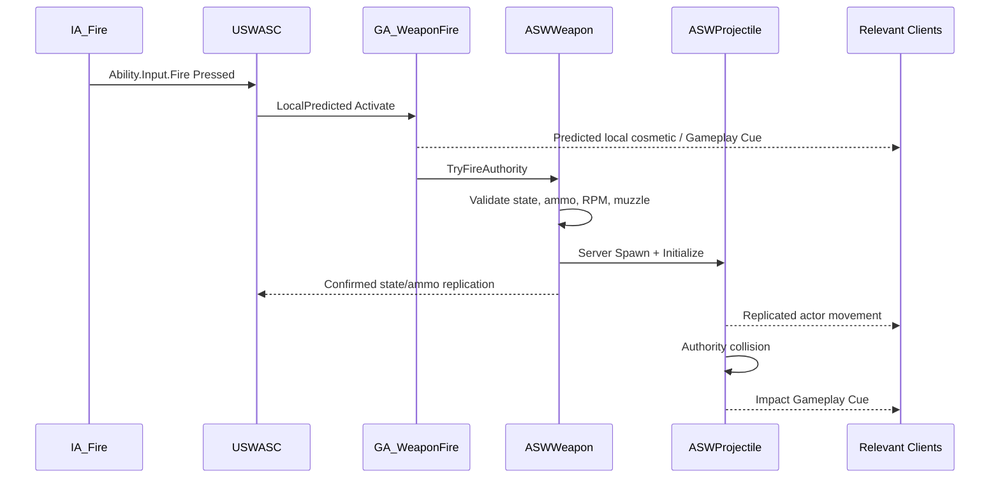
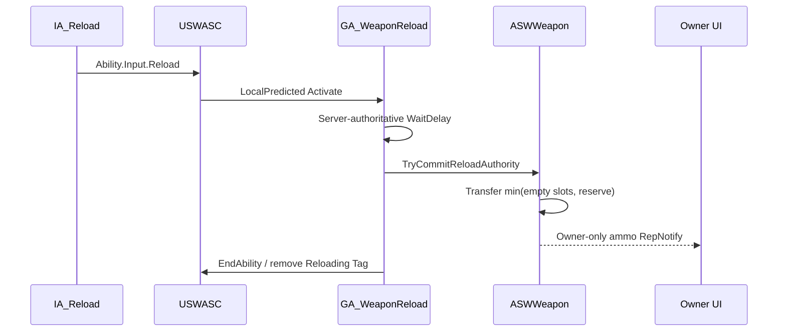

# M04 输入、移动、相机与固定武器基础设计文档

**状态：** Approved（已完成验收）
**负责人：** `12456df`
**最后更新：** 2026-07-30
**建议分支：** `feature/m04-input-movement-camera`
**建议提交：** `feat: add networked character controls and fixed weapon`

## 1. 问题与目标

项目需要把 M02 的可生成玩家角色和 M03 的 GAS 基础推进为第一个可操作、可瞄准、可播放完整移动动画并能使用固定武器发射服务器权威弹丸的第三人称射击切片。系统既要允许蓝图快速替换角色动画、武器外观和射击参数，又不能让蓝图成为移动复制、弹药、射速或弹丸生成的第二权威来源。

M04 的目标是建立可供后续角色复用的输入、移动、相机、动画和固定武器契约，而不是完成伤害、死亡或全部主动技能框架。

## 2. 核心结论

### 2.1 M04 范围调整

用户确认固定武器、弹丸、开火、换弹、瞄准和准星必须在 M04 完成，因此原路线图边界调整如下：

| 模块 | 调整后的责任 |
|---|---|
| M04 | 完成输入、移动、相机、动画模板、固定武器、弹匣/备弹、瞄准、换弹、半自动/自动开火、服务器弹丸和最小准星闭环。弹丸只产生权威命中事件，不造成伤害。 |
| M05 | 接收 M04 弹丸命中事件，完成队伍关系、伤害、生命、死亡、重生和临时无敌。 |
| M06 | 在已有固定武器闭环上完成射击结算扩展：命中扫描/投射物统一契约、伤害接入、服务器命中验证、必要的延迟与反作弊策略。 |
| M07 | 扩展 M04 已建立的 Input Tag → GAS Ability 通道，完成角色主动技能的目标、消耗、冷却、次数、取消和 Gameplay Cue 管线。 |

### 2.2 C++ 与蓝图总边界

| 领域 | C++ 负责 | 蓝图负责 |
|---|---|---|
| Enhanced Input | IMC 生命周期、IA 绑定、输入值解释、Input Tag 路由、重复绑定保护 | 创建 `IMC_Gameplay`、各 `IA_*` 资产并配置按键、Trigger 和 Modifier |
| 移动 | CMC 配置契约、移动/跳跃/下蹲执行、疾跑资格、网络预测和服务器校验 | 为角色蓝图填写可调移动参数；不直接写速度和复制状态 |
| 相机 | Spring Arm/Camera 组件、控制旋转、肩射/瞄准状态切换接口、本地插值 | 配置臂长、肩偏移、普通/瞄准 FOV 和表现曲线 |
| 动画 | `USWAnimInstance` 采集稳定只读动画变量；C++/GAS 提供状态 Tag | 无骨架 `ABP_SW_Template`、基于 Quinn Skeleton 的具体 ABP、Blend Space、Aim Offset、State Machine、Montage、IK 和动画表现 |
| 动画资产复用 | 确保 AnimInstance 只依赖稳定运行时状态 | 当前角色与动作共用标准 Quinn Skeleton，直接组织并引用动画资产；仅未来接入异骨架资产时才使用重定向 |
| 武器 | 固定武器 Actor 生命周期、弹药、射速、扩散、验证、服务器发射和复制 | 创建武器 BP 子类，选择网格体、弹丸类、动画/VFX/SFX并填写参数 |
| 弹丸 | 服务器生成、移动/碰撞、生命周期、权威命中事件和移动复制 | 创建弹丸 BP 子类，选择网格体、轨迹/VFX/SFX并填写速度、重力等参数 |
| GAS 动作 | 能力授予、Input Tag 路由、激活/取消、状态 Tag、服务器权威副作用 | 基于 C++ Ability 子类配置 Montage、Gameplay Cue 和非权威表现 |
| 准星 | 本地创建/销毁、只读准星状态、与武器/瞄准状态连接 | `WBP_Crosshair` 的材质、颜色、形状、动画和布局 |

蓝图不得直接减少弹药、绕过射速、生成权威弹丸、修改疾跑真值或决定命中结果。蓝图事件只消费 C++ 已确认的状态并播放表现。

## 3. 需求与边界

### 3.1 功能需求

- FR-01：本地玩家必须通过一个 `IMC_Gameplay` 获得移动、视角、跳跃、下蹲、疾跑、开火、瞄准和换弹输入。
- FR-02：WASD 移动必须按控制器 Yaw 转换为世界方向；鼠标输入必须控制第三人称视角，不把原始 IA 或鼠标值复制到网络。
- FR-03：角色必须使用面向镜头的标准第三人称射击移动：可前后左右扫射，角色朝向与控制器 Yaw 一致。
- FR-04：跳跃和下蹲必须复用 `ACharacter` / CMC 内建预测；C 和 Left Ctrl 必须映射到同一个下蹲动作。
- FR-05：疾跑必须由 `GA_Sprint` 管理激活、取消和状态 Tag，并由 `USWCharacterMovementComponent` 保存可预测的疾跑意图和决定最终速度。
- FR-06：角色必须具有可配置的肩后相机；进入瞄准时仅本地相机平滑切换到武器配置的 FOV/偏移，退出时恢复。
- FR-07：必须提供一个 C++ 动画实例基类和一个项目父 ABP；具体角色 ABP 从父 ABP 创建，不复制动画状态采集逻辑。
- FR-08：当前角色 Skeletal Mesh 与 M04 动作资产共用标准 Quinn Skeleton，必须直接用于移动 Blend Space、跳跃、瞄准与武器 Montage；只有未来接入不同 Skeleton 的外部动作时，才离线重定向并验证结果。
- FR-09：每个玩家 Pawn 必须只有一把固定武器；服务器生成并附着到角色，不能切换、丢弃、卸下或拾取第二把武器。
- FR-10：武器蓝图必须能选择静态或骨骼网格体，并配置弹容量、初始备弹、射速、扩散、是否支持瞄准、是否自动射击、换弹时长、瞄准相机参数、弹丸类和表现资产。
- FR-11：开火必须由 `GA_WeaponFire` 激活；半自动武器每次按下最多发射一发，自动武器在按住期间按配置射速持续尝试发射，释放输入立即停止。
- FR-12：只有服务器能够扣除权威弹药、通过射速校验并生成弹丸；拥有者客户端可预测准星、后坐表现和开火反馈，但不得生成权威弹丸。
- FR-13：换弹必须由 `GA_WeaponReload` 激活；服务器按弹匣空位和备弹量转移弹药，不能制造额外弹药。
- FR-14：瞄准必须由 `GA_WeaponAim` 激活；不支持瞄准的武器必须拒绝激活，瞄准状态必须可被远端动画读取。
- FR-15：弹丸蓝图必须能选择网格体并配置初速度、最大速度、重力、碰撞半径、寿命、是否随速度旋转和是否弹跳。
- FR-16：弹丸碰撞和命中事件必须由服务器确认；M04 命中只广播稳定契约并播放表现，不修改生命或造成伤害。
- FR-17：拥有者客户端屏幕中心必须显示最小准星；瞄准、移动和武器扩散可驱动准星表现，但 Dedicated Server 和远端玩家不得创建该 UI。
- FR-18：Pawn 重生后必须重新生成并附着固定武器、重新建立 Input/ASC Avatar 连接且不重复授予能力。

### 3.2 非功能需求

- NFR-01：Dedicated Server 是全部弹药、射速、弹丸生成和命中的唯一权威。
- NFR-02：普通移动使用 CMC 内建预测；疾跑意图进入 `FSavedMove_Character`，丢包或服务器纠正后不得长期速度分歧。
- NFR-03：玩家 ASC 继续由 `ASWPlayerState` 持有并使用 `Mixed` 复制；M04 不改变 ADR-0002。
- NFR-04：输入只在本地消费；状态通过 CMC、GAS、属性复制或武器 Actor 复制同步，不新增逐帧输入 RPC。
- NFR-05：武器参数和弹丸参数均为 Blueprint Class Defaults 数据，不在 C++ 或蓝图图表散落同类魔法数。
- NFR-06：所有配置在 C++ 入口校验；非法弹容量、射速、扩散、速度、寿命或缺失类必须留下可诊断日志并安全拒绝操作。
- NFR-07：Character、Weapon 和 Projectile 不增加无条件业务 Tick。允许 CMC/ProjectileMovement 的引擎 Tick，以及一个仅本地准星/相机表现更新。
- NFR-08：Editor、Game、Server Development Target 必须构建通过，并以 Staged DS + 两客户端完成移动、动画、武器和弹丸测试。
- NFR-09：M04 只增加完成当前切片所需的类，不引入库存、装备槽、武器管理器、对象池或通用战斗 Manager。
- NFR-10：关键状态在晚加入、重新相关、Pawn 更换和重复 OnRep 时必须幂等。

### 3.3 边界情况

- EC-01：Input Config、IMC 或 IA 缺失时，本地记录错误并跳过对应绑定；不得导致 DS 或其他玩家崩溃。
- EC-02：ASC 尚未完成 ActorInfo 绑定时，Ability Input 暂不激活；绑定完成后正常工作，不缓存过期 Avatar。
- EC-03：武器类或有效网格体缺失时，服务器拒绝建立武器闭环并记录错误；角色仍可移动，不能开火。
- EC-04：弹丸类、Muzzle Socket 或 Muzzle Transform 无效时，本次射击不扣弹并记录诊断。
- EC-05：弹匣为空时开火失败；若有备弹，可由玩家按 R 换弹，M04 不默认自动换弹。
- EC-06：弹匣已满、备弹为零或正在换弹时，换弹能力拒绝激活。
- EC-07：开火、瞄准和疾跑发生冲突时按本文件的 Tag 规则取消或阻断，不允许多份布尔状态互相覆盖。
- EC-08：玩家在换弹、开火或瞄准期间死亡/失去 Avatar 时，Ability 必须取消并清理 Task、计时器、Tag 和本地相机状态。
- EC-09：武器或弹丸配置在运行时为空/非法时使用安全失败，不使用隐式默认值制造不同端结果。
- EC-10：玩家贴墙导致枪口在遮挡物后时，弹丸仍从服务器枪口生成；镜头瞄准点只决定方向，不能让子弹穿过枪口前遮挡。
- EC-11：客户端预测了开火但服务器因弹药、射速或状态拒绝时，客户端只回滚表现；权威弹药和弹丸不发生变化。
- EC-12：重复生成/重绑调用不得创建第二把武器或重复授予同一 Ability。

### 3.4 明确不做

- 不实现伤害、护甲、暴击、吸血、生命归零、死亡、重生规则和临时无敌；属于 M05。
- 不实现命中扫描武器、武器切换、拾取、丢弃、装备槽、背包、附件或购买；分别属于 M06/M08/M09。
- 不实现客户端回溯、服务器倒带、复杂延迟补偿或正式反作弊；M06 根据武器策略评估。
- 不实现角色主动技能的目标选择、消耗、冷却、次数和升级；属于 M07。
- 不实现完整 HUD、弹药面板、设置菜单、按键重映射或手柄全覆盖；属于 M14 或后续输入设置。M04 只提供最小准星。
- 不实现脚步 IK、Motion Matching、复杂转身、攀爬、翻越、滑铲或自定义重力。
- 不在 M04 引入弹丸对象池；先以实际压力数据决定是否需要。

## 4. 输入设计

### 4.1 IMC 与 IA

| 资产 | Value Type | 默认键位 | IA Trigger | C++ 绑定事件 | 执行路径 |
|---|---|---|---|---|---|
| `IA_Move` | Axis2D | W/A/S/D | `None`（默认 Down） | `Triggered` | Character → `AddMovementInput` |
| `IA_Look` | Axis2D | Mouse X/Y | `None`（默认 Down） | `Triggered` | Character/Controller → Yaw/Pitch |
| `IA_Jump` | Bool | Space | `None`（默认 Down） | `Started` / `Completed` | `Jump()` / `StopJumping()` |
| `IA_Crouch` | Bool | C、Left Ctrl | `None`（默认 Down） | `Started` | Toggle `Crouch()` / `UnCrouch()` |
| `IA_Sprint` | Bool | Left Shift | `None`（默认 Down） | `Started` / `Completed` | `Ability.Input.Sprint` |
| `IA_Fire` | Bool | Left Mouse Button | `None`（默认 Down） | `Started` / `Completed` | `Ability.Input.Fire` |
| `IA_Aim` | Bool | Right Mouse Button | `None`（默认 Down） | `Started` / `Completed` | `Ability.Input.Aim` |
| `IA_Reload` | Bool | R | `None`（默认 Down） | `Started` | `Ability.Input.Reload` |

`IA_Move` 使用 Cumulative 累积；W/S 使用 Swizzle YXZ，S/A 分别对 Y/X 使用 Negate。M04 首次验收只要求键鼠；目标平台尚为 `TBD`，手柄映射不伪造为已完成。

图中“已按下”对应 `UInputTriggerPressed`，它会让 Action 只在按下帧进入 Triggered；本项目的单次按键和按住/释放行为改由 `BindAction` 的 `Started` / `Completed` 阶段区分，因此所有上述 IA 均不添加显式 Trigger。`Started`、`Triggered` 与 `Completed` 是 C++ 绑定事件，不是 IA Details 面板中的 Trigger 选项。

### 4.2 输入所有权

- `ASWPlayerController` 的蓝图 Class Default 持有唯一 `USWInputConfig`；Controller 在本地 `BeginPlay` 添加 `IMC_Gameplay`，在结束生命周期时移除，Pawn 重生不重复添加。
- `ASWCharacter_Player::SetupPlayerInputComponent` 从 Controller 只读取得同一 Input Config，绑定当前 Pawn 的直接移动动作和 Ability Input Tag，不保存第二份配置。
- `USWInputConfig` 是蓝图可配置的数据资产，集中保存 IA 引用和 IA → Native Gameplay Tag 映射。
- Ability 输入回调只把 Tag 交给 `USWAbilitySystemComponent`；ASC 在 `PostProcessInput` 阶段处理 Pressed/Held/Released。
- 不使用 `bReplicateInputDirectly`；按 UE 5.7 GAS 接口优先使用 Ability Spec 输入与 Generic Replicated Event。
- 实现完成后删除 `DefaultInput.ini` 中遗留的 Legacy Action/Axis Mapping，只保留 Enhanced Input 默认类和确有用途的轴配置。

### 4.3 Native Gameplay Tags

M04 在 `SWGameplayTags` 增加以下叶子 Tag：

| Tag | 用途 |
|---|---|
| `Ability.Input.Fire` | 开火输入 |
| `Ability.Input.Aim` | 瞄准输入 |
| `Ability.Input.Reload` | 换弹输入 |
| `Ability.Input.Sprint` | 疾跑输入 |
| `Ability.Weapon.Fire` | 开火能力身份 |
| `Ability.Weapon.Aim` | 瞄准能力身份 |
| `Ability.Weapon.Reload` | 换弹能力身份 |
| `Ability.Movement.Sprint` | 疾跑能力身份 |
| `State.Weapon.Firing` | 当前正在执行开火循环 |
| `State.Weapon.Aiming` | 当前处于瞄准 |
| `State.Weapon.Reloading` | 当前正在换弹 |
| `State.Movement.Sprinting` | 当前处于疾跑 |
| `Event.Weapon.Fire` | 武器 Montage 的权威发射时刻 |
| `Event.Weapon.ProjectileImpact` | M04 弹丸权威命中事件 |
| `GameplayCue.Weapon.Fire` | 枪口火焰、枪声、局部后坐表现 |
| `GameplayCue.Weapon.Reload` | 换弹表现 |
| `GameplayCue.Projectile.Impact` | 弹丸命中表现 |

代码只引用这些 Native Tag，不使用字符串 `RequestGameplayTag`。

## 5. 移动与相机设计

### 5.1 标准第三人称射击移动

- `bUseControllerRotationYaw = true`。
- `bUseControllerRotationPitch/Roll = false`。
- `UCharacterMovementComponent::bOrientRotationToMovement = false`。
- 移动方向只使用 Controller Rotation 的 Yaw；Pitch 不影响地面移动。
- 普通移动、下蹲、跳跃继续走 CMC 的预测和服务器纠正。
- 移动速度、加速度、制动、空中控制、跳跃高度和下蹲速度均由角色蓝图 Class Defaults 配置。M04 的 `USWCharacterMovementComponent` 默认步行/疾跑/下蹲速度为 `600/900/300`，其余运动参数仍按具体角色蓝图确定。

### 5.2 疾跑

疾跑既有 IA，也由 Ability 授予，两者不是二选一：

1. `IA_Sprint Started` 发送 `Ability.Input.Sprint`。
2. `GA_Sprint` 以 `LocalPredicted` 激活，添加 `State.Movement.Sprinting`。
3. Ability 调用 `USWCharacterMovementComponent::SetSprintRequested(true)`。
4. CMC 仅在角色在地面、未下蹲、未换弹/瞄准且前向输入达到阈值时采用 `SprintSpeed`。
5. `bWantsToSprint` 写入 `FSavedMove_Character::FLAG_Custom_0`，服务器重放同一意图。
6. 输入释放、跳跃、下蹲、瞄准、换弹、死亡或 Ability 取消时清除请求。

Ability 管理玩法状态和互斥；CMC 管理速度、预测和物理。蓝图不能直接设置 `MaxWalkSpeed`。

M04 先在 `USWAttributeSet` 建立 `Stamina`/`MaxStamina`，使疾跑拥有稳定的 GAS 数据契约；本模块的 `GA_Sprint` 仍只负责设置/清除 CMC 的疾跑意图。M05 建立初步玩法闭环时，以 GE 初始化、消耗和恢复体力；届时 GA 依据体力拒绝或结束疾跑，CMC 的预测协议不变。

### 5.3 相机

`ASWCharacter_Player` 构造以下默认子对象：

- `USpringArmComponent* CameraBoom`
- `UCameraComponent* FollowCamera`

普通肩射配置由角色蓝图提供；瞄准 FOV、瞄准肩偏移和过渡时间由当前武器配置提供。相机插值只在 `IsLocallyControlled()` 的 Pawn 上执行，不复制 Camera Transform，也不让 Dedicated Server 访问 Viewport。

`ASWCharacter_Player` 提供右肩镜头默认值 `DefaultCameraArmLength=260`、`DefaultHipCameraOffset=(0,55,20)`，具体角色蓝图可覆盖。角色只订阅 CMC 的实际疾跑状态切换，并在拥有者本地启动/停止可配置的 `UCameraShakeBase`；不以 Tick 重复创建震动，也不向服务器或其他客户端复制镜头表现。

瞄准时角色和远端动画读取 `State.Weapon.Aiming`；只有拥有者本地相机读取同一预测状态并改变 FOV/Offset。武器没有开镜动画时仍使用同一 FOV/Offset 插值完成放大瞄准；`bSupportsAim = false` 的武器不进入该状态。

## 6. 动画模板与 Quinn Skeleton 直接复用

### 6.1 采用的模板层级

```text
USWAnimInstance（C++，稳定只读变量）
└── ABP_SW_Template（无骨架 Animation Blueprint Template）
    └── ABP_SW_Quinn_Base（指定 Quinn Skeleton 的具体 ABP）
        ├── ABP_SW_<CharacterA>（可选子 ABP）
        └── ABP_SW_<CharacterB>（可选子 ABP）
```

M04 使用 UE 5.7 的 `UAnimBlueprint::bIsTemplate` 建立无骨架 Animation Blueprint Template：

- 当前角色 Skeletal Mesh 实际使用标准 Quinn Skeleton；此前将物理资产中的骨骼树误认为网格的 Skeleton，现已更正。
- M04 已使用的动作资产与该 Quinn Skeleton 相同，可直接引用，不创建 IK Rig、IK Retargeter，也不导出重定向副本。
- 模板不直接引用 Skeletal Mesh 或 Animation Sequence、Blend Space、Aim Offset 等具体动画资产；它保存状态机、转换规则和空的 Asset Player 节点。M04 模板的复用契约限定为标准 Quinn 骨骼层级，因此为上下半身分层可使用 `spine_01` 等 Quinn 骨骼名；它不是面向任意骨架的通用模板。
- `ABP_SW_Quinn_Base` 在创建时选择 Quinn Skeleton 和该模板，并通过 Asset Override Editor 为继承的 Asset Player 填写 Quinn 动画资产；角色差异动作再由可选子 ABP 的 Asset Override 处理。

**当前实施状态（2026-07-28）：未完成。** 已建立无骨架模板的基础结构；在购买并导入八方向 In-place 动作后，仍须完成 `BS_SW_Locomotion`、Idle/Locomotion/JumpStart/InAir/Land 的 Asset Override、完整状态转换、蹲下与疾跑表现、Aim Offset、`UpperBody` Slot、`Layered Blend Per Bone`、武器 Montage 以及本地/远端动画验证。上述项完成并通过验收前，动画模板不得标记为完成。

### 6.2 `USWAnimInstance` 蓝图只读变量

| 变量 | 类型 | 来源/用途 |
|---|---|---|
| `GroundSpeed` | `float` | CMC XY 速度长度 |
| `Direction` | `float` | 速度相对角色朝向，范围 -180～180 |
| `Acceleration` | `float` | CMC 当前加速度长度 |
| `bShouldMove` | `bool` | 速度和加速度超过阈值 |
| `bIsInAir` | `bool` | `MovementComponent->IsFalling()` |
| `bIsCrouching` | `bool` | CMC 下蹲状态 |
| `bIsSprinting` | `bool` | CMC 预测状态/ASC Tag 的一致只读结果 |
| `bIsAiming` | `bool` | ASC 的 `State.Weapon.Aiming` |
| `bIsReloading` | `bool` | ASC 的 `State.Weapon.Reloading` |
| `AimYaw` | `float` | Base Aim Rotation 与 Actor Rotation 的 Yaw 差 |
| `AimPitch` | `float` | Base Aim Rotation 的 Pitch，供远端瞄准 |
| `LocomotionState` | `enum` | Idle/Moving/Sprinting/Crouching/InAir 的只读归类；具体 Walk/Run 由 Blend Space 的速度轴采样 |

这些属性使用 `UPROPERTY(Transient, BlueprintReadOnly)`。C++ 在游戏线程缓存 UObject 状态；AnimGraph 只读缓存值，不在 Thread Safe Update 中访问任意 Gameplay UObject。

### 6.3 `ABP_SW_Template` 与 `ABP_SW_Quinn_Base` 内容

- `ABP_SW_Template`：`LocomotionSM`（Idle、Walk/Run、Sprint、Crouch、Jump Start、In Air、Land）、转换规则，以及不带资产引用的 Locomotion/Crouch/Jump/Aim/Montage Asset Player 节点。
- `ABP_SW_Quinn_Base`：通过 Asset Override Editor 为上述继承节点直接填写 Quinn 动画资产；`BS_SW_Locomotion` 使用方向 × 速度的 2D Blend Space，支持射击扫射。
- 模板包含 `BS_SW_Crouch`、`AO_SW_Rifle`、`UpperBody` Slot、`FullBody` Slot 与 `Layered Blend Per Bone` 的结构；Quinn 具体 ABP 只通过 Asset Override Editor 提供实际动画资产。
- Locomotion 使用 In-place 动画；Root Motion 模式为 `RootMotionFromMontagesOnly`。
- 蓝图只根据 C++ 只读变量选择姿势，不自行查询 PlayerController、Weapon 或 ASC。

跳跃采用状态机内的三段式流程：地面状态（Idle/Locomotion）在 `bIsInAir = true` 时进入 `JumpStart`；`JumpStart` 的非循环 Sequence Player 按自动序列规则转入循环的 `InAir`；`InAir` 在 `bIsInAir = false` 时转入非循环的 `Land`；`Land` 以自动序列规则进入 `GroundedAfterLand` Conduit，再由该 Conduit 的 `GroundSpeed` 分流到 Idle 或 Locomotion。自动规则的转换图不额外添加条件。三个 Asset Player 在模板中保持无资产，由 Quinn 具体 ABP 的 Asset Override Editor 赋值。

### 6.3.1 上下半身动画分层

`ABP_SW_Quinn_Base` 以 `LocomotionSM` 的输出作为下半身唯一基础姿势；`Layered Blend Per Bone` 的 Base Pose 连接该姿势，Blend Pose 连接武器持枪/Aim Offset/`UpperBody` Slot 的输出，Branch Filter 从标准 Quinn 的 `spine_01` 开始。这样腿部继续由八方向移动 Blend Space 驱动，而脊柱、手臂和头部可独立使用 Pistol/Rifle 动作。

- 静止持枪：以 Pistol/Rifle 的 Hip Idle 作为上半身姿势，经过 `spine_01` 分层覆盖。
- 瞄准：对上半身基础姿势应用 `AO_SW_Rifle`，以 `bIsAiming` 选择是否覆盖。
- 开火/换弹：在上半身基础姿势后串接 `UpperBody` Slot；对应 Montage 必须使用该 Slot。GAS Ability 负责播放与网络同步，Character Blueprint 不直接播放 Montage。
- 疾跑：没有专门的持枪疾跑上半身动作时，`bIsSprinting` 时让上半身回退为 `LocomotionSM` 姿势，避免静止持枪手臂覆盖疾跑动作。
- 所有参与混合的动作必须与 Quinn Skeleton 相同，并优先使用 In-place 版本；动作缺少八方向时可只承担上半身表现，不能替代下半身 Locomotion Blend Space。

### 6.4 Quinn Skeleton 兼容性检查与直接使用流程

1. 打开角色 Skeletal Mesh 和每个待使用 Animation Sequence/Blend Space/Montage，在 Details 中确认它们的 `Skeleton` 都指向同一个标准 Quinn Skeleton 资产；物理资产树不作为此判断依据。
2. 将兼容动作直接组织到项目的 Locomotion、AimOffsets 与 Montages 目录，或直接引用其原始位置；不复制、不导出重定向版本。
3. 先创建无骨架 `ABP_SW_Template`，再创建选择 Quinn Skeleton 且指定该模板的 `ABP_SW_Quinn_Base`；在具体 ABP 的 Asset Override Editor 中填写模板继承节点的 Quinn 动画资产，并创建 Blend Space、Aim Offset 与 Montage。
4. 检查脚滑、骨盆高度、手部握枪、Root Motion、曲线与 Notify；问题优先在原动画、Blend Space、Control Rig/IK 或角色表现层修正，不在 Character Tick 中补偿。
5. 未来只有在外部动作的 `Skeleton` 不是 Quinn Skeleton 时，才新建对应 IK Rig/IK Retargeter，离线导出到项目自有目录，并完成上述表现检查。

## 7. 固定武器设计

### 7.1 生命周期

- `ASWCharacter_Player` 的蓝图 Class Default 指定唯一 `DefaultWeaponClass`。
- 服务器在有效 Possess/ASC Avatar 初始化后生成 `ASWWeapon`，设置 `Owner = Character`、`Instigator = Character` 并附着到角色 `WeaponAttachSocket`。
- `CurrentWeapon` 由 Character 以 `ReplicatedUsing` 只读复制；OnRep 只执行幂等附着/表现初始化。
- Weapon 随 Pawn 生命周期销毁；PlayerState/ASC 继续存活。重生后新 Pawn 得到新武器，能力通过当前 Avatar 查询新武器。
- 不提供 Equip、Unequip、Drop、Pickup、SwitchWeapon API。

### 7.2 武器蓝图配置

`ASWWeapon` 暴露一个 `FSWWeaponConfig`，使用 `EditDefaultsOnly, BlueprintReadOnly`：

| 字段 | 类型 | 规则 |
|---|---|---|
| `MagazineCapacity` | `int32` | 必须 > 0 |
| `RoundsPerMinute` | `float` | 必须 > 0；射击间隔为 `60 / RPM` |
| `HipSpreadDegrees` | `float` | 必须 >= 0；服务器计算 |
| `AimSpreadMultiplier` | `float` | 必须在 `[0, 1]`；不支持瞄准时忽略 |
| `bAutomatic` | `bool` | true 为按住连续射击；false 为每次按下单发 |
| `bSupportsAim` | `bool` | false 时 `GA_WeaponAim` 拒绝激活 |
| `ReloadDurationSeconds` | `float` | 必须 > 0；服务器计时，不依赖动画 Notify |
| `MaxAimDistance` | `float` | 必须 > 0；用于服务器相机方向射线 |
| `AimFOV` | `float` | 仅本地相机表现 |
| `AimCameraOffset` | `FVector` | 仅本地相机表现 |
| `AimTransitionSeconds` | `float` | 必须 >= 0 |
| `ProjectileClass` | `TSubclassOf<ASWProjectile>` | 必须有效 |
| `MuzzleSocketName` | `FName` | 必须能取得有效 Transform |
| `FireMontage` | `TObjectPtr<UAnimMontage>` | 可空；只影响表现 |
| `ReloadMontage` | `TObjectPtr<UAnimMontage>` | 可空；只影响表现 |
| `FireGameplayCueTag` | `FGameplayTag` | 必须位于 `GameplayCue.Weapon` |

Weapon Actor 同时提供 `USkeletalMeshComponent` 与 `UStaticMeshComponent` 两种视觉槽，适配用户期望的骨骼武器和仓库现有静态武器。蓝图必须只启用其中一个；C++ 通过统一 `UMeshComponent` 查询 Muzzle Socket。

### 7.3 武器运行时状态

| 状态 | 唯一写入者 | 复制 |
|---|---|---|
| `CurrentMagazineAmmo` | 服务器 `ASWWeapon` | `COND_OwnerOnly` + RepNotify |
| 备弹 | 固定为无限 | 不作为运行时状态复制；UI 以无限符号表现 |
| `NextAllowedFireServerTime` | 服务器 `ASWWeapon` | 不复制；服务器校验用 |
| 瞄准/换弹/开火状态 | PlayerState ASC 的 Ability/Tag | GAS 复制 |
| 弹匣容量/射击间隔修正 | PlayerState `USWAttributeSet` | GAS 属性复制；服务器读值形成最终武器参数 |
| 网格、射速、容量等配置 | Weapon Blueprint CDO | 类资产，不作为运行时可写状态复制 |

蓝图只能读取弹药并订阅 `OnAmmoChanged`，不能直接写入。

### 7.4 射击方向

服务器执行两段式方向计算：

1. 以服务器可见的 Pawn View/Control Rotation 从视线起点向 `MaxAimDistance` 查询瞄准点。
2. 以枪口为起点朝瞄准点计算弹丸方向，并应用服务器生成的扩散。

弹丸始终从枪口生成，因此近墙时会先撞击枪口前遮挡，不允许从镜头穿墙。M04 不接受客户端提交可信命中 Actor 或伤害结果。

## 8. 弹丸设计

### 8.1 `FSWProjectileConfig`

| 字段 | 类型 | 规则 |
|---|---|---|
| `InitialSpeed` | `float` | 必须 > 0 |
| `MaxSpeed` | `float` | 0 表示不额外限制，否则必须 >= InitialSpeed |
| `GravityScale` | `float` | 可为 0；不得为非有限值 |
| `CollisionRadius` | `float` | 必须 > 0 |
| `LifeSeconds` | `float` | 必须 > 0 |
| `bRotationFollowsVelocity` | `bool` | 控制视觉朝向 |
| `bShouldBounce` | `bool` | M04 支持 ProjectileMovement 基础弹跳，不定义复杂反弹伤害 |
| `Bounciness` | `float` | 仅弹跳开启时有效，范围 `[0, 1]` |

### 8.2 组件与网络

`ASWProjectile` 默认包含：

- `USphereComponent`：根碰撞体。
- `UProjectileMovementComponent`：服务器模拟速度、重力、扫掠和可选弹跳。
- `UStaticMeshComponent`：蓝图选择视觉网格；可作为插值组件。

网络规则：

- 只允许服务器生成 `ASWProjectile`。
- `bReplicates = true`、`SetReplicateMovement(true)`。
- 服务器执行碰撞和权威命中；客户端碰撞回调不产生 Gameplay Event。
- 模拟代理使用 RepMovement 和 ProjectileMovement 的插值能力平滑视觉，不独立决定最终轨迹。
- 命中后服务器发送 `Event.Weapon.ProjectileImpact` 给受信任战斗入口，并触发 `GameplayCue.Projectile.Impact`；M04 随后销毁弹丸。

## 9. GAS Ability 设计

### 9.1 授予

- `ASWCharacter_Player` 蓝图通过 `StartupAbilities` 配置 M04 能力类及其 `Ability.Input.*` 路由 Tag。
- 服务器在 ASC 有效绑定后调用 `USWAbilitySystemComponent::GrantStartupAbilities`。
- ASC 在 PlayerState 上跨重生存活；授予函数按 Ability Class/Handle 去重。
- Ability 从当前 ActorInfo Avatar 查询 `ASWCharacter_Player` 和其 `CurrentWeapon`，不缓存旧 Pawn/Weapon。

### 9.2 Ability 列表

| Ability | Policy | 输入行为 | 权威副作用 |
|---|---|---|---|
| `GA_Sprint` | Local Predicted | 按住激活，释放结束 | CMC 验证疾跑请求；无资源消耗 |
| `GA_WeaponAim` | Local Predicted | 按住激活，释放结束 | 添加/移除 Aiming Tag；相机只在本地响应 |
| `GA_WeaponFire` | Local Predicted | Ability 蓝图编排半自动单次或自动循环 | 服务器在 `Event.Weapon.Fire` 到达时，经 C++ 受控入口校验射速/弹药并扣弹、生成弹丸 |
| `GA_WeaponReload` | Local Predicted | 按下激活一次 | 服务器计时结束后填满当前弹匣 |

所有 Ability 使用 `InstancedPerActor`，成功、失败、取消和 Avatar 丢失路径都必须调用 `EndAbility` 并清理 Task/Timer/Tag。

### 9.3 冲突规则

| 正在进行 | 新请求 | 结果 |
|---|---|---|
| Sprint | Aim 或 Fire | Sprint 被取消，新请求继续 |
| Aim 或 Fire | Sprint | Aim/Fire 被取消；只有满足前向/地面条件才进入 Sprint |
| Reload | Fire 或 Sprint | 新请求被阻断 |
| Aim | Reload | Aim 被取消，Reload 开始 |
| Fire | Reload | Fire 输入结束或 Ability 取消后才能 Reload |
| Crouch/In Air | Sprint | Sprint 拒绝或立即结束 |

状态冲突使用 Ability/State Tag 的 Activation Required/Blocked/Cancel 契约表达，不在多个蓝图 Event Graph 中重复判断。

### 9.4 开火与换弹时序

- 武器服务器时间 `NextAllowedFireServerTime` 是射速唯一真值；Ability 的 WaitDelay 只负责调度下一次尝试。
- 服务器以持枪 Controller 的视点中心作为屏幕中心准星射线；射线忽略武器与持枪 Pawn，自枪口朝命中点或最大距离生成权威弹丸。Widget 不参与此计算。
- 半自动武器在一次 Ability 激活中最多调用一次发射。
- 自动武器循环到输入释放、弹匣为空、状态被阻断、Avatar/Weapon 无效或 Ability 被取消。
- `USWGameplayEventAnimNotify` 是可复用的 Montage 时刻通知：向角色 ASC 分发配置的 `Event.*` Tag，默认仅服务器分发；武器、法术和未来近战均可消费该契约。
- `GA_WeaponFire` 蓝图必须先注册 `WaitGameplayEvent(Event.Weapon.Fire)` 再播放 Montage；事件分支仅在服务器调用 C++ 的 `CommitFireFromAnimEvent`。半自动蓝图的客户端分支不得因按键释放或 Montage 结束抢先结束权威 Ability。
- 权威发射成功后才扣除一发弹药并生成一个弹丸。
- Reload 使用服务器计时 `ReloadDurationSeconds`；Montage/Notify 不能成为 DS 上弹药转移的权威时钟。
- `GA_WeaponReload` 的客户端实例只预测 Montage 与状态 Tag；仅服务器实例创建 `WaitDelay`、提交弹药并结束 Ability，避免客户端结束同步抢先取消服务器的权威计时。
- Reload 结束时将 `CurrentMagazineAmmo` 填充至当前有效弹匣容量；不消耗备弹。
- `GA_WeaponFire` 与 `GA_WeaponReload` 读取当前武器配置中的 `FireMontage` / `ReloadMontage`，通过 GAS Montage Task 播放表现；Montage 为空时不阻断权威开火或换弹流程。

## 10. 准星

M04 提供 `USWCrosshairWidget` C++ 基类和蓝图子类 `WBP_Crosshair`：

- `ASWPlayerController` 仅在 `IsLocalController()` 且非 Dedicated Server 时创建。
- 锚点固定在 Viewport 中心。
- C++ 只向蓝图提交 `FSWCrosshairState`：
  - `bVisible`
  - `bAiming`
  - `bCanFire`
  - `SpreadNormalized`
- 蓝图决定纹理、颜色、动画和分片间距。
- M04 不制作完整弹药 HUD；弹药只通过只读委托为 M14 预留。

为后续 M14 保留最小 UI 基础：`ASWHUD` 仅在本地 PlayerController 上创建可选的根 `USWUserWidget`，`USWUserWidget` 提供可选的 WidgetController 注入事件。它们不创建 Overlay、属性面板、菜单或数据绑定，且不替代本节中准星由 PlayerController 管理的生命周期。

为定位 DS 联机时的移动纠正和弹丸表现问题，允许一个开发期只读 `WBP_NetworkDiagnostics`。它通过 `USWNetworkDiagnosticsWidgetController` 消费本机 `UNetConnection` 的 Ping、抖动、带宽、包率、丢包与帧耗时，并消费 `ASWGameState` 每秒复制一次的服务器连接数、总带宽、包率、丢包与帧耗时。`ASWHUD` 负责为本地玩家创建并缓存 Controller；Widget 只订阅快照，不访问 NetDriver、不发送 RPC、不写玩法状态。该诊断面板是调试工具，不构成 M14 的正式 HUD。

允许一个仅拥有者本地的轻量每帧表现更新，根据速度、空中状态、瞄准和武器扩散计算 `SpreadNormalized`；它不写权威状态、不产生网络流量。相机 FOV/肩偏移插值仅在目标发生变化到收敛的过渡期间启用 Character Tick，收敛后立即关闭；静止、普通移动、远端 Pawn 和 Dedicated Server 不保留该 Tick。

## 11. 蓝图公开契约

### 11.1 `USWInputConfig`

| 属性/API | 反射 | 蓝图权限 |
|---|---|---|
| `DefaultMappingContext` | `EditDefaultsOnly, BlueprintReadOnly` | 配置 |
| `MoveAction` / `LookAction` / `JumpAction` / `CrouchAction` | `EditDefaultsOnly, BlueprintReadOnly` | 配置 |
| `AbilityInputActions` | `EditDefaultsOnly, BlueprintReadOnly` | 配置 IA → Native Tag |
| `FindAbilityInputActionForTag` | `BlueprintPure` | 只读查询 |

### 11.2 `ASWPlayerController`

| 属性/API | 反射 | 蓝图权限 |
|---|---|---|
| `InputConfig` | `EditDefaultsOnly, BlueprintReadOnly` | 指定唯一输入数据资产 |
| `CrosshairWidgetClass` | `EditDefaultsOnly, BlueprintReadOnly` | 指定最小准星 BP |
| `GetInputConfig` | `BlueprintPure` | Character 只读查询 |
| `PostProcessInput` | C++ Override | 每帧处理 ASC Ability 输入集合 |

### 11.3 `ASWCharacter_Player`

| 属性/API | 反射 | 蓝图权限 |
|---|---|---|
| `CameraBoom` / `FollowCamera` | `VisibleAnywhere, BlueprintReadOnly` | 读取/配置子对象 Defaults |
| `DefaultWeaponClass` | `EditDefaultsOnly, BlueprintReadOnly` | 指定唯一武器 BP |
| `WeaponAttachSocket` | `EditDefaultsOnly, BlueprintReadOnly` | 配置 |
| `StartupAbilities` | `EditDefaultsOnly, BlueprintReadOnly` | 配置 Ability Class 与 `Ability.Input.*` 路由 Tag |
| `CurrentWeapon` | `ReplicatedUsing, BlueprintReadOnly` | 只读 |
| `GetCurrentWeapon` | `BlueprintPure` | 只读 |
| `IsAiming` / `IsSprinting` | `BlueprintPure` | 只读 |
| `BP_OnWeaponReady` | `BlueprintImplementableEvent` | 表现通知；不得生成/替换武器 |
| `BP_OnAimStateChanged` | `BlueprintImplementableEvent` | 表现通知 |

### 11.4 `USWCharacterMovementComponent`

| 属性/API | 反射 | 蓝图权限 |
|---|---|---|
| `WalkSpeed` / `SprintSpeed` / `CrouchSpeed` | `EditDefaultsOnly, BlueprintReadOnly` | 配置 |
| `SprintForwardThreshold` | `EditDefaultsOnly, BlueprintReadOnly` | 配置 |
| `IsSprinting` | `BlueprintPure` | 只读 |
| `SetSprintRequested` | C++/Ability 调用 | 不暴露为任意蓝图写入口 |

### 11.5 `ASWWeapon`

| 属性/API | 反射 | 蓝图权限 |
|---|---|---|
| `WeaponConfig` | `EditDefaultsOnly, BlueprintReadOnly` | 配置 |
| `SkeletalWeaponMesh` / `StaticWeaponMesh` | `VisibleAnywhere, BlueprintReadOnly` | 选择并配置一个视觉组件 |
| `GetMagazineAmmo` | `BlueprintPure` | 只读；备弹固定为无限，由 UI 自行显示 `∞` |
| `CanFire` / `CanReload` / `SupportsAim` / `IsAutomatic` | `BlueprintPure` | 只读 |
| `GetMuzzleTransform` | `BlueprintPure` | 只读 |
| `OnAmmoChanged` | `BlueprintAssignable` | 表现订阅 |
| `BP_OnFireCosmetic` / `BP_OnReloadStateChanged` | `BlueprintImplementableEvent` | 仅表现 |

服务器写函数不暴露为蓝图节点，只由受信任 C++ Ability/Character 契约调用，并在函数内部再次验证 `HasAuthority()`。

### 11.6 `ASWProjectile`

| 属性/API | 反射 | 蓝图权限 |
|---|---|---|
| `ProjectileConfig` | `EditDefaultsOnly, BlueprintReadOnly` | 配置 |
| `CollisionComponent` / `ProjectileMovement` / `ProjectileMesh` | `VisibleAnywhere, BlueprintReadOnly` | 组件 Defaults |
| `GetLaunchVelocity` | `BlueprintPure` | 只读 |
| `BP_OnProjectileLaunched` / `BP_OnProjectileImpact` | `BlueprintImplementableEvent` | 仅表现 |

蓝图没有 `ApplyDamage`、`SetAmmo` 或可信 `ReportHit` 接口。

### 11.7 `USWAnimInstance`

第 6.2 节列出的变量全部为 `Transient, BlueprintReadOnly`。不暴露可从 ABP 修改 Character、Weapon、CMC 或 ASC 的写函数。

## 12. 子系统、所有权与依赖

| 子系统 | 单一职责 | 依赖 | 拥有的数据 | 产生事件 |
|---|---|---|---|---|
| `ASWPlayerController` | 本地 IMC 与准星生命周期、输入处理阶段 | LocalPlayer、Character、ASC | 本地 UI 引用 | InputTag Pressed/Released |
| `USWInputConfig` | IA 与 Input Tag 配置 | Enhanced Input、Gameplay Tags | 不可变配置 | 无 |
| `ASWCharacter_Player` | Pawn 输入转发、相机、当前固定武器引用和 ASC Avatar | Controller、CMC、ASC、Weapon | 当前 Pawn 组件和 `CurrentWeapon` 引用 | WeaponReady |
| `USWCharacterMovementComponent` | 移动物理、疾跑资格与预测 | Character、CMC | `bWantsToSprint`、速度规则 | SprintStateChanged |
| `USWAbilitySystemComponent` | Ability Input Tag 队列、授予和激活 | GAS、PlayerState Owner、Character Avatar | Ability Specs、输入状态 | Ability/Tag 事件 |
| M04 Abilities | 行为编排、取消和状态 Tag | ASC、Character、Weapon/CMC | 每次激活临时状态 | Gameplay Cue、发射/换弹请求 |
| `ASWWeapon` | 固定武器配置、弹药、射速与权威发射 | Character、Projectile | 弹药、下次允许开火时间 | AmmoChanged、ShotConfirmed |
| `ASWProjectile` | 弹丸移动、碰撞和权威命中 | Weapon、ProjectileMovement | 轨迹和生命周期 | ProjectileImpact |
| `USWAnimInstance` / ABP | 读取运行时状态并输出姿势 | Character、CMC、ASC 只读 | 动画缓存/Graph 状态 | Anim Notify（仅表现） |
| `USWCrosshairWidget` | 显示本地准星 | PlayerController、Weapon/Character 只读 | 本地表现状态 | 无 |



依赖方向保持单向：输入不写武器状态，动画/UI 只读，Projectile 不反向修改 Weapon，Weapon 不直接修改生命。

## 13. 公开契约

| 所有者 | API/事件 | 输入 | 输出 | 副作用 | 前置条件 | 后置条件 |
|---|---|---|---|---|---|---|
| Controller | `ApplyGameplayMappingContext` | LocalPlayer、InputConfig | 成功/失败 | 添加 IMC | 本地 Controller | IMC 只添加一次 |
| ASC | `AbilityInputTagPressed/Released` | Native Input Tag | 无 | 更新本地输入集合 | ActorInfo 有效或安全忽略 | 对应 Ability 在处理阶段激活/收到释放 |
| ASC | `GrantStartupAbilities` | Ability Class + Input Tag 列表 | Handles | 仅服务器 GiveAbility，并写入 Spec Dynamic Tag | Owner/Avatar 有效 | 不重复授予 |
| Character | `SpawnDefaultWeaponAuthority` | DefaultWeaponClass | Weapon | 服务器生成并附着 | Authority、无现有武器 | 恰好一把 `CurrentWeapon` |
| CMC | `SetSprintRequested` | bool | 无 | 改变预测输入意图 | 当前 Avatar | 下一 SavedMove 携带相同意图 |
| CMC | `CanSprint` | 当前移动/GAS 状态 | bool | 无 | 任意端 | 相同输入得到相同资格 |
| Weapon | `TryFireAuthority` | 服务器瞄准上下文 | `FSWShotResult` | 校验、扣弹、生成弹丸 | Authority、配置有效 | 成功恰好扣 1 发并生成 1 弹丸；失败无副作用 |
| Weapon | `TryCommitReloadAuthority` | 无 | 实际装填数量 | 填满当前弹匣 | Authority、Reload Ability 有效 | 当前弹匣达到有效容量 |
| Weapon | `GetMuzzleTransform` | 无 | Transform/有效性 | 无 | 视觉组件有效 | 返回统一枪口坐标 |
| Projectile | `InitializeProjectileAuthority` | Instigator、方向、配置 | 成功/失败 | 初始化速度和寿命 | Authority、配置有效 | 开始服务器模拟 |
| Projectile | `OnAuthoritativeImpact` | HitResult | 无 | 发事件/Cue、销毁 | Authority、尚未处理 | 命中只处理一次 |
| AnimInstance | `NativeUpdateAnimation` | DeltaSeconds | 缓存属性 | 更新动画缓存 | Game Thread | ABP 获得只读快照 |
| Crosshair | `SetCrosshairState` | `FSWCrosshairState` | 无 | 更新本地表现 | Local Controller | 不修改 Gameplay State |

## 14. 运行时数据流

### 14.1 移动/疾跑



### 14.2 开火



### 14.3 换弹



## 15. 实现顺序

M04 不另建过度细分的工作流文档；本节就是执行清单。

| 顺序 | 工作 | 主要 C++ 文件 | 主要蓝图/资产 | 验证 |
|---:|---|---|---|---|
| 1 | Input Config、Native Input Tags、ASC 输入路由 | `Input/SWInputConfig.*`、`SWGameplayTags.*`、`SWAbilitySystemComponent.*`、`SWPlayerController.*` | `IMC_Gameplay`、8 个 `IA_*` | 本地按键事件一次且重生不重复 |
| 2 | 第三人称移动、相机和疾跑预测 | `Movement/SWCharacterMovementComponent.*`、`SWCharacter_Player.*`、`GA_Sprint.*` | 角色 BP Camera/Movement Defaults | PIE/DS 下走、跳、蹲、疾跑与纠正 |
| 3 | AnimInstance、ABP 模板与 Quinn 动画直接复用 | `Animation/SWAnimInstance.*` | `ABP_SW_Template`、直接引用的 Quinn 动画、Blend Space、Aim Offset、`ABP_SW_Quinn_Base` 和可选角色子 ABP | 本地与远端完整姿势 |
| 4 | AttributeSet 扩展、固定武器 Actor、复制与弹药 | `AbilitySystem/SWAttributeSet.*`、`Weapon/SWWeapon.*`、`Weapon/SWWeaponTypes.*`、Character 武器生命周期 | `BP_Weapon_*` | 武器修正从 PlayerState ASC 生效；每 Pawn 恰好一把，Owner-only 弹药正确 |
| 5 | 输入专用 GAS Ability | `AbilitySystem/Abilities/Input/SW*GameplayAbility.{h,cpp}` | Ability BP、Montage、Gameplay Cue | 疾跑、半自动/自动开火、瞄准、无限备弹换弹与冲突规则 |
| 6 | 服务器弹丸与命中事件 | `Weapon/SWProjectile.*`、`Weapon/SWProjectileTypes.*` | `BP_Projectile_*`、Impact Cue | 只服务器生成/命中，双客户端轨迹一致 |
| 7 | 最小准星与本地表现 | `UI/SWCrosshairWidget.*`、Controller | `WBP_Crosshair` | 只本地显示，中心对齐，瞄准/扩散响应 |
| 8 | 构建、DS 双客户端和文档同步 | 受影响文件 | 测试地图/资产 | Editor/Game/Server + Staged DS 验收 |

## 16. 资产目录与命名

建议新增项目自有内容目录：

```text
/Game/SciFiWorlds/
  Input/
    IMC_Gameplay
    Actions/IA_*
    DA_InputConfig
  Characters/
    Animation/
      ABP_SW_Template
      ABP_SW_Quinn_Base
      ABP_SW_<Character>
      BlendSpaces/
      AimOffsets/
      Montages/
  Weapons/
    BP_Weapon_*
    Projectiles/BP_Projectile_*
    GameplayCues/
  UI/Crosshair/WBP_Crosshair
```

具体根目录若需沿用现有 `/Game/BlurPrints/`，在实现前统一一次即可；同类 M04 资产不得散落在 Marketplace 原始目录中。

## 17. 验收与需求追踪

| 需求 | 实现责任 | 可重复测试 |
|---|---|---|
| FR-01～04 | InputConfig、Controller、Character、CMC | 键鼠逐项触发；走/看/跳/蹲；重生后不重复 |
| FR-05～06 | Sprint Ability、CMC、Camera | DS 丢包模拟下疾跑无长期分歧；瞄准仅本地改相机 |
| FR-07～08 | AnimInstance、ABP、Quinn Skeleton 直接引用的动画资产 | 本地/远端 Idle、八向移动、跳、蹲、跑、瞄准 |
| FR-09～10 | Character、Weapon BP | 每 Pawn 一把；替换 BP 参数后行为改变 |
| FR-11～14 | Fire/Aim/Reload Ability、Weapon | 半自动、自动、弹空、满弹、无备弹、冲突和取消 |
| FR-15～16 | Projectile | 速度/重力配置生效；只服务器碰撞；不造成 M05 前伤害 |
| FR-17 | Crosshair | 仅拥有者中心显示；DS/远端无 Widget |
| FR-18 | Character/ASC/Weapon 生命周期 | Pawn 更换后新武器、旧能力无悬空引用、不重复授予 |
| NFR-01～04 | CMC/GAS/Weapon/Projectile 网络设计 | DS + 两客户端、网络仿真、检查无输入 Tick RPC |
| NFR-05～10 | 配置校验、生命周期、代码审查 | 非法 BP Defaults 安全失败；OnRep/晚加入幂等 |

### 17.1 DS 验收场景

1. 启动 Staged Dedicated Server，两个客户端分别加入 TeamA/TeamB。
2. 两端同时完成移动、看向、跳跃、下蹲和疾跑；第三端视角观察远端动画。
3. 启用 `Net PktLag`/`Net PktLoss` 的开发模拟，确认普通移动和疾跑会纠正且不持续超速。
4. 客户端 A 使用半自动武器，长按左键只能打一发；重复点击受 RPM 限制。
5. 客户端 B 使用自动武器，按住持续射击，释放停止。
6. 两端验证瞄准支持开关、FOV/肩偏移、扩散表现和远端 Aim Offset。
7. 验证弹匣耗尽后换满、部分换满、满弹拒绝和换弹期间开火阻断。
8. 验证每次权威成功射击恰好扣一发、服务器生成一个弹丸；客户端不能自行制造弹丸。
9. 验证弹丸的速度、重力、寿命、碰撞和 Impact Cue；生命值在 M04 不改变。
10. 销毁并重建 Pawn，确认 ASC Owner 不变、Avatar 更新、能力不重复、旧武器销毁且新武器正常。

## 17.2 本地 DS 双客户端性能记录

- 已验证问题：同机运行外部 DS 与两个 `UnrealEditor.exe -game` 客户端时，未限帧的前台客户端会造成明显的 GPU/Draw 争用；失焦客户端帧时间升高，进而使本地网络诊断中的 Ping/Jitter 失真，并在远端表现为移动瞬移。
- 解决方案：在两个客户端执行 `t.MaxFPS 60` 后，`Draw` 时间明显下降，双客户端运行恢复稳定。当前 `GameUserSettings` 会在启动时覆盖该 CVar，因此本地 DS 双客户端验证开始前，需在各客户端控制台手动执行 `t.MaxFPS 60` 与 `t.IdleWhenNotForeground 0`。后者属于 Cheat CVar，不能写入项目 `DefaultEngine.ini`。
- 验证边界：这是同机多窗口性能调度问题，不是 DS 网络复制逻辑或 `127.0.0.1` 真实网络延迟。实际公网延迟/丢包仍应通过 Network Emulation 或多机 LAN 验收。

## 17.3 动画 TODO

- [ ] 后续项（不阻塞 M04）：排查 `WeaponUpperSM` 在移动时未按预期使用 `BS1D_PistolUpper_Locomotion` 的原因。已确认该 BlendSpace 的 `GroundSpeed` 输入、继承链和蓝图编译均正常；后续需在运行时确认状态机是否进入 `WeaponStandLocomotion`，并核验子 AnimBP 的资产覆盖是否实际作用于父模板节点。

### 17.4 M04 完成验收（2026-07-30）

- Development Editor、Game 与 Dedicated Server 三个 Target 均已构建成功。
- 已完成 Staged DS 加两个外部客户端验证：连接、移动、跳跃、下蹲、疾跑、瞄准、开火、换弹、弹药同步与服务器权威弹丸均可运行。
- 同机双客户端的失焦帧时间与远端移动瞬移已通过在两个客户端执行 `t.MaxFPS 60` 和 `t.IdleWhenNotForeground 0` 消除；该命令是本地验证前置项，不代表真实公网延迟测试。

## 18. 完成门槛

- [ ] 本文经用户确认后状态改为 `Approved`
- [ ] 所有 FR/NFR/EC 均有实现或明确验证结果
- [ ] Development Editor、Game、Server Target 构建通过
- [ ] Staged DS + 两客户端完成第 17.1 节测试
- [ ] 无蓝图权威弹药/射速/弹丸/移动状态逻辑
- [ ] 无新增逐帧输入 RPC、双数据源、武器 Manager 或重复 Ability
- [ ] 新增 `.uasset` 由 Git LFS 跟踪
- [ ] `.agents/ue-project-context.md`、路线图、Systems 索引和必要 TDD 同步
- [ ] M04 提交创建并记录；完成前不提前标记路线图为 Completed

## 19. 待确认参数

以下均不阻塞设计，但实现前必须在角色/武器 Blueprint Defaults 中给出首个测试值：

- 首个 Quinn 动作资产的具体来源与目录（角色 Skeletal Mesh/Skeleton 已确认使用标准 Quinn Skeleton）。
- Walk/Sprint/Crouch 速度、加速度、制动、Air Control、Jump Z。
- Camera Boom 长度、普通 FOV、肩偏移。
- 第一把武器的弹容量、备弹、RPM、扩散、Aim FOV、换弹时间。
- 第一种弹丸的速度、重力、碰撞半径和寿命。
- 准星视觉资产。

这些参数均为内容配置，不改变本文 C++/蓝图和网络所有权边界。
