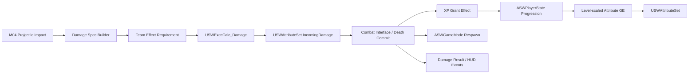
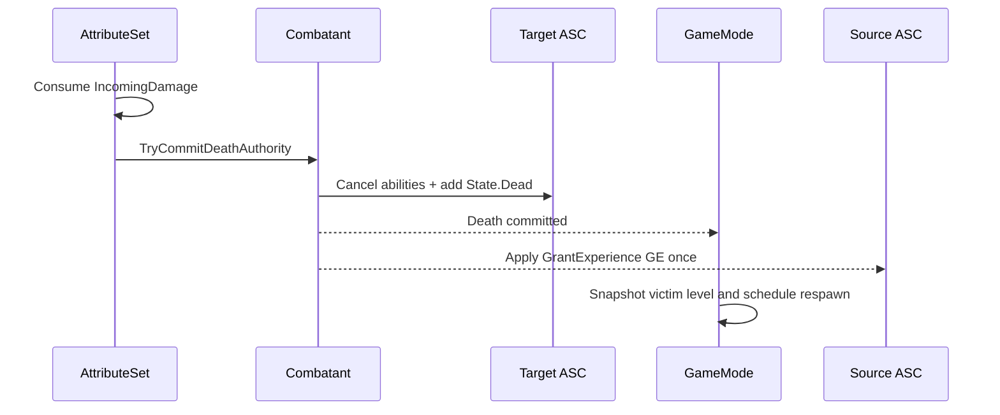

# M05 战斗生命循环设计文档

**状态：** Completed
**负责人：** `12456df`
**最后更新：** 2026-08-05
**建议分支：** `feature/m05-combat-lifecycle`
**建议提交：** `feat: add combat lifecycle`

## 1. 问题与目标

M04 已经提供服务器权威的固定武器、弹丸与命中事件，但命中尚未形成伤害、死亡、奖励和重生闭环。M05 需要在现有 PlayerState ASC、AI 自持 ASC、队伍枚举和 Weapon 弹药所有权不变的前提下，建立可被玩家、AI、小兵、塔和水晶复用的战斗生命循环，并给蓝图保留数值、资源和表现的高效配置空间。

M05 的最终可玩结果是：两个不同队伍的玩家在 Dedicated Server 上互相射击，服务器完成队伍校验、伤害计算、生命扣减、死亡、经验奖励、等级成长、按等级重生和短暂无敌；拥有者 HUD 能显示生命、蓝量、弹匣、经验和等级，攻击者能看到伤害数字。

## 2. 核心决策

### 2.1 C++ 与蓝图总边界

| 领域 | C++ 负责 | 蓝图/资产负责 |
|---|---|---|
| AttributeSet | 属性声明、复制、默认语义、上下限、Meta Attribute 消费 | 通过 GE/Curve 配置具体初始值和成长值 |
| 队伍 | `ESWTeamId` 真值、Team Tag 镜像、关系查询、GE 应用校验 | 为单位选择 Team、为 GE 选择目标策略 |
| 伤害 | Effect Spec 构建、属性捕获、公式执行、随机判定、权威结算 | 配置伤害 GE、基础伤害、成长系数、伤害类型和曲线 |
| 初始化 | ASC 生命周期、按等级应用等级基础属性 GE 与资源回满 GE、防重复和重生重置 | 创建等级基础属性与资源回满 GE 并填写曲线 |
| 等级/经验 | 总经验、跨多级结算、奖励一次性、复制与委托 | 配置等级阈值、每级奖励和单位击杀经验 |
| 死亡/重生 | 死亡幂等、Ability 取消、状态复制、服务器计时与 RestartPlayer | 死亡动画、布料/溶解、音效、VFX、镜头表现 |
| UI | WidgetController、只读数据绑定、初始快照、伤害数字 Client RPC | UMG 布局、样式、动画、颜色、数字飘动轨迹 |

蓝图不得直接写 Health、经验、等级、队伍、死亡状态、当前弹药或重生计时；C++ 不硬引用具体 Montage、Widget、音效、VFX 或角色美术资源。

### 2.2 Aura 参考的采用与收敛

采用：

- `ExecutionCalculation` 捕获 Source/Target Attribute，再输出 `IncomingDamage`。
- 等级基础属性与资源回满两类 Gameplay Effect 初始化；装备属性只由装备 Infinite GE 聚合。
- `CombatInterface` / `PlayerInterface` 的最小接口思路。
- WidgetController 订阅 ASC 和 PlayerState 委托，Widget 只消费事件。
- 被击杀单位按自身等级提供 `FScalableFloat` 经验奖励。

不直接照搬：

- 不在运行时动态创建 Debuff Gameplay Effect；Buff/Debuff 使用可审查的 GE 资产。
- 不依赖一个隐藏的常驻监听 Ability 转发经验；服务器直接向击杀者 ASC 应用原生 `USWGrantExperienceGameplayEffect`。
- 不让 AttributeSet 成为死亡、奖励、UI 和表现的总管理器；它只消费 Meta Attribute 并发出结构化结果。
- 伤害数字使用不可靠 Client RPC，丢失一条表现消息不影响权威状态。
- 不复制 Aura 的单机/课程项目假设；所有状态按 Dedicated Server 和晚加入场景设计。

### 2.3 “死亡受等级影响”的解释

M05 将该需求解释为：**玩家重生等待时间由死亡时的角色等级决定**。死亡判定本身仍然只由 Health 是否归零决定，不因等级改变。重生时间曲线由蓝图数据配置，服务器在死亡瞬间取一次快照，之后不回溯重算。

## 3. 范围与可测试需求

### 3.1 功能需求

- FR-01：`USWAttributeSet` 应新增 `MovementSpeedMultiplier` 和 `MagazineCapacityMultiplier`，两者无效果时均为 `1.0`。
- FR-02：移动速度乘数变化后，走路、疾跑和下蹲的有效速度应同步变化；服务端和自主代理不得长期分歧。
- FR-03：弹匣容量乘数变化后，Weapon 应重新计算有效容量；当前弹药仍由 `ASWWeapon` 唯一拥有。
- FR-04：每个可战斗单位应能查询唯一 `ESWTeamId`，ASC 同时拥有且只拥有一个对应的 `State.Team.*` Tag。
- FR-05：Gameplay Effect 应按 `SelfOnly`、`AlliesOnly`、`AlliesAndSelf`、`EnemiesOnly` 或 `Any` 目标策略决定是否应用。
- FR-06：M04 弹丸命中有效敌方 ASC 后，应由服务器创建伤害 Effect Spec 并执行 `USWExecCalc_Damage`。
- FR-07：伤害计算应支持物理、魔法和真实伤害，读取进攻、防御、穿透、暴击和物理吸血属性，并将最终值写入 `IncomingDamage`。
- FR-08：`IncomingDamage` 应一次性扣减 Health，产生一份结构化伤害结果；同一次致死命中只允许提交一次死亡。
- FR-09：玩家和 AI 应通过等级基础属性 GE 按当前等级初始化相关属性，并在首次生成和重生时通过资源回满 GE 初始化当前资源。
- FR-10：玩家总经验达到一个或多个等级阈值时，应在一次服务器结算中跨越相应等级并复制结果。
- FR-11：每个可击杀队伍单位应按自身单位配置和死亡时等级提供击杀经验；经验只授予合法击杀者一次。
- FR-12：玩家死亡后，GameMode 应按死亡等级计算重生延迟并在有效队伍出生点 `RestartPlayer`。
- FR-13：新 Pawn 应重新绑定旧 PlayerState ASC、恢复 Vital Attribute、生成新固定武器并应用短暂无敌效果，不重复授予已有 Ability。
- FR-14：拥有者战斗 HUD 应显示 Health/MaxHealth、Mana/MaxMana、Stamina/MaxStamina、三项每秒恢复值、当前/有效弹匣容量、总经验/本级进度和等级。
- FR-15：攻击者拥有者客户端应收到伤害数字载荷并在命中位置或目标上方播放本地 Widget 动画。
- FR-16：C++ 应提供最小 `Combat`、`Team` 和 `PlayerProgression` 接口，使后续玩家、AI、小兵、塔和水晶不依赖具体 Character 子类。
- FR-17：死亡、重生、队伍、等级和 HUD 绑定在重复 OnRep、Avatar 替换和晚加入时必须幂等。

### 3.2 非功能需求

- NFR-01：伤害、经验、死亡、重生、队伍和弹药容量裁决只在服务器执行。
- NFR-02：M05 不新增逐帧战斗 Manager、逐帧 UI 属性轮询或逐帧网络 RPC。
- NFR-03：所有平衡数值来自 GE、Data Asset、Curve Table、Weapon/Projectile Blueprint Defaults。
- NFR-04：原始 `.uasset` 继续由 Git LFS 管理；Runtime 代码不引入 Editor-only 依赖。
- NFR-05：单次伤害只能产生一次 Health 变化、一次死亡提交和至多一次击杀奖励。
- NFR-06：UI 不拥有 Gameplay State；Dedicated Server 不创建 Widget、WidgetComponent 或本地表现对象。
- NFR-07：Development Editor、Game、Server 三个 Target 必须构建通过。
- NFR-08：Staged Dedicated Server + 两个客户端必须完成敌我伤害、死亡、奖励、重生和 UI 验收。

### 3.3 边界情况

- EC-01：Source 或 Target 缺少 ASC、接口、有效 Avatar 或伤害配置时，本次效果安全失败并记录诊断。
- EC-02：`TeamId=None` 与任何单位均为 Neutral；除 `Any` 和合法 Self 目标外，不满足 Ally/Enemy 策略。
- EC-03：同队伤害 GE、敌方增益 GE 和不符合 Self 策略的 GE 必须在应用前被拒绝。
- EC-04：目标已死亡、处于 `State.Invulnerable` 或 Health 已为 0 时，后续伤害不再次触发死亡与经验。
- EC-05：攻击者为自己、环境、已销毁 Actor 或无玩家进度所有者时，不授予击杀经验。
- EC-06：伤害导致 Overkill 时，Health 最低为 0，伤害数字显示实际承受伤害而非未经截断的输入值。
- EC-07：弹匣容量降低到当前弹药以下时，服务器将当前弹药截断到新容量；M04 为无限备弹，因此不需要返还溢出弹药。
- EC-08：弹匣容量提高时不凭空填弹，只扩大下一次换弹可达到的上限。
- EC-09：移动速度乘数非法、NaN 或负值时按安全下限处理；定身使用专用状态 GE/Tag，而不依赖负速度。
- EC-10：一次经验可跨多级；等级表缺失、非递增或越界时拒绝升级并记录配置错误。
- EC-11：玩家在重生计时中退出、比赛结束或 Controller 失效时，GameMode 清理计时器且不生成孤儿 Pawn。
- EC-12：伤害数字 RPC 到达时目标已不相关或已销毁，客户端改在载荷中的世界坐标播放，不崩溃。
- EC-13：Pawn 重生后旧 ASC 的死亡 Tag、Avatar 引用、Widget/Weapon 委托不得残留。

### 3.4 明确不做

- M05 不实现护盾、格挡、Debuff 触发率、DOT、治疗削减、伤害反弹和助攻分配。
- M05 不实现命中扫描、服务器倒带和正式反作弊；这些属于 M06。
- M05 不实现主动技能目标选择、消耗和完整冷却管线；这些属于 M07。
- M05 不实现装备栏和装备实例；只验证一个测试 GE 能修改移动/弹匣乘数，正式装备接入属于 M08。
- M05 不实现完整商店、技能栏、计分板、结算界面和 UI 导航；这些仍属于 M14。
- M05 不实现 AI 行为树、兵线复活或对象池。

## 4. 数据所有权与依赖

| 状态/配置 | 唯一所有者 | 写入位置 | 读取者 |
|---|---|---|---|
| 玩家 TeamId | `ASWPlayerState` | `ASWGameMode` | Team 接口、ASC Tag 镜像、UI |
| AI/世界单位 TeamId | 对应战斗 Actor | Enemy 蓝图初始配置或服务器生成器 | Team 接口、ASC Tag 镜像 |
| Team Gameplay Tag | ASC 派生状态 | C++ 从 TeamId 镜像 | GE Requirement、Ability、表现 |
| 玩家 Level/Experience/AbilityPoints | `ASWPlayerState` | 服务器进度结算 | Attribute 初始化、HUD |
| AI/单位 CombatLevel | 对应战斗 Actor | 服务器生成/配置 | 初始化、击杀经验、伤害 |
| Attribute | `USWAttributeSet` / ASC | GE 与 Meta 消费 | CMC、Weapon、UI、ExecCalc |
| 当前弹匣弹药 | `ASWWeapon` | 服务器 Weapon | Ability、HUD |
| 有效弹匣容量 | Weapon Base Capacity × ASC Multiplier | 服务器计算，客户端只读同式 | Weapon、HUD |
| 死亡状态 | 可战斗 Actor 的 `bDead` | 服务器死亡提交 | ASC 派生 Tag、表现、GameMode |
| 重生计时 | `ASWGameMode` | 服务器 | 无客户端真值；UI 后续可读事件 |
| 初始属性/击杀经验 | `USWCombatantDefinition` | Data Asset | 初始化与死亡奖励 |
| 等级阈值/重生曲线 | `USWProgressionData` | Data Asset | PlayerState、GameMode、HUD |
| 伤害系数/防御基准 | `USWDamageCalculationConfig` | Data Asset | `USWExecCalc_Damage` |



依赖保持单向：Projectile 不写 Health；Widget 不写 Gameplay State；PlayerState 不操作 Widget；AttributeSet 不创建 Pawn；GameMode 不计算伤害。

## 5. AttributeSet 与移动/武器接入

### 5.1 新增与迁移

| 属性 | 默认语义 | GE 配置约定 | 消费者 |
|---|---|---|---|
| `MovementSpeedMultiplier` | `1.0` 表示基础速度 | Buff/Debuff 通常使用 Additive，如 `-0.30` 得到 `0.70` | `USWCharacterMovementComponent` |
| `MagazineCapacityMultiplier` | `1.0` 表示基础容量 | 装备 GE 通常使用 Additive，如 `+0.25` 得到 `1.25` | `ASWWeapon` |

现有 `MagazineCapacityBonusPercent` 的 `0 + Bonus` 语义迁移为 `MagazineCapacityMultiplier` 的 `1 × Multiplier` 语义。若已有 Blueprint/GE 序列化引用，实施时添加 Core Redirect 并逐项验证；当前没有生产装备 GE 时可直接迁移。

`MovementSpeedMultiplier`、`MagazineCapacityMultiplier` 与 `CriticalDamage` 的无修正基础值由 AttributeSet C++ 构造函数设为 `1.0`；它们不依赖初始化 GE，装备与临时 GE 在此基础上聚合。即使内容资产漏配，也不能让角色速度、弹匣容量或暴击倍率意外归零。

计算规则：

```text
EffectiveGroundSpeed =
    MovementModeBaseSpeed × max(MovementSpeedMultiplier, SafeMinimum)

EffectiveMagazineCapacity =
    max(1, floor(BaseMagazineCapacity × max(0, MagazineCapacityMultiplier)))
```

`WalkSpeed`、`SprintSpeed`、`CrouchSpeed` 仍由 Character Blueprint Defaults 配置。Multiplier 只修正它们，不替代 CMC 的 SavedMove、预测和服务器校验。

### 5.2 变化通知

- CMC 在 `GetMaxSpeed()` 中读取当前 ASC Snapshot，不新增 Tick Delegate。
- Weapon 在生成后订阅 `MagazineCapacityMultiplier` 变化；只在属性实际变化时由服务器截断弹药并广播 Ammo View。
- HUD 同时订阅当前弹药和容量乘数；不在 Widget Tick 中计算。
- PlayerState ASC 替换 Avatar 时重新建立 Character/Weapon 的委托，旧委托必须对称解除。

### 5.3 属性语义在 M05 固化

- `CriticalChance`：`0..1` 的概率。
- `CriticalDamage`：最终暴击倍率，合法值不小于 `1`。
- `PhysicalLifesteal`：`0..1`，只按最终物理伤害计算。
- `PhysicalPenetrationPercent` / `MagicalPenetrationPercent`：`0..1` 的百分比穿透；不直接修改目标防御。
- `PhysicalPenetrationFlat` / `MagicalPenetrationFlat`：百分比穿透后扣减的固定穿透值；不在 AttributeSet 层施加数值约束。
- `FireIntervalReductionPercent`：`0..1`，沿用 M04。
- `AbilityRangeBonusPercent` / `AbilityDurationBonusPercent` / `CooldownReductionPercent`：均以 `0` 表示无修正；字段名明确其百分比增减语义。

具体默认数值和安全上限由初始化 GE 与 `USWDamageCalculationConfig` 配置，不写死在伤害函数中。

## 6. 队伍 Tag 与 Gameplay Effect 目标策略

### 6.1 TeamId 与 Team Tag

新增 Native Gameplay Tags：

| Tag | 含义 |
|---|---|
| `State.Team.None` | 尚未分队或中立 |
| `State.Team.TeamA` | Team A |
| `State.Team.TeamB` | Team B |

`ESWTeamId` 是唯一真值，Team Tag 是 ASC 上的派生查询状态。玩家的真值位于 `ASWPlayerState`；AI/世界单位的真值位于对应 Actor。`ASWCharacter_Enemy` 将 `TeamId` 复制给客户端，`TeamA`/`TeamB` 分别用于双方小兵，`None` 专门表示中立野怪。具体 Enemy 蓝图只能选择初始 TeamId；运行时改队仅能由服务器调用 `SetTeamIdAuthority`。`USWAbilitySystemComponent::SetTeamIdTagAuthority` 先移除三个 Team Tag，再以 `TagOnly` 复制方式添加一个对应 Tag。内容蓝图没有直接增删 Team Tag 的写入口。

关系规则：

```text
同一 Actor                         -> Self
两个有效且相同的 TeamA/TeamB      -> Ally
TeamA 与 TeamB                    -> Enemy
任意一侧为 None/缺失              -> Neutral
```

### 6.2 Effect Target Policy

当前 `USWGameplayEffect` 已提供 `AreSourceAndTargetOnSameTeam` 与 ASC 版本的同队查询：优先从两个 ASC 的 Owner，再从 Avatar 上的 `ISWTeamInterface` 读取 `ESWTeamId`；只有相同且不为 `None` 才返回 `true`。因此 PlayerState ASC、Enemy 自持 ASC 以及后续塔/水晶都可复用同一查询。Damage、Buff、Debuff 均可复用该只读查询；完整 `Target Policy` 与 Application Requirement 在下一步接入此函数。

`USWGameplayEffect` 新增 `ESWEffectTargetPolicy` Class Default：

- `Any`
- `SelfOnly`
- `AlliesOnly`
- `AlliesAndSelf`
- `EnemiesOnly`

`USWGameplayEffect` 的 C++ 构造函数自动添加 UE 5.7 的 `UCustomCanApplyGameplayEffectComponent` 和 `USWTeamEffectApplicationRequirement`。Requirement 从 Source/Target ASC 查询 Team Tag，并调用唯一的关系函数。

所有项目 Gameplay Effect 必须派生自 `USWGameplayEffect`。伤害 GE 默认 `EnemiesOnly`；自我初始化 GE 使用 `SelfOnly`；友军 Buff 使用 `AlliesAndSelf` 或 `AlliesOnly`。`USWExecCalc_Damage` 再调用同一关系函数做防御性早退，避免误用原生 `UGameplayEffect` 时出现友伤。

`State.Invulnerable` 不依赖队伍策略。重生无敌 GE 使用 `UImmunityGameplayEffectComponent` 阻止带 `Effect.Damage` Asset Tag 的效果。

## 7. 伤害系统

### 7.1 数据配置

`FSWDamageChannelSpec`：

| 字段 | 类型 | 蓝图用途 |
|---|---|---|
| `DamageType` | `FGameplayTag` | `Damage.Type.Physical/Magical/True` |
| `BaseMagnitude` | `FScalableFloat` | 按 Effect Level 取基础伤害 |
| `AttackPowerCoefficient` | `float` | 攻击力成长 |
| `SpellPowerCoefficient` | `float` | 法强成长 |
| `bCanCritical` | `bool` | 本通道是否参与同一次暴击判定 |

`FSWDamageConfig`：

- `DamageEffectClass`：`USWDamageGameplayEffect` Blueprint 子类。
- `Channel`：一次伤害结算只配置一个物理、魔法或真实伤害通道；若未来需要混合伤害，则拆分为多次独立结算，而不引入 Mixed 类型。
- 后续 M06 可扩展命中区域倍率、爆头和射线数据，但不改变 M05 Apply Contract。

`USWDamageGameplayEffect` 的 Blueprint Class Default 持有一个 `FSWDamageChannelSpec` 与 `USWDamageCalculationConfig`：前者定义单一伤害通道的 `FScalableFloat` 基础值、攻击力/法强系数和暴击资格，后者定义全局防御与暴击安全边界。Projectile 后续只选择该 Damage Effect Class 并以攻击者等级创建 Spec；蓝图不手工构造 Effect Spec。

### 7.2 Native Tags

```text
Damage.Type.Physical
Damage.Type.Magical
Damage.Type.True
Effect.Damage
SetByCaller.Damage.Physical.Base
SetByCaller.Damage.Physical.AttackCoefficient
SetByCaller.Damage.Physical.SpellCoefficient
SetByCaller.Damage.Magical.Base
SetByCaller.Damage.Magical.AttackCoefficient
SetByCaller.Damage.Magical.SpellCoefficient
SetByCaller.Damage.True.Base
SetByCaller.Damage.True.AttackCoefficient
SetByCaller.Damage.True.SpellCoefficient
SetByCaller.Experience
State.Dead
State.Invulnerable
Ability.Behavior.SurviveDeath
Event.Combat.DamageResolved
Event.Combat.Death
GameplayCue.Combat.Hit
GameplayCue.Combat.Death
```

### 7.3 ExecCalc 公式

`USWExecCalc_Damage` 捕获：

- Source：`AttackPower`、`SpellPower`、`PhysicalPenetrationPercent`、`MagicalPenetrationPercent`、`PhysicalPenetrationFlat`、`MagicalPenetrationFlat`、`CriticalChance`、`CriticalDamage`、`PhysicalLifesteal`。
- Target：`PhysicalArmor`、`MagicalArmor`。
- Source/Target：聚合 Gameplay Tags 和 Combat Level。

每个通道先计算：

```text
RawDamage =
    BaseMagnitude(Level)
    + AttackPower × AttackPowerCoefficient
    + SpellPower × SpellPowerCoefficient
```

防御计算：

```text
PhysicalArmorAfterPercent = max(0, PhysicalArmor × (1 - PhysicalPenetrationPercent))
MagicalArmorAfterPercent  = max(0, MagicalArmor  × (1 - MagicalPenetrationPercent))

EffectivePhysicalArmor = max(0, PhysicalArmorAfterPercent - PhysicalPenetrationFlat)
EffectiveMagicalArmor  = max(0, MagicalArmorAfterPercent  - MagicalPenetrationFlat)

PhysicalDamageReduction = EffectivePhysicalArmor / (EffectivePhysicalArmor + Config.PhysicalArmorMitigationHalfPoint)
MagicalDamageReduction  = EffectiveMagicalArmor  / (EffectiveMagicalArmor  + Config.MagicalArmorMitigationHalfPoint)

PhysicalAfterDefense = PhysicalRaw × (1 - PhysicalDamageReduction)
MagicalAfterDefense  = MagicalRaw  × (1 - MagicalDamageReduction)
TrueAfterDefense     = TrueRaw
```

`PhysicalArmorMitigationHalfPoint` / `MagicalArmorMitigationHalfPoint` 是正数；当有效护甲等于对应基准时，减伤为 50%。该有理函数严格小于 100% 减伤，并具有边际递减：护甲越高，每一点护甲增加的减伤越少。`USWDamageGameplayEffect` Blueprint Class Default 显式引用该配置和单一通道定义，ExecCalc 从 `Spec.Def` 取得它们；不通过全局查找或任意访问 GameMode。

暴击：

- 同一次 Effect Spec 只进行一次服务器随机判定。
- `Chance = clamp(CriticalChance, 0, Config.MaxCriticalChance)`。
- 判定成功时，仅带 `bCanCritical` 的通道乘 `max(1, CriticalDamage)`。
- 暴击结果写入 `FSWGameplayEffectContext`，客户端不自行重掷。

最终伤害：

```text
FinalDamage = max(0, Physical + Magical + True)
```

ExecCalc 只输出对 `IncomingDamage` 的 Additive Modifier。它不直接调用 Death、GameMode、Widget 或 PlayerState。`USWAttributeSet` 仅在服务器的 `PostGameplayEffectExecute` 消费该 Meta Attribute：将其清零后一次性扣减真实 `Health`。因此所有 Damage GE 都只能改变目标的 `IncomingDamage`，不能直接修改 `Health`。

物理吸血在最终物理伤害大于 0 且 Source 仍存活时，以 `min(最终物理伤害, AppliedDamage) × PhysicalLifesteal` 为治疗量，通过独立的服务器治疗 GE 回写 Source Health；不直接调用 `SetHealth`。

### 7.4 Damage Result

扩展 `FSWGameplayEffectContext`，至少序列化：

- `bCriticalHit`
- `DamageType`（每份伤害结果只对应一个物理、魔法或真实伤害类型）

首版伤害数字的 `WorldLocation` 从目标 Avatar 的当前世界坐标取得；精确命中点在需要命中部位差异化表现时再随投射物命中数据接入 Context。

AttributeSet 消费 `IncomingDamage` 后，计算：

- `RequestedDamage`
- `AppliedDamage = min(RequestedDamage, HealthBefore)`
- `HealthBefore` / `HealthAfter`
- `bFatal`

随后从 `FSWGameplayEffectContext` 读取 `bCriticalHit` 与 `DamageType`，并组装仅供表现使用的 `FSWDamageNumberPayload`：

- `AppliedDamage`
- `bCritical`
- `DamageType`
- `TargetActor`（可空）
- `WorldLocation`

首版不额外建立仅供一次性转发使用的 `FSWDamageResult` 类型；`AppliedDamage` 同时用于伤害数字和吸血，避免 Overkill 产生额外收益。

## 8. 等级、初始属性与击杀经验

### 8.1 数据资产

`USWCombatantDefinition`（每类战斗单位配置）：

- `LevelAttributesEffect`
- `VitalAttributesEffect`
- `XPRewardByLevel`
- `RespawnInvulnerabilityEffect`（玩家可用）
- `CorpseLifetimeSeconds`（非玩家可用）

`USWProgressionData`（全局玩家成长配置）：

- 按等级升序的 `FSWLevelProgressionEntry`
  - `RequiredTotalExperience`
  - `AbilityPointReward`
- `RespawnDelayByLevel`
- 最大等级由最后一条有效记录决定。

`USWDamageCalculationConfig`：

- 物理/魔法护甲减伤 50% 基准值。
- 暴击概率安全上限。
- 移动乘数安全下限/上限。
- 伤害结算需要的其他全局安全边界。

### 8.1.1 当前使用入口

- `ASWCharacter_Base` 暴露只读的 `CombatantDefinition` 槽位；Player/Enemy 在服务器完成 ASC 的 Owner/Avatar 绑定后，按自身等级应用 `LevelAttributesEffect`，并在首次生成/重生时应用 `VitalAttributesEffect`。玩家等级只从 `ASWPlayerState` 读取，AI 等级只由 AI Character 持有。
- `ASWGameMode` 持有本局唯一的 `ProgressionData` 槽位，并在 BeginPlay 写入已复制的 `ASWGameState`。`ASWPlayerState::AddExperienceAuthority` 仅在服务器读取它，按累计经验结算最终等级、逐级累计技能点奖励，并先写入最终 Level/XP/AbilityPoints 再广播委托；客户端 HUD 只读取复制状态，不能各自选择 Data Asset。
- `USWDamageCalculationConfig` 暂不设置全局运行时入口；它只能由后续伤害 GE 的 CDO 显式引用，并由 `USWExecCalc_Damage` 从 Effect Spec 读取。这避免伤害公式依赖 GameMode 或全局查找。

### 8.2 两类初始化 GE

| GE | 责任 | 推荐 Policy |
|---|---|---|
| Level Attributes | Max Resource、攻击、防御、穿透、暴击等按等级变化的基础属性 | Instant + Override |
| Vital | 将 Health/Mana/Stamina 初始化到当前 Max | Instant + Override |

所有初始化 GE 的 Spec Level 等于 `GetCombatLevel()`，Context SourceObject 为当前 Combatant。C++ 验证 Effect Class、Spec Handle、Level 和 ASC 后按顺序应用。

PlayerState ASC 跨重生存在，因此规则是：

- 首次生成：Level Attributes → Vital。
- 等级变化：记录资源比例 → Level Attributes → 按比例恢复当前资源；默认不因升级免费回满。
- 重生：Level Attributes → Vital，明确回满当前资源。
- 重复调用：Level Attributes 使用 Override，结果幂等；Vital 只在首次生成和重生入口调用。
- 不随等级变化的属性保持 AttributeSet 默认值，或仅由装备 Infinite GE 聚合；初始化流程不为其创建第二类派生 GE。

### 8.3 XP 奖励与升级

死亡提交成功后：

1. 从被击杀单位 `USWCombatantDefinition::XPRewardByLevel` 读取死亡等级对应经验。
2. 确认 Source ASC、击杀者 PlayerState 和敌对关系仍然有效。
3. 创建 `USWGrantExperienceGameplayEffect` 的 Spec，通过 `SetByCaller.Experience` 写入奖励。
4. Source AttributeSet 消费 `IncomingXP`，调用 PlayerState 的 `AddExperienceAuthority` 服务器进度接口。
5. PlayerState 以总经验查 `USWProgressionData`，一次跨越多级并广播一次最终状态和逐级奖励总和。
6. 当前 Player Avatar 在服务器收到 `OnLevelChanged` 后，按升级前的 Health/Mana/Stamina 比例重新应用等级属性；升级不免费回满资源。

自杀、同队、环境来源缺失和重复死亡均不奖励。M05 不做助攻分配；后续若增加助攻，扩展奖励协调层而不修改 Damage ExecCalc。

## 9. 最小 Interaction 接口

### 9.1 `ISWTeamInterface`

只读查询：

```cpp
ESWTeamId GetTeamId() const;
```

PlayerState、玩家 Character 转发层、AI 和未来世界单位实现。写入仍由各自权威所有者控制。

### 9.2 `ISWCombatInterface`

稳定查询：

```cpp
int32 GetCombatLevel() const;
bool IsDead() const;
const USWCombatantDefinition* GetCombatantDefinition() const;
FVector GetCombatSocketLocation(FGameplayTag SocketTag) const;
FSWOnDeath& GetOnDeathDelegate();
```

权威 C++ Contract：

```cpp
bool TryCommitDeathAuthority(const FSWDeathContext& Context);
```

前置条件：服务器、尚未死亡、有效 ASC/Avatar。
后置条件：恰好一次把 `bDead` 设为 true、添加 `State.Dead`、取消不允许跨死亡存活的 Ability、广播死亡事件。重复调用返回 false 且无副作用。

不把死亡写函数暴露为任意 BlueprintCallable。蓝图只接收 `BP_OnDeathStateChanged`、`BP_PlayDeathPresentation` 等表现事件。

### 9.3 `ISWPlayerProgressionInterface`

由 `ASWPlayerState` 实现：

```cpp
int32 FindLevelForExperience(int32 TotalExperience) const;
void AddExperienceAuthority(int32 Delta);
int32 GetExperience() const;
int32 GetPlayerLevel() const;
```

写入口仅供服务器 C++/可信 GE 消费路径调用。Character 通过 ASC OwnerActor 查 PlayerState，不复制 Aura 中 Character 再转发一层的写接口。

### 9.4 不创建的接口

M05 不复制 Aura 的 `EnemyInterface` 高亮接口，也不把 Hit React、血液 Niagara、武器 Mesh、召唤物计数等无关职责塞进 `ISWCombatInterface`。这些内容在首次出现真实消费者时再新增专用契约。

## 10. 死亡、重生与无敌

### 10.1 服务器死亡提交



死亡时 C++：

- 设置并复制 `bDead`。
- 添加派生 `State.Dead` Tag。
- 取消 Fire/Aim/Reload/Sprint 和其他未标记 `Ability.Behavior.SurviveDeath` 的 Ability。
- 禁止 Movement、Pawn 输入和新的伤害应用。
- 玩家固定武器停止权威射击；随旧 Pawn 生命周期销毁。
- 广播 `FSWDeathContext`，包含 Source、Target、Effect Context、死亡等级和位置。
- 玩家击杀调用现有 `ASWGameMode::ReportTeamKill`；非玩家单位不计入玩家击杀分数。

蓝图表现：

- 选择 Death Montage、Ragdoll、溶解、音效、VFX 和镜头。
- 不决定是否死亡、不启动重生计时、不授予经验。

### 10.2 玩家重生

`ASWGameMode::HandlePlayerDeathAuthority`：

1. 用 `USWProgressionData::RespawnDelayByLevel` 在死亡时计算延迟。
2. 记录 Controller 对应 Timer Handle。
3. Timer 到期前重新验证比赛状态、Controller、PlayerState 和 TeamId。
4. 销毁/回收旧 Pawn，调用 `RestartPlayer`。
5. 新 Pawn `PossessedBy` 完成 ASC Avatar 重绑。
6. 清理旧 `State.Dead`，应用等级基础属性与资源回满 GE、重生无敌 GE，并生成新固定武器。

重生无敌效果由 Blueprint GE 配置 Duration、`State.Invulnerable` 和对 `Effect.Damage` 的 Immunity。表现可用 Gameplay Cue；C++ 不维护第二个无敌倒计时。

### 10.3 复制与晚加入

- `bDead` 作为 Pawn 持久状态复制，`OnRep_Dead` 幂等应用表现。
- `State.Dead`、`State.Invulnerable` 通过 GAS Tag/Effect 复制供 Ability 和 Anim 查询。
- 死亡不是只发 Multicast；晚加入者依据当前复制状态恢复表现。
- Damage Number 是瞬时表现，晚加入不补发。

## 11. UI 设计

### 11.1 Combat Overlay

在 `UI/WidgetController/Overlay/` 下新增三个只读 Controller，均复用现有 `USWWidgetController` 与 `USWUserWidget` 注入契约：

- `USWAttributeOverlayWidgetController`：订阅 PlayerState ASC 的 Health/MaxHealth、Mana/MaxMana、Stamina/MaxStamina 及三项每秒恢复值属性变化。
- `USWWeaponOverlayWidgetController`：订阅本地 PlayerController 的 Pawn 更换、Player Character 的 CurrentWeapon 更换，以及拥有者复制的弹匣变化；快照同时携带武器配置的 HUD 图标软引用，控制器在首次快照时完成本地解析；重生后自动重新绑定。
- `USWProgressionOverlayWidgetController`：订阅 PlayerState 的 Level/Experience 复制委托，并用已复制的 `ProgressionData` 计算本级经验条。

广播数据：

| Delegate/Payload | 数据源 |
|---|---|
| `OnHealthChanged(Current, Max)` | ASC Attribute Delegate |
| `OnManaChanged(Current, Max)` | ASC Attribute Delegate |
| `OnAmmoChanged(Current, Capacity, bInfiniteReserve)` | 当前 Weapon + Magazine Multiplier |
| `OnExperienceChanged(Total, CurrentLevelStart, NextLevel, Percent)` | PlayerState + ProgressionData |
| `OnLevelChanged(Level)` | PlayerState |
| `OnDeathStateChanged(bDead)` | 当前 Pawn |

`ASWHUD` 分别缓存并提供上述三个 Controller；每个 Controller 在注入依赖后先广播完整初始快照，随后只响应委托。客户端 `PlayerState` 可能晚于 HUD 创建，`ASWPlayerController::OnRep_PlayerState` 与 `BeginPlayingState` 会要求 HUD 对已缓存控制器重新注入依赖、重绑并重发初始快照。Dedicated Server 和远端非本地 HUD 不创建它们。

Blueprint Widget 负责：

- Health/Mana ProgressBar、文本和低血量动画。
- 弹匣数字及无限备弹符号。
- XP 条、等级文本和升级动画。
- 布局、颜色、字体、响应式尺寸。

M05 的“血条”指拥有者主 HUD 生命条。敌人头顶血条不是本模块完成门槛；若首轮玩法验证确实需要，可复用同一个只读数据 Payload 制作轻量 `WBP_WorldHealthBar`，但不得反向扩大 C++ 契约。

### 11.2 伤害数字

服务器在伤害结算后向攻击者 `ASWPlayerController` 调用：

```cpp
ClientShowDamageNumber(FSWDamageNumberPayload Payload); // Unreliable
```

Payload：

- `AppliedDamage`
- `bCritical`
- `DamageType`
- `TargetActor`（可空）
- `WorldLocation`

客户端本地创建 `USWDamageTextComponent` 或 `WBP_DamageNumber`，蓝图决定颜色、字号、暴击样式、飘动和淡出。Dedicated Server 不加载或创建该对象。首版不建立对象池；只有性能数据证明需要时再增加。

## 12. 关键公开契约

| 所有者 | API/事件 | 输入 | 输出/副作用 | 前置条件 | 后置条件 |
|---|---|---|---|---|---|
| ASC | `SetTeamIdTagAuthority` | TeamId | 替换派生 Team Tag | Authority | 恰好一个 Team Tag |
| Team Library | `GetRelationship` | Source/Target | Self/Ally/Enemy/Neutral | 可为空 | 纯函数、无副作用 |
| GE Requirement | `CanApplyGameplayEffect` | Spec/Target ASC | bool | `USWGameplayEffect` | 不合策略无 Effect 副作用 |
| Damage Helper | `ApplyDamageEffectAuthority` | SourceASC、TargetASC、Config、Hit | Active Handle/失败 | Authority、敌对、目标存活 | 成功时恰好应用一个伤害 Spec |
| ExecCalc | `Execute_Implementation` | Captures + Spec | `IncomingDamage` Modifier | 有效 Config | 不直接写其他系统 |
| AttributeSet | `ConsumeIncomingDamage` | Callback Data | Health 结算、伤害数字 Payload、死亡提交 | Authority | IncomingDamage 清零、Health 合法 |
| Combatant | `TryCommitDeathAuthority` | Death Context | bool | Authority | 首次成功一次，重复无副作用 |
| PlayerState | `AddExperienceAuthority` | 正经验 | Level/XP/AbilityPoints 最终状态 | Authority、有效表 | 支持跨多级并逐级累计奖励 |
| GameMode | `HandlePlayerDeathAuthority` | Controller、Death Context | Respawn Timer | Authority | 一个 Controller 至多一个 Timer |
| HUD | `GetAttribute/Weapon/ProgressionOverlayWidgetController` | 本地依赖 | 三个 Controller | Local Controller | 分别缓存、绑定幂等 |
| PlayerController | `ClientShowDamageNumber` | Payload | 本地表现 | Server → Owner | 不修改 Gameplay State |

## 13. 精简实施顺序

本模块不再维护额外的多人流程表；以下清单就是开发顺序和验收入口。

### Step 1：数据与 Tag

C++：

- `AbilitySystem/SWAttributeSet.*`
- `GameplayTags/SWGameplayTags.*`
- `Team/SWTeamTypes.h`
- `AbilitySystem/Data/SWCombatantDefinition.*`
- `AbilitySystem/Data/SWProgressionData.*`
- `AbilitySystem/Data/SWDamageCalculationConfig.*`

资产：

- `DA_SW_Progression`
- `DA_SW_DamageCalculation`
- 首个玩家与测试 AI 的 `DA_SW_Combatant_*`

验证：默认乘数为 1；TeamId 与 Team Tag 一致；非法 Data Asset 可诊断。

### Step 2：GE 初始化与等级

C++：

- ASC 初始化 Helper。
- Player/AI 按 Combat Level 应用等级基础属性 GE，并在首次生成或重生时应用资源回满 GE。
- PlayerState 完成总经验、跨级、奖励与委托。

资产：

- `GE_Attributes_Primary_*`
- `GE_Attributes_Vital`
- `USWGrantExperienceGameplayEffect`（原生，无需 Blueprint 配置）

验证：1 级/测试高等级属性不同；重生不叠加；一次经验可跨多级。

### Step 3：Team Policy 与伤害

C++：

- `SWGameplayEffect` Target Policy。
- `SWTeamEffectApplicationRequirement`。
- `SWDamageGameplayEffect`、`SWExecCalc_Damage`、Damage Helper。
- `FSWGameplayEffectContext` 扩展与序列化。
- Projectile Damage Config 接入。

资产：

- `GE_Damage_Default`
- 物理/魔法/真实伤害测试配置。

验证：同队不受伤，敌队按三种类型结算；暴击只由服务器决定；Overkill 正确。

### Step 4：死亡、奖励与重生

C++：

- `Interaction/SWCombatInterface.*`
- `Interaction/SWTeamInterface.*`
- `Interaction/SWPlayerProgressionInterface.*`
- `ASWCharacter_Base` 死亡状态与表现事件。
- `ASWGameMode` 服务器重生 Timer。

资产：

- Death Montage/VFX/SFX。
- `GE_RespawnInvulnerability`。

验证：死亡一次、奖励一次、按等级延迟、原队出生、新 Pawn/Weapon/ASC 正确。

### Step 5：移动/弹匣 Buff 验证

资产：

- `GE_Test_Slow`
- `GE_Test_MagazineCapacity`

验证：慢速对 Walk/Sprint/Crouch 生效；容量增减遵守截断/不免费填弹规则；客户端无长期分歧。

### Step 6：Combat HUD 与伤害数字

C++：

- `UI/WidgetController/Overlay/SWAttributeOverlayWidgetController.*`
- `UI/WidgetController/Overlay/SWWeaponOverlayWidgetController.*`
- `UI/WidgetController/Overlay/SWProgressionOverlayWidgetController.*`
- `UI/Widget/SWDamageTextComponent.*`
- `ASWHUD` / `ASWPlayerController` 接入。

资产：

- `WBP_CombatOverlay`
- `WBP_DamageNumber`

验证：无 Tick 轮询；重生后重新绑定；DS 无 Widget；攻击者看到正确数字。

### Step 7：构建与 DS 验收

- 构建 Development Editor、Game、Server。
- Staged DS + TeamA/TeamB 两个外部客户端。
- 执行第 14 节验收矩阵。
- 同步路线图、项目上下文和完成记录。

### 13.1 当前 C++ 实现记录（2026-08-01）

- `USWDamageGameplayEffect` 的蓝图子类配置单一伤害通道、等级缩放基础伤害、攻击力/法强系数、暴击资格和 `USWDamageCalculationConfig`。
- `FSWProjectileConfig` 显式持有 `DamageEffectClass`；服务器弹丸仅在命中具有 ASC 的目标后，通过源 `USWAbilitySystemComponent::ApplyDamageEffectToTargetAuthority` 创建并应用 Spec。不同武器/弹丸以不同 GE 蓝图配置伤害，不在弹丸 C++ 中写死手枪、步枪或狙击枪数值。
- `ISWCombatInterface` 目前提供等级与死亡查询，`ISWTeamInterface` 提供队伍真值查询；Projectile 与 Gameplay Effect 使用接口，不依赖 Player/Enemy 的具体类转换。
- 弹丸沿用服务器 `OnComponentHit` 阻挡命中路径，不额外引入会重复结算的 Overlap 路径；蓝图应配置 Collision Sphere 产生阻挡 Hit。

### 13.2 当前 C++ 实现记录（2026-08-04）

- `ISWCombatInterface` 新增仅 C++ 可调用的 `TryCommitDeathAuthority` 与 `GetOnDeathDelegate` 契约；接口不保存死亡状态，也不向 Blueprint 暴露权威写入口。
- `ASWCharacter_Base` 以复制的 `bDead` 保存唯一死亡真值。`USWAttributeSet::ConsumeIncomingDamage` 将 Health 扣至 0 后，从 GE Context 组装 `FSWDeathContext` 并请求 Avatar 提交死亡；重复伤害由 `bDead` 幂等拒绝。
- 首次死亡提交会添加可复制的 `State.Dead`、取消未标记 `Ability.Behavior.SurviveDeath` 的活动 Ability、停止 CharacterMovement，并清空后续 Ability 输入。所有 `USWGameplayAbility` 派生 Ability 还在 `CanActivateAbility` 统一拒绝带有该 Tag 的 Avatar，避免死后重新激活。
- `OnRep_Dead` 与服务器首次提交统一调用 `BP_OnDeathStateChanged`。布娃娃、碰撞切换、死亡特效和音效由角色 Blueprint 实现；Dedicated Server 不模拟该纯视觉表现。精确骨骼物理不同步，后续如需同步尸体姿态再单独设计。

### 13.3 当前 C++ 实现记录（2026-08-04，玩家重生）

- `FSWDeathContext` 补充 `VictimActor`，使 GameMode 可从死亡事件精确定位死亡 Pawn；野怪/小兵生命周期尚未接入。
- `ASWGameMode` 在 `WaitingToStart` 与 `InProgress` 中监听玩家 Pawn 的 `OnDeath`，按 `USWProgressionData::RespawnDelayByLevel` 为每名 Controller 维护唯一服务器 Timer。玩家退出会清理其 Timer；仅赛后等不可玩阶段拒绝重生。
- Timer 到期后销毁旧 Pawn、清理 PlayerState ASC 的 `State.Dead`、调用 `RestartPlayer`，由新 Pawn 的既有 `PossessedBy` 流程重绑 ASC、恢复 Vital 属性并生成固定武器；随后应用 `CombatantDefinition` 配置的重生无敌 GE。
- 重生倒计时 UI、野怪出生点 Spawner 与兵营波次生成不属于本轮实现。准备阶段允许正常移动、战斗与重生；准备区边界及“正式开局后才能离开”的限制属于后续独立系统，当前不实现。

### 13.4 当前 C++ 实现记录（2026-08-04，经验与升级）

- `USWGrantExperienceGameplayEffect` 是统一的瞬时经验 GE；仅以 `SetByCaller.Experience` 写入 `IncomingXP`，不含任何具体奖励数值。
- `ASWCharacter_Base` 只在首次成功提交死亡后结算一次击杀经验：环境来源、自杀、同队伤害和无奖励配置均不发放；被击杀单位的 `XPRewardByLevel` 仍由其 `CombatantDefinition` 数据资产决定。
- `USWAttributeSet` 消费 `IncomingXP` 后通过 `ISWPlayerProgressionInterface` 提交给 PlayerState；`ASWPlayerState` 是等级、累计经验、技能点和跨级奖励的唯一服务器写入者，并复制最终状态给客户端。

## 14. 验收矩阵

| 需求 | 验证 |
|---|---|
| FR-01～03 | 测试 GE 修改 Movement/Magazine Multiplier；验证三种移动速度、容量变化和弹药规则 |
| FR-04～05 | TeamA/TeamB/None Tag 检查；Self/Ally/Enemy/Neutral 的 GE 应用表 |
| FR-06～08 | Projectile 命中物理/魔法/真实目标；检查捕获、穿透、暴击、Overkill 和死亡幂等 |
| FR-09～10 | 玩家/AI 多等级初始化；一次 XP 跨多级；重生与升级资源策略 |
| FR-11 | 击杀不同等级单位得到不同 XP；自杀、同队、重复死亡无奖励 |
| FR-12～13 | 两个等级的玩家死亡延迟不同；原队重生；ASC 不变、Avatar/Weapon 更新、无敌到期 |
| FR-14 | Health/Mana/Ammo/XP/Level 初始快照与变化事件正确 |
| FR-15 | 攻击者伤害数字、暴击样式、目标销毁回退位置 |
| FR-16～17 | 玩家/AI 接口复用；重复 OnRep、Pawn 替换和晚加入无重复副作用 |
| NFR-01～06 | Authority/Blueprint 审查、RPC 审查、无 UI Tick、无跨系统直接写 |
| NFR-07～08 | 三 Target 构建 + Staged DS 双客户端录像/日志 |

### 14.1 Dedicated Server 场景

1. TeamA 与 TeamB 各加入一个客户端，确认 PlayerState TeamId 和 ASC Team Tag。
2. 同队测试 GE 被拒绝，敌队伤害生效；`State.Invulnerable` 阻止伤害。
3. 分别验证物理、魔法、真实伤害和至少一次强制暴击测试。
4. 验证伤害数字等于 Applied Damage，Overkill 不显示超额伤害。
5. 击杀低/高等级测试单位，确认 XP 按被击杀者等级变化。
6. 一次授予跨级 XP，确认等级、Attribute、HUD 和 AbilityPoints 结果一致。
7. 两个不同等级玩家死亡，确认重生延迟曲线、队伍出生点和新固定武器。
8. 重生后确认旧 ASC Owner 不变、新 Avatar 正确、Death Tag 清理、无敌到期。
9. 在目标已死亡时追加命中，确认无二次 XP、Team Kill 或重生 Timer。
10. 在死亡/重生中途退出，并以第三客户端晚加入，确认无孤儿 Pawn 和错误表现。

## 15. 蓝图交付清单

实施 C++ 后，需要在编辑器完成：

- 每个战斗单位 Blueprint 指定 `USWCombatantDefinition` 和必要死亡表现。
- 等级基础属性与资源回满 GE 的 Modifier、Curve 和 Duration Policy。
- `GE_Damage_Default` 选择 `USWExecCalc_Damage`、`EnemiesOnly` 和 `Effect.Damage`。
- 无需创建 `GE_GrantXP` 蓝图；原生 `USWGrantExperienceGameplayEffect` 已固定将 `SetByCaller.Experience` 写入 `IncomingXP`。
- `GE_RespawnInvulnerability` 配置 Duration、`State.Invulnerable` 和 Damage Immunity。
- Projectile Blueprint 填写 Damage Config。
- `WBP_CombatOverlay` 绑定 WidgetController Delegate。
- `WBP_DamageNumber` 实现普通/暴击/伤害类型样式和结束后自销毁。
- 测试 Slow 与 Magazine Capacity GE。

蓝图资产没有完成并通过 DS 验收前，M05 不得标记为 Completed。

## 16. 待确认的平衡数据

以下不阻塞架构，但进入实现验证前必须在资产中给出测试值：

- 1 级和首个高等级测试点的全套 Attribute。
- 物理/魔法防御倍率曲线。
- 暴击概率上限与默认暴击倍率。
- 移动速度乘数安全上下限。
- 等级经验阈值、每级 AbilityPoint 奖励。
- 不同单位的 `XPRewardByLevel`。
- 玩家 `RespawnDelayByLevel`。
- 重生无敌时长。
- 首个 Projectile 的物理/魔法/真实伤害与成长系数。

## 17. 设计完成检查

- [x] 用户提出的 Attribute、队伍 Tag、ExecCalc、GE 初始化、等级、击杀经验、接口、死亡重生和 UI 均有明确归属。
- [x] C++/蓝图边界已逐域说明，蓝图没有权威写入口。
- [x] 每份运行时状态有唯一所有者。
- [x] 依赖不要求 Damage、UI、GameMode 或 Projectile 互相直接写状态。
- [x] Aura 参考已按 ScifiWorlds 的 ASC 所有权和 Dedicated Server 模型重新验证。
- [x] 实施顺序按数据/契约 → 结算 → 生命周期 → UI 排列。
- [ ] 用户确认 M05 范围和关键决策。
- [ ] 状态由 Draft 改为 Approved 后进入生产实现。
