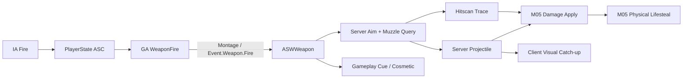

# M06 射击命中结算与扩展设计文档

**状态：** Completed  
**负责人：** `12456df`  
**最后更新：** 2026-08-07  
**建议分支：** `feature/m06-authoritative-shooting`  
**建议提交：** `feat: add authoritative shooting resolution`

## 1. 问题与目标

M04 已建立固定武器、射击 Ability、服务器弹丸、瞄准与弹药闭环，M05 已把弹丸命中接入伤害、死亡和经验系统，但当前武器只能生成投射物，命中扫描与投射物没有统一结算契约，射击 Ability 只能读取一个 `FireMontage`，弹丸在客户端首次可见时还可能与枪口产生视觉间隙。M06 需要在不改变 PlayerState ASC 和服务器权威模型的前提下，补齐物理吸血、统一两类射击、支持角色化射击动作，并完成 SCI-6、SCI-7 的动画与枪口表现修复。

## 2. 核心决策

1. 客户端继续通过 `LocalPredicted` GAS Ability 表达开火意图；不新增提交 Hit Actor、Impact Point 或最终方向的可信客户端 RPC。
2. 服务器从当前 Controller View、枪口 Socket 和武器配置构建射击查询，并唯一决定散布、阻挡、命中和伤害。
3. `ASWWeapon` 继续拥有弹药和单次射击编排；基础射速唯一由 Montage 的 `FireCycle` 时长定义，不新增 Weapon Manager 或独立 Shooting Subsystem。
4. 命中扫描和投射物共享武器上的伤害配置与命中结果契约；Projectile 只拥有移动、碰撞和视觉参数。
5. M06 首版使用服务器当前世界状态判定命中，不实现服务器倒带、历史 Hitbox 或完整反作弊框架。
6. 多射击 Montage 属于内容与表现：C++ 提供候选配置、选择结果和安全校验，Ability 蓝图继续使用 GAS Montage Task 编排行为。
7. SCI-6 的骨骼遮罩完全在 ABP 中完成；C++ 不硬编码 Quinn 手臂骨骼名。
8. SCI-7 先验证 Socket、Actor Origin、Mesh Relative Transform 和生成时序；只有确认是网络首次相关延迟后，才启用视觉追赶方案。
9. 队伍限制继续复用 `USWGameplayEffect::AreSourceAndTargetOnSameTeam`，不增加通用 Effect Target Policy 枚举。

## 3. 需求

### 3.1 功能需求

- FR-01：武器蓝图必须能选择 `Projectile` 或 `Hitscan` 射击结算模式。
- FR-02：两种射击模式必须共享同一伤害 GE、最大射程、散布和服务器验证入口。
- FR-03：服务器必须验证当前武器所有权、Ability 状态、死亡/换弹状态、配置、枪口和弹药；失败不得扣弹、生成弹丸或应用伤害。射击节奏由服务器执行的 Montage `FireCycle` 事件推进，不维护独立 RPM 时间门槛。
- FR-04：服务器必须先从 View 确定准星目标点，再从枪口向该方向执行实际射击，枪口前遮挡不得被第三人称相机绕过。
- FR-05：Hitscan 必须使用项目专用 `WeaponTrace` 通道，命中第一个阻挡物后至多向一个有效目标应用一次 M05 Damage GE。
- FR-06：Projectile 必须由服务器生成和碰撞，并通过与 Hitscan 相同的伤害应用入口结算命中。
- FR-07：每次成功射击必须产生一份只在服务器使用的统一结果，包含模式、枪口、终点、命中结果和弹药结果；表现不得成为第二命中来源。
- FR-08：武器蓝图必须能配置多个射击 Montage 候选；射击 Ability 每次选择并缓存一个候选，Montage、起始 Section 和播放速率可由内容配置。
- FR-09：所有射击 Montage 必须通过同一个 `Event.Weapon.Fire` Gameplay Event 请求权威发射；非法或已无可射击状态的事件必须被服务器的 Ability/Weapon 状态与弹药校验拒绝。
- FR-10：没有有效 Montage 时，Ability 必须允许无动画的服务器射击回退，不因表现资产缺失阻断功能验证。
- FR-11：开火和瞄准动画必须只覆盖 Quinn 的手臂、锁骨和武器相关分支，Locomotion 与非预期躯干姿态保持生效，完成 SCI-6。
- FR-12：本地与 DS 客户端观察到的弹丸必须从枪口视觉起点出发，并保持准星方向一致，完成 SCI-7。
- FR-13：物理伤害必须按 `AppliedDamage × PhysicalLifesteal` 为仍存活的来源应用独立 Instant Healing GE；魔法、真实伤害和 Overkill 超额部分不得产生吸血。
- FR-14：两种模式必须继续复用 M05 的同队拒绝、无敌、死亡幂等、伤害数字和击杀经验链路。
- FR-15：Character 只需替换自己的默认 Weapon Blueprint，即可改变射击模式、Montage 组合、弹丸/命中表现和伤害配置，不复制 Ability 或 Weapon C++ 流程。

### 3.2 非功能需求

- NFR-01：弹药、散布、命中、伤害和物理吸血的唯一权威均为服务器；射击节奏的唯一真相是服务器执行 Montage 的 `FireCycle` 推进。
- NFR-02：射击不得新增逐帧 RPC、可靠 Multicast 高频事件或客户端可信命中数据。
- NFR-03：每次射击最多执行两条同步单次射线；默认使用 Simple Collision，不执行逐帧或复杂三角形 Trace。
- NFR-04：Projectile、Weapon、Character 不新增无条件业务 Tick；视觉追赶只允许在客户端 Projectile Mesh 上短时运行并自动停止。
- NFR-05：所有射击数值和资产选择位于 Weapon/Projectile Blueprint Defaults 或 Gameplay Effect，不在代码中写死角色特例。
- NFR-06：Dedicated Server 不创建 Niagara、音频、Widget 或纯视觉弹丸替身。
- NFR-07：Development Editor、Game、Server Target 必须构建通过，并完成 Staged DS + 两客户端验收。

### 3.3 边界情况

- EC-01：射击模式与配置不匹配时（Projectile 无 Class、Hitscan 无有效 Range、Damage GE 缺失），服务器拒绝本次射击并记录诊断。
- EC-02：枪口 Socket 缺失、枪口位于阻挡物内或射击方向接近零时，本次射击不扣弹。
- EC-03：相机能看见目标但枪口被墙体遮挡时，实际结果命中墙体。
- EC-04：目标没有 ASC、已经死亡、处于无敌或与来源同队时，不应用伤害，但仍可播放表面命中表现。
- EC-05：同一个 Projectile 重复触发 Hit、或同一 Montage 重复发送 Fire Event 时，只允许首次合法结算产生副作用。
- EC-06：客户端预测了 Montage/Cue，但服务器拒绝射击时，只允许出现短暂表现差异，不改变弹药或伤害。
- EC-07：候选 Montage 为空、Section 无效或 Montage 播放失败时，Ability 使用无动画回退；无效候选不导致数组越界。
- EC-08：武器、Avatar 或 Ability 在 Montage 中途失效时，结束 Ability 并清理 Task；晚到 Fire Event 不产生射击。
- EC-09：吸血来源已死亡、来源 ASC 无效、吸血率不合法或实际伤害为零时，不创建 Healing Spec。
- EC-10：弹丸首次复制时已经飞离枪口，视觉追赶只能移动 Mesh/Trail，不能回退服务器碰撞 Actor。

### 3.4 明确不做

- 不实现服务器倒带、历史姿势缓存、客户端时间戳命中重放和完整反作弊框架。
- 不实现爆头、部位倍率、穿透多个目标、跳弹伤害、霰弹多 Pellet 或范围爆炸伤害。
- 不实现武器切换、拾取、附件、库存、装备或弹药类型系统。
- 不为动画随机变化建立网络玩法状态；Montage 差异只影响表现，服务器命中仍独立验证。
- 不在 M06 重做完整动画框架、Motion Matching、IK Retarget 或 M07 主动技能管线。

## 4. C++ 与蓝图边界

| 领域 | C++ 负责 | 蓝图负责 |
|---|---|---|
| 射击配置 | 模式枚举、配置结构、合法性校验、稳定只读查询 | 选择模式、伤害 GE、射程、弹丸类、散布和表现资产 |
| 权威射击 | 弹药/状态验证、View/枪口查询、散布、Trace、Projectile Spawn | 不得生成权威弹丸、提交 Hit 或扣弹 |
| 伤害与吸血 | Damage GE 应用、AppliedDamage、物理吸血 Healing GE、服务器幂等 | 配置伤害 GE 数值与 Cue；不直接写 Health |
| 射击 Ability | 最小候选选择契约、当前武器查询、权威 Commit 函数 | `Play Montage and Wait`、`Wait Gameplay Event`、自动/半自动流程和取消分支 |
| 动画 | 提供 GAS Montage 复制与只读状态 | Montage 资产、Section、Notify、SCI-6 手臂遮罩和具体角色动作 |
| Projectile 表现 | 初始视觉数据复制、客户端初始化事件、权威碰撞不受视觉偏移影响 | Mesh、Trail、VFX、视觉追赶曲线和 SCI-7 最终调校 |
| 命中表现 | 输出受信任的 Impact Point/Normal/Surface 数据 | 枪口火焰、Tracer、Impact VFX/SFX、Camera Shake |

蓝图可以选择“表现是什么”，但不能决定“是否成功射击、命中了谁、造成多少伤害或回复多少生命”。

## 5. 数据契约

### 5.1 武器射击配置

```cpp
UENUM(BlueprintType)
enum class ESWShotResolutionMode : uint8
{
    Projectile,
    Hitscan
};

UENUM(BlueprintType)
enum class ESWFireMontageSelectionMode : uint8
{
    FirstValid,
    Sequential
};

USTRUCT(BlueprintType)
struct FSWFireMontageVariant
{
    TObjectPtr<UAnimMontage> Montage = nullptr;
    FName StartSection = NAME_None;
    float PlayRate = 1.f;
};

USTRUCT(BlueprintType)
struct FSWFireMontageSelection
{
    TObjectPtr<UAnimMontage> Montage = nullptr;
    FName StartSection = NAME_None;
    float EffectivePlayRate = 1.f;
    bool bValid = false;
};
```

`SelectNextFireMontage` 只选择内容资产并返回已计入 `FireIntervalReductionPercent` 的 `EffectivePlayRate`；不扫描 Notify、不计算前导时间，也不安排自动射击 Delay。`Event.Weapon.Fire` 的位置属于 Montage 内容，未配置时由蓝图内容验收发现，而不是由 C++ 解析具体资产。

每把武器的开火 Montage 统一使用 `FireWindup → FireCycle → FireRecovery` 三个 Section。`FireRecovery` 必须是终止段，不得再链接回 `FireWindup`。非自动武器顺序播放三段；自动武器在按住期间令 `FireCycle` 自循环，释放输入或服务器拒绝下一次射击（例如弹匣耗尽）后由 Fire Ability 蓝图把当前 Section 的下一段改为 `FireRecovery`。由于 Section 跳转必须在活动 Montage 实例存在后才会生效，Ability 仅提供播放后设置下一段的最小 C++ 桥接函数；输入、事件与生命周期仍由蓝图编排。`FireCycle` 的实际时长是基础射速的唯一真相：射速属性以百分比同步提高整个 Montage 的播放倍率，因而等比缩短该 Section 的循环时长。有效 RPM 只由该时长推导，供 UI/调试显示；它不再是配置项或服务器拒绝射击的第二套时钟。

`FSWWeaponConfig` 在保留现有弹匣、扩散、瞄准、枪口和开火表现配置的基础上调整：

| 字段 | 类型 | 规则 |
|---|---|---|
| `ShotResolutionMode` | `ESWShotResolutionMode` | 蓝图选择 Projectile/Hitscan |
| `DamageEffectClass` | `TSubclassOf<USWDamageGameplayEffect>` | 两种模式共享；从 Projectile 配置迁移到 Weapon |
| `MaxAimDistance` | `float` | 继续作为准星查询和权威最大射程 |
| `ProjectileClass` | `TSubclassOf<ASWProjectile>` | 仅 Projectile 模式必填 |
| `FireMontageVariants` | `TArray<FSWFireMontageVariant>` | 替代单一 `FireMontage` |
| `FireMontageSelectionMode` | `ESWFireMontageSelectionMode` | 首个有效或顺序轮换；M06 不提供随机玩法状态 |

迁移后 `FSWProjectileConfig` 只保留速度、重力、碰撞半径、寿命、旋转、弹跳和视觉相关参数，不再拥有独立伤害真值。

### 5.2 服务器射击结果

```cpp
struct FSWResolvedShot
{
    ESWShotResolutionMode Mode = ESWShotResolutionMode::Projectile;
    FTransform MuzzleTransform;
    FVector TraceEnd = FVector::ZeroVector;
    FHitResult HitResult;
    bool bFired = false;
    bool bBlockingHit = false;
    int32 MagazineAmmoAfterShot = 0;
};
```

该结构只在服务器调用链中使用，不复制给客户端，也不直接暴露为蓝图权威输入。表现使用 Gameplay Cue 参数或 Projectile 初始复制数据。

### 5.3 Projectile 初始视觉数据

```cpp
USTRUCT(BlueprintType)
struct FSWProjectileVisualInitData
{
    FVector_NetQuantize10 MuzzleLocation;
    FVector_NetQuantizeNormal LaunchDirection;
    float ServerSpawnTime = 0.f;
};
```

该结构使用 `COND_InitialOnly`。客户端只能用它初始化 Mesh/Trail 的短时视觉偏移，Projectile Actor 的碰撞位置和速度仍由服务器复制决定。

### 5.4 物理吸血数据

- `USWExecCalc_Damage` 捕获 Source `PhysicalLifesteal`，并将服务器计算使用的比例写入 `FSWGameplayEffectContext` 的非玩法表现字段。
- `USWAttributeSet::ConsumeIncomingDamage` 在得到 `AppliedDamage` 后判断物理伤害与来源存活状态。
- `USWHealGameplayEffect` 是原生 Instant GE，通过 `SetByCaller.Healing` 对 Source Health 做 Additive 修改。
- `USWAbilitySystemComponent::ApplyHealingToSelfAuthority` 是唯一吸血治疗入口，校验 Authority、数值、死亡状态和 Effect Spec。

当前 C++ 实现还会序列化该吸血快照，以保持 EffectContext 在网络传输中的字段一致；客户端只消费已复制的 Health，不参与吸血或伤害重算。

### 5.5 当前 C++ 实现记录

- `FSWWeaponConfig` 已拥有 `ShotResolutionMode` 与唯一的 `DamageEffectClass`；Projectile 配置只保留飞行、碰撞与表现相关数据。
- `ASWWeapon::TryFireAuthority` 会先执行一次准星 Trace，再从枪口执行一次 `WeaponTrace`。Hitscan 只处理第二条射线的首个阻挡结果；Projectile 继续只在服务器生成和碰撞。
- 两种模式最终都使用既有 `USWAbilitySystemComponent::ApplyDamageEffectToTargetAuthority`，因此共享队伍、无敌、死亡、伤害、吸血与经验规则。
- `WeaponTrace` 使用 `ECC_GameTraceChannel1`，其项目级 Collision Profile 定义在 `DefaultEngine.ini`；蓝图后续只需选择模式并配置武器的伤害 GE，不得提交命中或伤害结果。

## 6. 子系统与所有权

| 子系统 | 单一职责 | 依赖 | 拥有的数据 | 产生事件 |
|---|---|---|---|---|
| `USWWeaponFireGameplayAbility` | 输入后的射击表现编排与权威 Commit 请求 | ASC、Weapon、Montage Task | 本次激活临时 Montage 选择 | Fire Gameplay Event |
| `ASWWeapon` | 射击配置、弹药和权威射击编排 | Character、World Query、Projectile、ASC | 弹药 | Shot Cosmetic/Cue |
| Hitscan Resolution | 服务器双阶段 Trace 与首个阻挡结果 | Weapon、World、WeaponTrace | 无持久状态 | Resolved Hit |
| `ASWProjectile` | 服务器移动/碰撞与客户端视觉追赶 | Weapon、ProjectileMovement | 轨迹、初始化数据、命中幂等 | Projectile Impact |
| M05 Damage/Healing | 伤害、AppliedDamage、物理吸血和死亡 | ASC、AttributeSet、EffectContext | Health 与战斗属性 | Damage/Death/Healing 结果 |
| ABP | Locomotion、Aim、手臂动作与 SCI-6 遮罩 | AnimInstance、Montage 只读 | 动画图临时状态 | 动画表现 |



依赖保持单向：Ability 不计算命中；Weapon 不写 Health；Projectile 不扣弹；AttributeSet 不生成弹丸；ABP 不触发客户端可信伤害。

## 7. 公开契约

| 所有者 | API/事件 | 输入 | 输出 | 副作用 | 前置/后置条件 |
|---|---|---|---|---|---|
| Fire Ability | `SelectNextFireMontage` | 当前 Weapon | `FSWFireMontageSelection` | 仅更新 Ability 的表现序号 | 每次 Ability 激活只调用并缓存一次 |
| Fire Ability | `CommitFireFromAnimEvent` | Active Ability | `bool` | 请求服务器 Weapon 射击 | 仅 Authority 产生权威副作用 |
| Weapon | `TryFireAuthority` | 服务器 View/枪口上下文 | `FSWResolvedShot` | 校验、结算、扣一发 | 成功只有一次模式结算；失败零副作用 |
| Weapon | `BuildAuthoritativeShotQuery` | View、Muzzle、Range、Spread | Query | 最多一次 View Trace | 忽略 Owner/Weapon，方向合法 |
| Weapon | `ResolveHitscanAuthority` | Query、Damage GE | Result | 一次 WeaponTrace、可应用一次伤害 | 只处理首个阻挡物 |
| Weapon | `ResolveProjectileAuthority` | Query、Projectile Class、Damage GE | Result | 服务器 Spawn/Initialize | Projectile 获得共同伤害配置 |
| ASC | `ApplyDamageEffectToTargetAuthority` | Target ASC、GE、Level、Causer | `bool` | 应用伤害 Spec | 继续复用 M05 同队/无敌/死亡规则 |
| ASC | `ApplyHealingToSelfAuthority` | Healing、Causer | `bool` | 应用原生 Healing GE | Source Authority 且仍存活 |
| Projectile | `InitializeProjectileAuthority` | Instigator、Direction、Damage GE、Visual Data | `bool` | 启动服务器移动 | 配置有效且仅初始化一次 |
| Projectile | `BP_OnProjectileVisualInitialized` | Visual Init Data | 无 | 客户端纯表现 | 不移动碰撞 Actor |

## 8. 关键运行时数据流

### 8.1 Hitscan

1. 本地输入激活 `GA_WeaponFire`；客户端立即播放候选 Montage/Cue。
2. 服务器上的 Ability 播放同一类 Montage，并在 `Event.Weapon.Fire` 到达时调用 `TryFireAuthority`。
3. Weapon 验证状态、弹药、配置和枪口；射击节奏由 Montage 的 `FireCycle` 事件到达频率决定。
4. 服务器从 `GetPlayerViewPoint` 沿 `MaxAimDistance` 执行第一条准星射线，得到 Aim Point。
5. 服务器应用散布，从枪口沿最终方向执行 `WeaponTrace`；该射线决定真实阻挡与命中。
6. 命中有效敌方 ASC 时调用 M05 Damage Apply；成功射击最后扣一发并更新时间门槛。
7. Gameplay Cue 只使用服务器结果播放 Tracer/Impact，不修改状态。

### 8.2 Projectile

1. 前四步与 Hitscan 相同。
2. Weapon 从枪口生成服务器 Projectile，并传入最终方向、共同 Damage GE 与 Visual Init Data。
3. ProjectileMovement 在服务器运行，客户端接收 Actor Movement。
4. 服务器 `OnComponentHit` 首次命中后调用共同 Damage Apply 并销毁 Projectile。
5. 客户端首次看到 Projectile 时，先验证是否仅为 Mesh/Pivot 配置问题；若是网络间隙，Mesh 从 MuzzleLocation 短时追赶至权威 Actor 位置。

### 8.3 多 Montage 射击 Ability

1. Ability 激活时调用一次 `SelectNextFireMontage` 并缓存返回结构。
2. 有效时用 `Play Montage and Wait` 播放指定 Montage/Section/PlayRate；无效时进入无动画分支。
3. 每个候选 Montage 的权威发射帧都放置相同 `Event.Weapon.Fire` Gameplay Event。
4. 蓝图 `Wait Gameplay Event` 收到事件后调用 `CommitFireFromAnimEvent`。
5. 非自动依次播放 `FireWindup → FireCycle → FireRecovery`；自动时 `FireCycle` 自循环，释放输入后蓝图切换到 `FireRecovery`；取消、死亡或换弹立即结束。
6. Montage 选择是表现状态；实际射击始终再次经过服务器 Weapon 校验。

### 8.4 物理吸血

1. ExecCalc 捕获并限制 `PhysicalLifesteal`，仅物理 Damage Channel 保留该值。
2. AttributeSet 先清空 `IncomingDamage`，扣减 Health 并计算 `AppliedDamage`。
3. 若 Source 存活且 `AppliedDamage > 0`，计算 `Healing = AppliedDamage × Lifesteal`。
4. Source ASC 通过原生 Instant Healing GE 修改自身 Health，AttributeSet 负责 Clamp。
5. 现有 Health 复制和 HUD Delegate 自动反映结果，不新增 UI 专用 RPC。

## 9. SCI-6 动画修复设计

- 在 `ABP_SW_Template` / Quinn 具体 ABP 的 `Layered Blend Per Bone` 中移除从 `spine_01` 覆盖整个上半身的宽遮罩。
- 使用 Quinn 实际骨骼层级配置左右 `clavicle` 分支，覆盖锁骨、手臂、手部和武器/IK 相关骨骼；具体骨骼名保留在 ABP 资产中。
- Base Pose 始终来自完整 Locomotion；Aim/Fire Slot 只混入手臂分支。
- 启用适合该资产的 Mesh Space Rotation Blend，并逐项检查肩部接缝、双手持枪和 Aim Offset 叠加。
- C++ `USWAnimInstance` 只继续提供 `bIsAiming`、速度、方向等只读变量，不增加骨骼或资产引用。

验收覆盖站立、八向移动、疾跑退出、瞄准、单发、自动射击、本地角色和远端模拟代理。

## 10. SCI-7 枪口视觉偏移设计

按以下顺序诊断和修复，避免直接增加网络补丁：

1. 开发模式绘制 Muzzle Socket Transform、Projectile Actor Origin、Collision Sphere 和首帧速度方向。
2. 确认 Weapon Mesh Socket 使用世界变换，Projectile Actor Origin 与 Collision Sphere 中心一致，Projectile Mesh Relative Location/Rotation 无意外偏移。
3. 确认服务器 Montage 在 DS 上推进到 Fire Event，枪口姿势与发射时刻一致。
4. 确认 `SpawnActorDeferred` 的 Transform、Finish 与 Projectile 初始化顺序不会在第一帧重置位置。
5. 若服务器位置正确、客户端仍因复制延迟看到前方出生，则复制 `FSWProjectileVisualInitData`，仅在客户端对 Mesh/Trail 做短时视觉追赶。
6. 拥有者即时枪口火焰继续使用预测 Gameplay Cue；不得为修复视觉偏移生成第二个可碰撞/可伤害 Projectile。

## 11. 实施顺序

| 顺序 | 工作 | 主要文件/资产 | 验证 |
|---:|---|---|---|
| 1 | 修正文档中的队伍策略决定并补齐物理吸血 | `SWAbilityTypes.*`、`SWExecCalc_Damage.*`、`SWAttributeSet.*`、Healing GE/Tag | 物理/魔法/真实、Overkill、来源死亡 |
| 2 | 增加统一射击配置、结果类型和 `WeaponTrace` | `SWWeaponTypes.*`、`SWWeapon.*`、`DefaultEngine.ini` | 非法配置安全失败；相机不能穿墙 |
| 3 | 迁移 Projectile 伤害配置并实现 Hitscan | `SWProjectileTypes.*`、`SWProjectile.*`、Weapon/Projectile BP | 两种模式进入同一 M05 伤害链路 |
| 4 | 扩展 Fire Ability 的多 Montage 契约 | `SWWeaponFireGameplayAbility.*`、Weapon BP、Fire Montage | 单发/自动、多个候选、无动画回退 |
| 5 | 完成 SCI-7 枪口偏移诊断与最小修复 | Projectile C++/BP、Socket、Cue | 本地/DS 两客户端枪口一致 |
| 6 | 完成 SCI-6 手臂动画分层 | `ABP_SW_Template`、Quinn/角色 ABP | Locomotion/躯干不被意外覆盖 |
| 7 | 构建、DS 双客户端验收与文档同步 | 三 Target、测试地图、Docs/Linear | 全部需求追踪通过 |

## 12. 验收矩阵

| 需求 | 可重复验证 |
|---|---|
| FR-01～07 | 分别配置 Projectile/Hitscan；检查同一伤害 GE、射程、墙体阻挡、每发弹药与一次伤害 |
| FR-08～10 | 配置至少三个射击 Montage；顺序播放、Section/速率生效、无 Montage 仍能射击 |
| FR-11 | SCI-6 的站立/移动/瞄准/开火本地和远端录像对比 |
| FR-12 | SCI-7 的 Socket/Origin 调试图与 DS 双客户端观察 |
| FR-13 | 50% 物理吸血、魔法/真实零吸血、Overkill、满血和来源死亡测试 |
| FR-14～15 | TeamA/TeamB/同队/无敌/死亡/经验；替换角色 Weapon BP 后无需改 C++ |
| NFR-01～06 | Authority/RPC/Blueprint 审查、Trace 数量、DS 无表现对象 |
| NFR-07 | Development Editor/Game/Server + Staged DS 两客户端 |

### 12.1 DS 场景

1. TeamA/TeamB 两个客户端分别使用 Projectile 与 Hitscan 配置。
2. 验证准星可见但枪口被墙挡时，两种模式都不能穿墙。
3. 验证同队不受伤、敌队受伤、无敌和死亡目标不重复结算。
4. 验证服务器弹药与状态拒绝，客户端预测表现不会制造弹丸或伤害。
5. 验证 `FireWindup`、`FireCycle`、`FireRecovery` 三个 Section 在半自动和自动射击中切换，远端观察结果可接受。
6. 验证 SCI-6 的手臂分层与 SCI-7 的枪口视觉起点。
7. 在模拟延迟/丢包下重复上述流程；允许短暂视觉差异，不允许长期弹药、生命或命中分歧。
8. 死亡重生后重新验证 Weapon、Montage 选择、Projectile/HitScan 和物理吸血。

## 13. Linear 映射

| Linear | 内容 | 与本文关系 |
|---|---|---|
| `SCI-5` | 设计 M06 射击命中结算 | 本文及路线图/索引同步 |
| `SCI-6` | 限制开火与瞄准动作影响范围为手臂 | 第 9 节与实施顺序 6 |
| `SCI-7` | 排查子弹从枪口发射时的视觉偏移 | 第 10 节与实施顺序 5 |
| SCI-11 | M05 物理吸血收尾 | 第 5.4、8.4 节与实施顺序 1 |
| SCI-12 | 统一射击契约与 Hitscan | 第 5～8 节与实施顺序 2～3 |
| SCI-13 | 多射击 Montage Ability | 第 5.1、8.3 节与实施顺序 4 |
| SCI-14 | M06 构建与 DS 验收 | 第 12 节与实施顺序 7 |

Linear 只记录事项状态、阻塞和简要验收；本文是 M06 技术设计真源。

## 14. 设计完成检查

- [x] M5 物理吸血、原定 M6、SCI-6、SCI-7 和多 Montage Ability 均有明确归属。
- [x] C++/蓝图边界、服务器权威和数据所有权明确。
- [x] Projectile/Hitscan 共享伤害入口且依赖无循环。
- [x] 延迟补偿与反作弊边界已明确。
- [x] 实施顺序与可重复 DS 验收已定义。
- [x] 后续实施事项已创建并关联至 M06 Linear 项目。
- [x] 用户确认 M06 范围和关键决策。
- [x] C++ 框架、蓝图配置与内容资产均已完成。
- [x] Development Editor、Game、Server Target 构建，以及 Staged DS 双客户端验收均已通过。
- [x] 状态已更新为 Completed。

## 15. 开发进度记录

### 2026-08-06 — 射击 Ability 完成

- 已完成多 Montage 候选选择、`FireWindup → FireCycle → FireRecovery` 三段 Section 契约，以及统一的 `Event.Weapon.Fire` Notify 发射入口。
- 自动武器在按住输入时仅循环 `FireCycle`；松开输入、弹匣耗尽或服务器拒绝发射时进入 `FireRecovery`。半自动每次播放完整三段。
- 已移除 `FireNotifyLeadTimeSeconds`、配置 `RoundsPerMinute` 与服务器独立射速时间门槛。`FireCycle` 的实际时长是基础射速唯一真相；`FireIntervalReductionPercent` 只同步提高 Montage 播放倍率，`GetEffectiveRoundsPerMinute()` 仅供 UI/调试显示。
### 2026-08-07 — M06 收尾验证完成

- SCI-6：开火与瞄准 Montage 已限制为手臂层；换弹继续走 UpperBody 层，验证正确。
- SCI-7：枪口起点、瞄准方向与射击动作表现已联合验证；散射仅保留为武器配置预期效果。
- Development Editor、Game、Server Target 构建成功；Staged Dedicated Server 加双客户端完成射击、命中、伤害、物理吸血、弹药和动画表现验证。
- M06 标记为 Completed，下一模块为 M07 主动技能框架。
