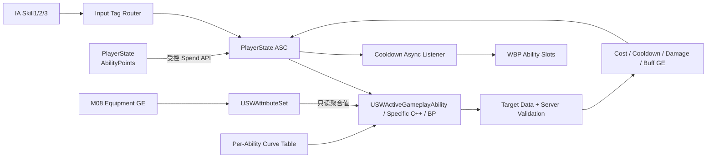

# M07 主动技能框架设计文档

**状态：** Completed（两个首发样例技能验收完成；第三槽与扩展契约保留）
**负责人：** `12456df`
**最后更新：** 2026-08-10
**建议分支：** `feature/m07-gameplay-ability-pipeline`
**建议提交：** `feat: add gameplay ability pipeline`

## 1. 问题与目标

M03 已建立 PlayerState 持有 ASC、AttributeSet 与 Ability 基类，M04 已建立 `Input Tag → GAS Ability Spec` 输入通道，M05 已提供等级、经验、`AbilityPoints`、伤害和 UI 只读数据源，M06 已完成服务器权威射击结算。当前工程仍缺少可供角色主动技能复用的等级、升级、目标、消耗、冷却/充能、取消、预测、Gameplay Cue 和冷却 UI 契约。

M07 的目标是在不创建第二套输入、进度或战斗系统的前提下，交付三个可扩展主动技能槽、其中两个完成配置的首发样例技能，使后续装备只需通过 Gameplay Effect 修改 AttributeSet，Ability 便能在提交时读取聚合后的属性并得到最终效果。

本模块设计服务于独立开发：只建立会被两个首发样例技能与 M08 装备系统立即消费的公共契约，并保留第三槽的扩展接口；不创建通用技能编辑器、技能树管理器或万能目标系统。

## 2. 核心决策与必要修正

1. 用户语境中的 “AS” 按项目现状落实为 `USWAttributeSet`。装备在 M08 通过 Gameplay Effect 修改 AttributeSet；Ability 只读属性聚合结果，装备不得直接修改 Ability 实例或蓝图变量。
2. 不新增 `SpellPoint`。现有 `ASWPlayerState::AbilityPoints` 是技能点唯一真值；UI 可以显示“技能点”，但 C++、复制与升级事务继续使用 `AbilityPoints`。
3. 输入 Tag 不包含物理键名。新增 `Ability.Input.Skill1/Skill2/Skill3`，默认由 `IMC_Gameplay` 映射为 Q/E/Z；未来改键不改变 Ability、升级或 UI 身份。
4. Ability 身份、输入槽和冷却身份分离：`Ability.Skill.*` 标识技能，`Ability.Input.Skill*` 标识槽位，`Cooldown.Ability.*` 标识该技能的冷却/充能效果。
5. Ability 等级使用服务器持有的 `FGameplayAbilitySpec::Level`；角色等级不会自动等于技能等级。每个初始技能从 1 级开始，升级消耗一个 `AbilityPoint`，上限由该 Ability 配置。
6. 每个技能拥有自己的 Curve Table，而不是把所有技能塞进一张通用大表。公共字段和技能专有 `FScalableFloat` 均引用该技能自己的表；未使用的字段不要求创建。
7. 伤害生产者拥有自己的基础伤害与属性系数，并在服务器上先计算 `RawDamage`；通用 `USWDamageGameplayEffect` / `USWExecCalc_Damage` 只按伤害包完成穿透、防御、暴击、吸血和 `IncomingDamage` 结算。
8. 冷却与“次数”统一为充能模型：Active Gameplay Effect 的 Stack 表示“已消耗的充能”，而不是额外复制一份计时器或整数。单充能技能是 `MaxCharges = 1` 的特例。
9. 进行中的冷却、持续效果和施法快照默认不因升级或装备变化回溯重算；下一次提交使用新的等级和 AttributeSet 聚合值。需要动态更新的特殊技能必须单独写明。
10. Aura 的 `WaitCooldownChange` 只借鉴“监听 ASC Tag 与 Active GE”的方向。ScifiWorlds 版本必须补齐初始状态、Stack 变化和所有委托解绑，不使用 `MarkAsGarbage()` 强制销毁。
11. M07 定义三个技能槽，但只要求完成两个首发样例技能；`Skill3` 保留为空槽和未来扩展入口，不作为本模块完成门槛。具体后续技能名称、机制、动画和数值保持 `TBD`；首发样例必须走完目标、消耗、冷却、伤害/效果和 Cue 全链路。

## 3. 需求与边界

### 3.1 功能需求

- FR-01：每个玩家角色必须拥有三个固定且可扩展的技能槽，分别映射到 `Skill1/Skill2/Skill3`，默认键位为 Q/E/Z；M07 仅要求 `Skill1/Skill2` 配置首发主动技能，`Skill3` 可为空。
- FR-02：已配置的首发技能在重生后必须保留 Ability Spec、技能等级、冷却与充能状态，不得重复授予。
- FR-03：每个可升级技能必须具有唯一 Ability Id、独立等级表、起始等级、最大等级和明确的升级资格。
- FR-04：服务器必须能使用一个 `AbilityPoint` 将已拥有且未满级的技能提升一级；失败不得扣点或改变 Ability Spec。
- FR-05：技能等级必须能分别影响冷却、消耗、持续时间、范围、基础伤害、攻击力/法强系数、最大充能或技能专有参数；每个技能只配置自己实际使用的字段。
- FR-06：主动技能必须通过统一只读 API 获取 AttributeSet 对范围、持续时间、冷却、伤害和充能的最终修正。
- FR-07：装备或 Buff 通过 GE 修改 AttributeSet 后，下一次技能提交必须使用新聚合值；Ability 不得持有装备引用或接受装备直接写入。
- FR-08：技能消耗必须由 GAS Cost/Gameplay Effect 修改 Mana 等资源；客户端不能直接扣蓝，服务器拒绝时不得产生权威效果。
- FR-09：单充能与多充能技能必须共享冷却/恢复模型；只有可用充能大于 0 时才能激活，每次成功提交只消耗一次充能。
- FR-10：公共契约必须保留 Self、准星 Actor、准星 Location 三种最小目标模式；M07 只要求两个首发技能覆盖其实际使用的目标模式。
- FR-11：客户端目标数据只能表达意图；服务器必须重新验证 Avatar、距离、视线、队伍、存活状态和目标类型。
- FR-12：技能必须正确处理主动取消、输入释放、Montage 中断、死亡、Avatar 更换和服务器拒绝，并在所有路径结束 Ability Task 与临时状态。
- FR-13：适合预测的玩家主动技能使用 `LocalPredicted`；伤害、治疗、Buff、位移终点和目标命中结果仍由服务器确认。
- FR-14：Gameplay Cue 只负责动画外的 VFX/SFX/材质/镜头表现，不得写入生命、Mana、冷却、充能或目标结果。
- FR-15：拥有者 HUD 必须显示三个固定技能槽；已配置槽显示图标、默认按键、等级、当前/最大充能和下一充能剩余时间，空槽正确显示空状态；不得每帧查询服务器或复制倒计时。
- FR-16：至少一个联网样例技能必须在 Staged DS + 两客户端下完成激活、目标验证、消耗、冷却/充能、伤害或效果、Cue、升级与重生验证。

### 3.2 非功能需求

- NFR-01：服务器是 Ability 授予、Spec Level、AbilityPoints、目标结果、资源消耗、冷却/充能 GE 和 Gameplay Effect 应用的唯一权威。
- NFR-02：输入仍只在本地消费；沿用现有 Ability Spec 输入和 Generic Replicated Event，不增加逐帧输入 RPC。
- NFR-03：技能运行时不新增业务 Tick。冷却以 Active GE 和事件驱动监听为真值；UI 可以根据一次性时间快照做本地视觉倒计时。
- NFR-04：每个技能的可调数值来自该技能的 Curve Table、Ability/GE Blueprint Class Defaults 或 Data Asset，不在 C++/蓝图图表散落等级分支和魔法数。
- NFR-05：无效 Tag、缺失 Curve Row、非法等级、NaN/Inf、负消耗、负范围或缺失 GE 必须留下可诊断日志并安全失败。
- NFR-06：公共 C++ 不依赖具体技能蓝图、Montage、Widget 或资产路径；具体技能内容替换不得修改 ASC 核心流程。
- NFR-07：玩家 ASC 继续使用 Mixed 复制，AI ASC 继续使用 Minimal；Owner UI 数据只发送给所属客户端。
- NFR-08：Development Editor、Game、Server Target 必须构建通过，并完成 Staged Dedicated Server + 两客户端验收。

### 3.3 明确不做

- 不在 M07 制作完整技能树、升级菜单、重置技能点、技能解锁前置图、存档或跨局成长；完整 UI 属于 M14，持久化另行设计。
- 不实现装备定义、装备栏、商店或装备对属性的实际 GE 内容；属于 M08/M09。M07 只交付它们将消费的 AttributeSet → Ability 通道。
- 不实现第三技能及后续英雄技能的最终玩法设计、正式数值、最终动画或美术；具体内容为 `TBD`。
- 不建立覆盖任意形状、寻路、链式目标和复杂指示器的万能 Targeting Framework；只交付三个最小目标模式和可扩展契约。
- 不实现客户端回溯、服务器倒带或技能命中的历史位置校验。
- 不让升级立即重算已开始的持续效果、冷却或充能队列。

## 4. C++ 与蓝图边界

| 领域 | C++ 负责 | 蓝图/资产负责 |
|---|---|---|
| Ability 身份与授予 | Ability Id、Input Tag、Spec Level、幂等授予、服务器升级事务 | 在角色 Blueprint 的 `StartupAbilities` 配置两个首发技能类；Skill3 保持空槽 |
| 等级数据 | `FScalableFloat` 取值、等级合法性、通用有效值公式和失败策略 | 每技能一张 Curve Table；只创建该技能使用的 Row |
| AttributeSet 通道 | 属性定义、复制、Clamp、只读查询与统一公式 | 装备/Buff GE 修改 AttributeSet；不调用 Ability 写接口 |
| 消耗 | Cost 检查、预测/服务器提交和资源唯一写入 | 配置是否消耗 Mana、每级基础消耗及表现 |
| 冷却/充能 | Active GE Stack 真值、激活门槛、充能消耗/恢复、状态查询 | 每技能配置 Cooldown GE、Tag、基础时长、最大充能曲线 |
| 升级 | RPC 校验、扣 `AbilityPoint`、更新 Spec Level、`MarkAbilitySpecDirty` | M07 仅提供测试入口；M14 负责正式按钮与布局 |
| 目标 | 目标数据结构、客户端发送、服务器范围/LOS/队伍/存活校验 | 技能 BP 选择 Self/Actor/Location，并编排指示器和确认/取消 |
| 技能行为 | 稳定权威 Helper、伤害/治疗/效果入口、生命周期不变量 | 单个 Ability 的 Montage、Ability Task 时序、分支和技能专有逻辑 |
| Gameplay Cue | Cue 参数和权威/预测边界 | Niagara、音效、材质、Camera Shake 与表现时序 |
| 冷却 UI | 只读快照、ASC Delegate 订阅、异步节点安全清理 | 三槽布局、图标、遮罩、数字、按键文字和本地倒计时动画 |

不得把具体 Skill1/2/3 的流程硬编码进 `ASWCharacter_Player`、`ASWPlayerController`、`ASWHUD` 或 `USWAbilitySystemComponent`。这些类只认识稳定 Tag、Spec 和数据契约。

## 5. 子系统、所有权与依赖

| 子系统 | 单一职责 | 依赖 | 拥有的数据 | 产生事件 |
|---|---|---|---|---|
| Enhanced Input 路由 | 把本地 IA 边沿转换为 Ability Input Tag | `USWInputConfig`、ASC | 本帧输入句柄 | Pressed/Released |
| `USWAbilitySystemComponent` | Ability Spec、输入处理、升级协调、冷却/充能查询 | GAS、PlayerState 公开进度 API | Ability Specs、Active GEs | Ability/Level/Runtime State Changed |
| `ASWPlayerState` | AbilityPoints 与玩家成长 | ProgressionData | Level、XP、AbilityPoints | Progression Changed |
| `USWAttributeSet` | 资源、战斗属性和技能公共修正 | GAS | Gameplay Attributes | Attribute Changed |
| `USWGameplayAbility` | 所有 Ability 的生命周期、死亡门槛、Avatar 与底层 Attribute 读取 | ASC、Tags | 激活期通用状态 | Commit/Cancel/End |
| `USWActiveGameplayAbility` | 角色主动技能的身份、等级、消耗、冷却、充能与 UI 契约 | `USWGameplayAbility`、ASC、AttributeSet | 主动技能元数据 | Active Skill Runtime State Changed |
| 具体 Ability Blueprint | 单技能的目标、Montage、Task 和效果编排 | Ability 基类、GE、Cue | 本次激活临时状态 | Gameplay Event/Cue 请求 |
| M05 伤害/效果链路 | 服务器最终伤害、治疗、Buff 与死亡 | ASC、ExecCalc | Health/战斗结果 | Damage/Death/Effect Result |
| 冷却异步监听 | 把 Active GE/Stack 变化转换为 UI 快照 | ASC | Delegate Handle | Cooldown Snapshot/End |
| Ability HUD | 只读显示三个槽位 | ASC 快照、Input Config | 本地 Widget 状态 | 无玩法事件 |



依赖是单向的：装备只写 AttributeSet；Ability 读取属性并请求 GE；伤害系统不认识具体技能；UI 只订阅 ASC，不反向修改玩法状态。

## 6. 数据与公共契约

### 6.1 初始技能与身份

扩展现有 `FSWStartupAbility`，不新建第二份 Ability Set：

```cpp
USTRUCT(BlueprintType)
struct FSWStartupAbility
{
    GENERATED_BODY()

    UPROPERTY(EditDefaultsOnly, BlueprintReadOnly)
    TSubclassOf<USWGameplayAbility> AbilityClass;

    UPROPERTY(EditDefaultsOnly, BlueprintReadOnly, meta=(Categories="Ability.Input"))
    FGameplayTag InputTag;

    UPROPERTY(EditDefaultsOnly, BlueprintReadOnly, meta=(ClampMin="1"))
    int32 StartingLevel = 1;
};
```

`USWActiveGameplayAbility` Class Defaults 增加：

| 字段 | 类型 | 规则 |
|---|---|---|
| `AbilityIdTag` | `FGameplayTag` | `Ability.Skill.*` 下唯一、精确匹配；升级/UI 使用 |
| `CooldownTag` | `FGameplayTag` | `Cooldown.Ability.*` 下唯一；一个技能一个 Tag |
| `MaxAbilityLevel` | `int32` | 至少 1；由技能内容决定，具体值 `TBD` |
| `bUpgradeable` | `bool` | 武器、瞄准、换弹、疾跑等系统 Ability 为 false |
| `DisplayName` | `FText` | UI 元数据，不参与规则 |
| `Icon` | `TSoftObjectPtr<UTexture2D>` | UI 软引用，不进入 DS 玩法判断 |
| `ManaCostByLevel` | `FScalableFloat` | 0 表示无 Mana 消耗 |
| `CooldownByLevel` | `FScalableFloat` | 0 表示无冷却 |
| `MaxChargesByLevel` | `FScalableFloat` | 取整后至少 1 |
| `MinimumCooldownSeconds` | `float` | 每技能安全下限；0 仅在明确允许无冷却时使用 |
| `CooldownEffectClass` | `TSubclassOf<UGameplayEffect>` | 每技能独立的可堆叠 Cooldown GE；不同技能不得共用同一个 Class |

Ability Id 不能由 Input Tag 推导。同一个技能未来可以换槽，同一个槽位也可以配置不同角色技能。

### 6.2 每技能独立等级表

每个具体技能建立 `CT_Ability_<SkillName>`。Ability、Cost/Cooldown Helper 和该技能的 Gameplay Effect 通过 `FScalableFloat` 引用同一张表的不同 Row。

建议 Row 命名：

| Row | 用途 | 是否强制 |
|---|---|---|
| `Cooldown` | 基础冷却/单次充能恢复时间 | 主动技能通常需要；允许为 0 |
| `ManaCost` | 基础 Mana 消耗 | 可选 |
| `MaxCharges` | 最大充能数 | 可选；缺省为 1 |
| `Range` | 基础范围 | 目标技能可选 |
| `Duration` | 基础持续时间 | 持续技能可选 |
| `Damage.Base` | 基础伤害 | 伤害技能可选 |
| `Damage.AttackPowerCoefficient` | 攻击力系数 | 可选 |
| `Damage.SpellPowerCoefficient` | 法强系数 | 可选 |
| `<SkillSpecific>` | 护盾量、弹丸数、位移距离等 | 仅具体技能使用 |

规则：

- Curve 横轴使用 Ability Level，1 级必须有有效值；`1..MaxAbilityLevel` 必须可求值。
- Ability 蓝图可以增加技能专有 `FScalableFloat`，并调用 C++ 的“按本次 Ability Level 求值”纯函数；公共基类不增加万能 `TMap<FName, float>`。
- 每个具体技能在自己的 C++ 子类或蓝图中持有基础伤害与攻击力/法强系数；由该技能在服务器按 Ability Spec Level 求值并形成 `RawDamage`。通用 Damage GE 不保存这些字段。
- 技能伤害的等级取值使用 Ability Spec Level；不得错误使用 Player Level。角色等级只通过基础属性成长间接影响技能。
- 缺失 Row 或非法数值时拒绝本次提交/升级，并输出 Ability Id、Level 和 Row 名称。

### 6.3 AttributeSet → Ability 通道

沿用现有属性：

- `AttackPower`
- `SpellPower`
- `AbilityRangeBonusPercent`
- `AbilityDurationBonusPercent`
- `CooldownReductionPercent`

具体技能所需的属性不在 M07 公共框架预先枚举。某技能首次进入生产时，才在其自身设计中声明读取哪些既有 AttributeSet 属性，并在该技能的 C++ Helper 或蓝图流程中于 Commit 时形成快照；禁止为了预留可能性新增万能属性表、属性枚举或 Tag → Attribute 映射。

M07 增加：

| 属性 | 默认值 | 作用 |
|---|---:|---|
| `AbilityChargeBonus` | 0 | 对基础最大充能做向下取整后的整数加成 |

默认快照公式：

```text
BaseValue(L)       = 该技能 Curve Table 在 Ability Level L 的值
EffectiveRange     = max(0, BaseRange(L) × (1 + AbilityRangeBonusPercent))
EffectiveDuration  = max(0, BaseDuration(L) × (1 + AbilityDurationBonusPercent))
EffectiveCooldown  = max(MinCooldown, BaseCooldown(L) × (1 - CooldownReductionPercent))
EffectiveCharges   = max(1, floor(BaseCharges(L)) + floor(AbilityChargeBonus))
AbilityRawDamage   = (BaseDamage(L)
                      + AttackPower × AttackCoefficient(L)
                      + SpellPower × SpellCoefficient(L))
```

`CooldownReductionPercent` 的最终上限继续由属性初始化/装备规则数据驱动；C++ 仍对 NaN、Inf 和负结果做安全 Clamp。是否暴击、护甲、穿透和吸血继续复用 M05/M06 的 `USWExecCalc_Damage`。

Ability 在目标确认并准备 Commit 时取得快照。默认情况下：

- 装备变化不缩短已经运行的冷却。
- 升级不增强已经生成的投射物或已经施加的持续效果。
- 持续技能若需要逐次动态读取属性，必须在该技能文档中显式声明，不能由公共框架默认开启。

### 6.4 冷却与充能模型

每个技能拥有独立 Cooldown GE Blueprint 与独立 Cooldown Tag。Active GE 的 Stack Count 表示“已消耗充能数”：

```text
MissingCharges = Cooldown GE Stack Count
CurrentCharges = clamp(EffectiveMaxCharges - MissingCharges, 0, EffectiveMaxCharges)
```

Cooldown GE 资产约束：

- `DurationPolicy = HasDuration`
- `StackingType = AggregateBySource`
- `StackDurationRefreshPolicy = NeverRefresh`
- `StackExpirationPolicy = RemoveSingleStackAndRefreshDuration`
- GE 的 Stack Limit 不作为玩法上限；C++ 以 `EffectiveMaxCharges` 拒绝超量提交，并验证资产上限不会更低
- 授予该技能唯一的 `Cooldown.Ability.*` Tag
- Duration 由 Ability 在 Commit 时以有效冷却快照写入

这样第一次消耗立即启动恢复；继续消耗其他充能不会重置当前恢复进度；每次到期只恢复一层并开始下一层。单充能技能只有 0/1 两种状态。

由于 Cooldown Tag 在任意缺失充能存在时都会保留，不能直接沿用 `UGameplayAbility` 的“拥有 Cooldown Tag 就完全阻断”语义。`USWActiveGameplayAbility::CheckCooldown` 必须改为查询 `CurrentCharges > 0`，`ApplyCooldown` 必须只为成功 Commit 增加一个 Stack；Cooldown Tag 仅用于 GE 查询、UI 和调试。这样两充能技能在第一层恢复中仍可使用第二次。

Mana Cost 使用一个原生、可预测的 `USWAbilityManaCostGameplayEffect`：`CheckCost` 以 `ManaCostByLevel` 的正值检查当前 Mana，`ApplyCost` 通过 `SetByCaller.Ability.ManaCost` 施加等量负 Modifier。无消耗技能取值为 0。Cost 和 Cooldown 都只从 `CommitAbility` 进入，具体 Ability 蓝图不得另行扣蓝或手动添加 Cooldown Stack。

公共契约：

| API | 输入 | 输出/副作用 | 前置/后置条件 |
|---|---|---|---|
| `GetAbilityRuntimeSnapshot` | Ability Id | Level、Current/Max Charges、Remaining、Duration | 只读；Owner/Server 可调用 |
| `CheckAbilityCharges` | Spec Handle | bool + Failure Tag | CurrentCharges > 0 才成功 |
| `CommitAbilityCooldown` | 当前 Ability | 增加一个缺失充能 Stack | 成功提交恰好一次 |
| `GetEffectiveCooldown` | Base Cooldown | 属性修正后的快照 | 非负且满足技能最小值 |

已死亡玩家不能激活技能，但 PlayerState 上的 Active Cooldown GE 继续运行；重生不能用来刷新技能。Avatar 更换后 Ability Spec 和 GE 仍由同一个 PlayerState ASC 持有。

### 6.5 技能升级事务

公开入口：

```cpp
// 客户端拥有的 PlayerController 只发送技能身份意图。
UFUNCTION(Server, Reliable)
void ServerRequestUpgradeAbility(FGameplayTag AbilityIdTag);

// 仅服务器协调；不直接暴露给任意蓝图。
bool USWAbilitySystemComponent::TryUpgradeAbilityAuthority(FGameplayTag AbilityIdTag);
```

服务器按以下顺序执行原子语义：

1. 精确找到唯一 Ability Spec；不存在或重复则失败。
2. 验证 Ability CDO 的 `AbilityIdTag`、`bUpgradeable`、`MaxAbilityLevel` 和下一等级数据。
3. 验证 Ability 当前未激活；冷却期间允许升级，但当前冷却不重算。
4. 验证 PlayerState `AbilityPoints > 0`。
5. 调用 PlayerState 的受控 `SpendAbilityPoint()`。
6. `Spec.Level += 1`，调用 `MarkAbilitySpecDirty`，广播只读的 Ability Level Changed 事件。

步骤 1～4 任一失败均零副作用。步骤 5～6 位于同一服务器调用栈；若 Spec 写入前置条件在扣点后失效，必须恢复点数并记录错误，不允许出现“扣点但未升级”。重复 RPC 由服务器当前最终状态串行校验。

### 6.6 目标、提交与效果

M07 只提供三种目标模式：

| 模式 | 客户端意图 | 服务器校验 |
|---|---|---|
| Self | 无外部目标 | Avatar 有效、未死亡、状态允许 |
| Actor Under Crosshair | Actor + Hit/Location Target Data | 目标存在、距离、LOS、队伍、存活、类型 |
| Location Under Crosshair | Location/Normal Target Data | 距离、LOS、地面/表面规则、世界有效性 |

目标数据由 Ability Task/TargetData 经 GAS Prediction Key 发送，不新增“客户端直接提交伤害”的 RPC。客户端的 Hit Actor 和位置只是候选；服务器使用自己的 Avatar/View/World Query 重新验证并可修正目标点。

默认技能时序：

1. `CanActivateAbility` 检查死亡、阻断 Tag、资源和可用充能。
2. 本地预测开始目标/动画/预备 Cue。
3. 目标确认后，服务器验证 Target Data。
4. 验证成功才调用 `CommitAbility`，一次性提交 Cost 与一个冷却/充能 Stack。
5. 具体 Ability Blueprint 使用 Montage Task、Gameplay Event 和受控 C++ Helper 编排效果。
6. 伤害生产者在服务器生成 `FSWDamageApplicationParams`，并通过 `ApplyDamageEffectToTargetAuthority` 创建 `USWDamageGameplayEffect` Spec；其中 `RawDamage` 已是技能规则结果，ExecCalc 只负责命中结算。
7. 成功、失败、取消、Montage Interrupted 和 Avatar 丢失均进入唯一 `EndAbility` 清理路径。

Commit 之前取消不扣资源、不进入冷却；Commit 之后默认不退款。需要退款的技能必须在自己的设计中说明可回滚内容和服务器幂等规则。

### 6.7 冷却异步监听与最小 UI

新增 `USWWaitAbilityCooldown`（`UBlueprintAsyncActionBase`）：

```cpp
USTRUCT(BlueprintType)
struct FSWAbilityRuntimeSnapshot
{
    FGameplayTag AbilityIdTag;
    FGameplayTag InputTag;
    int32 AbilityLevel = 1;
    int32 CurrentCharges = 0;
    int32 MaxCharges = 1;
    float TimeRemaining = 0.f;
    float Duration = 0.f;
    bool bCanUpgrade = false;
};
```

异步节点规则：

- 工厂只创建对象；在 `Activate()` 中注册监听，确保 Blueprint 输出委托已经绑定。
- 监听 Ability 授予/等级变化、Cooldown GE 添加/移除/Stack 变化和相关 Attribute 变化。
- 激活后立即查询并广播一次当前快照，解决 Widget 晚创建或重生后“已经在冷却却没有 Start 事件”的问题。
- 同一 Cooldown Tag 存在多个效果时，以阻塞/恢复所依据的有效 GE 为准；不得任取数组第一个元素。
- `EndTask()` 必须移除 Tag、Active GE、Stack 和 Attribute 的全部 Delegate Handle，清空 ASC 引用并 `SetReadyToDestroy()`。
- 不调用 `MarkAsGarbage()`；不使用 Tick 轮询 ASC。

`WBP_AbilityBar` 包含三个 `WBP_AbilitySlot`。每个 Slot 由 Input Tag 找到 Ability，使用异步节点消费快照，并在 `NativeDestruct`/`Destruct` 时调用 `EndTask`。倒计时动画在本地根据一次性 `TimeRemaining/Duration` 更新，不把每帧剩余时间复制到网络。

M07 最小 UI 只用于技能闭环和验收；M14 可以重做布局和视觉，但复用同一只读快照契约。

## 7. Gameplay Tag 与输入资产

### 7.1 M07 新增稳定 Tag

| Tag | 用途 |
|---|---|
| `Ability.Input.Skill1` | 第一个主动技能槽；默认 Q |
| `Ability.Input.Skill2` | 第二个主动技能槽；默认 E |
| `Ability.Input.Skill3` | 第三个主动技能槽；默认 Z |
| `Ability.Type.ActiveSkill` | 可升级主动技能分类 |
| `Ability.Fail.NoMana` | 消耗不足失败原因 |
| `Ability.Fail.NoCharges` | 无可用充能失败原因 |
| `Ability.Fail.InvalidTarget` | 服务器目标校验失败 |
| `Ability.Fail.InvalidLevelData` | 等级数据无效 |
| `SetByCaller.Ability.Cooldown` | 通用 Cooldown GE Duration |
| `SetByCaller.Ability.ManaCost` | 通用 Mana Cost GE 幅值 |
| `SetByCaller.Ability.Duration` | 需要装备持续时间修正的 GE Duration |

具体技能首次实现时再增加：

- 一个 `Ability.Skill.<Character>.<Skill>` 身份 Tag。
- 一个 `Cooldown.Ability.<Character>.<Skill>` 冷却 Tag。
- 必要的 `Event.Ability.*` 与 `GameplayCue.Ability.*` 叶子 Tag。

禁止预先创建没有消费者的英雄技能 Tag 树。

### 7.2 Enhanced Input 资产

| IA | 类型 | 默认键 | 绑定事件 | Input Tag |
|---|---|---|---|---|
| `IA_AbilitySkill1` | Bool | Q | Started / Completed | `Ability.Input.Skill1` |
| `IA_AbilitySkill2` | Bool | E | Started / Completed | `Ability.Input.Skill2` |
| `IA_AbilitySkill3` | Bool | Z | Started / Completed | `Ability.Input.Skill3` |

三个 IA 加入既有 `IMC_Gameplay` 和 `DA_SW_InputConfig`。不新增第二个 Gameplay IMC，也不在 Character 中写死 Q/E/Z。

## 8. 关键运行时数据流

### 8.1 授予与重生

1. 服务器在 PlayerState ASC 与新 Avatar 完成绑定后读取角色 Blueprint 的 `StartupAbilities`。
2. `GrantStartupAbilities` 按 Ability Class/Ability Id 幂等检查，以配置的 `StartingLevel` 创建 Spec，并写入 Input Tag。
3. 两个首发主动技能与既有 Fire/Aim/Reload/Sprint 共存；只有 `Ability.Type.ActiveSkill` 且 `bUpgradeable` 的 Spec 可升级，Skill3 无 Spec 时保持空槽。
4. 重生只更新 Avatar；不重新创建 Spec、不清冷却、不重置技能等级。

### 8.2 激活与结算

1. Q/E/Z 的本地 IA 发送 Skill1/2/3 Input Tag。
2. ASC 找到对应 Spec，在 `PostProcessInput` 尝试激活。
3. Ability 读取自己的 Spec Level 和 Curve 值，再读取 AttributeSet 当前聚合值形成提交快照。
4. 客户端开始可预测表现并收集 Target Data；服务器校验目标。
5. `CommitAbility` 成功后提交 Cost，并增加一个 Cooldown GE Stack。
6. Ability Blueprint 编排 Montage/Event；服务器 Helper 应用 Damage/Buff/Heal/Movement 结果。
7. GE、Tag、属性与 Cue 通过 GAS 复制；客户端不重算伤害。

### 8.3 升级

1. 本地 UI/测试入口发送 Ability Id。
2. PlayerController Server RPC 把意图交给 PlayerState ASC。
3. ASC 验证 Spec、当前 Level、下一等级表、激活状态和 AbilityPoints。
4. PlayerState 扣一点，ASC 提升 Spec Level 并标脏。
5. 所属客户端收到 Spec/进度变化，Ability Slot 刷新等级和下一次使用数值。

### 8.4 装备影响（M08 接入点）

1. M08 装备系统在服务器应用/移除装备 GE。
2. GE 修改 `AttackPower`、`SpellPower`、范围、持续时间、冷却、技能伤害或充能 Attribute。
3. ASC 聚合并复制最终 Attribute；M07 Ability 不知道装备来源。
4. 下一次目标确认/Commit 读取新值。已运行效果保持原快照。

## 9. 边界情况与失败规则

- EC-01：三个槽位任一未配置 Ability Class、Input Tag 或唯一 Ability Id 时，服务器跳过该项并记录错误；其他槽位仍可工作，但 M07 验收失败。
- EC-02：同一个 Input Tag 配置多个主动技能或重复 Ability Id 时拒绝后加入项，不能一次按键激活多个产品技能。
- EC-03：ASC 尚未完成 ActorInfo 初始化时不激活、不升级；不得缓存旧 Avatar。
- EC-04：客户端连续发送升级请求时，服务器逐次检查剩余点数和最大等级；不会扣成负数。
- EC-05：Ability 正在激活时升级请求失败；Cooldown 中可以升级，但当前 Cooldown/Stack Duration 不变化。
- EC-06：装备使最大充能增加时立即获得新增的容量；降低时当前可用数按新上限 Clamp，已有缺失 Stack 继续自然恢复，不删除/伪造已消耗状态。
- EC-07：装备在目标选择期间变化时，以服务器 Commit 时快照为准。
- EC-08：目标死亡、离开范围、被墙遮挡或改变队伍时，服务器拒绝效果；预测表现结束或回滚。
- EC-09：Mana 恰好不足、无充能、死亡或被阻断时，Cost、Cooldown、伤害和 Cue 权威副作用均不得发生。
- EC-10：死亡取消活动 Ability，但 PlayerState ASC 的冷却、技能等级和 AbilityPoints 保留；重生后输入数组已清空。
- EC-11：Widget 在 Cooldown 已开始后创建时，异步节点立即广播当前快照；Widget 销毁后不再收到委托。
- EC-12：晚加入的观察者不需要技能 UI 私有数据；所属客户端在 PlayerState/ASC 就绪后重建三个 Slot 的完整快照。
- EC-13：无有效 Montage/VFX/SFX 时，样例技能可以无表现运行权威逻辑；内容缺失必须可诊断，不能崩溃。
- EC-14：Dedicated Server 不创建 Widget、加载 UI 图标或播放 Camera Shake。

## 10. 实施顺序

| 顺序 | C++/配置 | 蓝图/资产 | 验证 |
|---:|---|---|---|
| 1 | 扩展 Native Tags、`FSWStartupAbility`、Ability 身份/等级元数据 | 创建三个 IA，加入 IMC/InputConfig | Q/E/Z 只产生对应三个 Input Tag |
| 2 | 增加 AbilityChargeBonus 与有效值 Helper；建立伤害包与通用 Damage GE 契约 | 建每技能 Curve Table 测试资产 | 1/2/3 级数据和装备 GE 修改结果 |
| 3 | ASC 增加按 Ability Id 查询、运行时快照和幂等授予 | 角色 BP 配置 Skill1/Skill2；Skill3 保留空槽 | 首次生成/重生均恰好授予两个首发主动技能 |
| 4 | 实现升级 RPC 与服务器事务 | 临时测试按钮或控制台入口 | 合法升级扣 1 点；全部失败路径零副作用 |
| 5 | 实现通用 Cost、Cooldown GE Stack 与充能查询 | 每技能 Cost/Cooldown GE 配置 | 单充能、多充能、连续消耗与逐层恢复 |
| 6 | 实现最小 TargetData/服务器校验和 Ability 权威 Helper | 至少一个完整样例 Ability BP、Montage/GE/Cue | 目标、Cost、Cooldown、伤害/效果闭环 |
| 7 | 实现 `USWWaitAbilityCooldown` 与最小 Ability Bar 数据契约 | 三个固定技能槽 Widget，其中 Skill3 支持空状态 | 晚创建、重生、Stack、升级和销毁解绑 |
| 8 | 自动化、三 Target 构建、Staged DS 双客户端 | 完成三个槽的测试配置 | 第 11 节全部通过 |
| 9 | 同步 TDD、路线图、项目上下文和 Linear | 记录测试证据 | 文档与实现一致 |

## 11. 验收矩阵

| 需求 | 可重复验证 |
|---|---|
| FR-01～02 | 初次生成和至少两次重生；Q/E 各自激活一次，Skill3 保持空状态，已授予 Spec 数量不增加 |
| FR-03～05 | 为三个槽配置不同 Curve Table；逐级检查冷却、消耗和至少一种技能专有参数 |
| FR-04 | 0/1/多点、满级、技能激活中、重复 RPC；核对 AbilityPoints 与 Spec Level |
| FR-06～07 | 应用/移除测试装备 GE；检查下一次范围、持续、冷却、伤害和充能快照 |
| FR-08～09 | Mana 不足、1 充能、2+ 充能、连续消耗、逐层恢复、死亡重生 |
| FR-10～11 | 对两个首发技能的实际目标模式各验证一次；越界、遮挡、同队、死亡目标和伪造位置 |
| FR-12～14 | 输入释放、Montage Interrupted、死亡、Avatar 更换、服务器拒绝和 Cue 纯表现审查 |
| FR-15 | Widget 在正常、Cooldown 中途、重生后和晚 PlayerState 下创建/销毁 |
| FR-16 | Staged DS + 两客户端：升级 → 激活 → 命中/效果 → 冷却 → 重生 → 再激活 |
| NFR-01～07 | Authority/RPC/Blueprint、数据所有权、Tick、引用和复制范围审查 |
| NFR-08 | Development Editor/Game/Server 构建与 Staged DS 双客户端 |

### 11.1 最低测试配置

具体英雄技能尚未确定时，M07 使用两个明显标记为首发样例的 BP Ability：

- Slot1：完成 Actor Target + Damage + Mana + 单充能 Cooldown。
- Slot2：完成 Self Effect + Duration + Mana。

`Slot3` 在 M07 保持空槽；未来新增技能时，可用其验证 Location Target、至少双充能恢复或其他尚未覆盖的机制。

这些资产用于覆盖三种目标和充能模型，不视为正式英雄设计；正式技能确定后可以替换，C++ 契约不得因此变化。

## 12. 设计验证

- [x] 问题、需求、范围和不做事项明确。
- [x] C++ 与蓝图职责明确，蓝图没有权威属性/点数/伤害写入口。
- [x] AttributeSet → Ability → GE 依赖单向，M08 不需要直接修改 Ability。
- [x] Ability Level 与 Player Level 分离，AbilityPoints 只有一个真值。
- [x] 每个技能独立等级表并允许技能专有字段，没有通用大表或散落等级分支。
- [x] 冷却与多充能共享 Active GE Stack 真值，不复制第二份计时器。
- [x] Aura 冷却监听模式已按生命周期、晚绑定和 Stack 场景修正。
- [x] 目标、消耗、取消、预测、Cue 和 DS 权威边界明确。
- [x] 实施顺序按 Tags/Data → ASC/升级 → Cost/Cooldown → Target/Ability → UI → 验收排列。
- [x] M07 首发范围已确定为两个样例技能；Skill3 保留为后续扩展槽。
- [x] 设计已进入生产实现；尚待最终构建、DS 验收和完成记录。

## 13. 参考依据

- Epic UE 5.7 Gameplay Ability System：Ability、Attribute、Gameplay Effect、Ability Task、网络复制与预测的引擎行为依据。
  <https://dev.epicgames.com/documentation/en-us/unreal-engine/gameplay-ability-system-for-unreal-engine?application_version=5.7>
- Epic UE 5.7 Gameplay Effects：Attribute 修改和数据驱动 Effect 的依据。
  <https://dev.epicgames.com/documentation/en-us/unreal-engine/gameplay-effects-for-the-gameplay-ability-system-in-unreal-engine?application_version=5.7>
- Aura `WaitCooldownChange`：仅参考 ASC Tag/Active GE 事件监听方向；ScifiWorlds 采用本文定义的完整解绑、初始快照和 Stack 规则。

## 14. 开发进度记录

### 2026-08-09 — Shield 充能技能与双向投射物屏障契约

- 新增 `USWShieldGameplayAbility` 与 `ASWShieldBarrier`。Shield 的充能数继续使用主动技能基类的 `MaxChargesByLevel`；屏障只读取 `AbilityAreaBonusPercent` 与 `AbilityDurationBonusPercent`。范围加成仅缩放蓝图预设吸收盒的 Y、Z（覆盖宽度与高度），X 轴厚度保持默认值；持续时间按倍率计算。
- 主动技能基类现以同一 `CooldownTag` 的 Active GE Stack 作为“已消耗充能”来源：达到 `MaxChargesByLevel` 后拒绝激活并给出 `Ability.Fail.NoCharges`。Shield 显式关闭通用 `AbilityChargeBonus`，其充能数只由自身等级数据决定；其 Cooldown GE 蓝图必须拥有 `Cooldown.Ability.Shield`，采用按来源聚合 Stack，并在每层到期时只移除一层。
- Shield 只能由服务器 Avatar 的位置与朝向生成：固定前方距离由每级 `ForwardSpawnDistance` 配置，蓝图不提交任意生成变换。施法 Montage 在 `Event.Ability.Shield.Spawn` 帧调用服务器生成入口。
- 新增对象通道 `ShieldBarrier` 与 `ISWProjectileAbsorptionInterface`。普通子弹和 PortalSphere 已实现该接口；屏障双向吸收所有不同队伍的投射物，己方投射物始终可穿过。屏障、投射物碰撞与销毁均仅在服务器执行，客户端只接收屏障 Actor 与视觉倍率复制。
- Shield Actor 为 `QueryOnly` Box，不产生实体阻挡或 Tick；蓝图负责默认 Box/VFX 尺寸、Niagara、材质与纯表现。
- Shield 的持续时间新增为 `DurationSeconds` 与服务端到期时间 `EndServerTimeSeconds` 复制初始化数据；服务端仍以 `SetLifeSpan` 作为唯一销毁权威，客户端通过 `BP_OnShieldDurationInitialized` 和 GameState 的服务器时间计算真实剩余时长，再编排纯表现的创建/结束 Timeline。屏障的 Niagara 缩放 Timeline 只修改 Niagara 组件，绝不修改 Actor Scale 或吸收碰撞 Box。

### 2026-08-09 — 通用确认式施法输入契约

- `USWAbilitySystemComponent` 提供 `TryConsumeGenericConfirmInput` 与 `TryConsumeGenericCancelInput`。它们只消费当前存在 `WaitConfirmCancel` 监听者的本地输入，并调用 GAS 原生 `InputConfirm` / `InputCancel`；不添加项目自定义 RPC，确认/取消仍由 Ability Task 依预测键同步至服务器。
- `ASWCharacter_Player` 的 `Ability.Input.Fire`（左键）与 `Ability.Input.Skill2`（E）均可优先确认，`Ability.Input.Aim`（右键）优先取消；无等待中的确认式 Ability 时，输入完全保持原有的开火/技能/瞄准路由。
- 新增 `State.Ability.Targeting`。确认式 GA 在等待阶段以 Activation Owned Tag 持有它；蓝图可据此驱动准备姿势、预览 UI 和其他 Ability 的阻止规则。具体预览 Actor、Montage、确认后 Commit 与权威生成时序均留在各 GA 蓝图。

### 2026-08-10 — 主动技能栏 UI 固定槽位契约

- `USWSkillOverlayWidgetController` 由 `SWHUD` 为每个本地玩家缓存，只订阅 PlayerState Owner ASC 的 Active Ability Spec。它以 `FSWSkillSlotSnapshot` 提供输入槽、是否已授予、技能身份、当前/最大等级、可升级标志、名称与图标；WidgetController 永不持有或写入技能真值。
- 技能栏固定为 `Ability.Input.Skill1`、`Ability.Input.Skill2`、`Ability.Input.Skill3` 三个槽位。首次通过 `OnSkillBarInitialized` 一次性广播三个快照（未授予时 `bHasAssignedAbility=false`）；蓝图只在此时创建三个 `WBP_SkillSlot_Base`，并将各自的 `SlotInputTag` 设为对应输入 Tag。
- 后续授予、移除或等级变更仅通过 `OnSkillSlotChanged` 广播受影响的单个快照。SkillBar 应按 `SlotInputTag` 找到既有 Widget 并原位刷新，不得清空重建；这为后续槽位升级动画、冷却、充能和解锁表现保留稳定实例。
- ASC 以 `OnActivatableAbilitySpecChanged(Spec, Added/Removed)` 精确通知授予/移除，以 `AbilitySpecDirtiedCallbacks` 通知同一 Spec 的等级等变更；移除事件直接携带仍可读取输入 Tag 的 Spec，因此不需要下一帧计时器或轮询。

### 2026-08-09 — 资源自然恢复与疾跑体力消耗

- `USWCombatantDefinition` 新增 `ResourceRegenerationEffect`。角色在服务器完成战斗初始化时会替换并应用这份常驻 GE；PlayerState ASC 跨重生存活时不会叠加出多个恢复周期。
- 该 GE 由蓝图配置为 `Infinite + Periodic`，分别把 `HealthRegeneration`、`ManaRegeneration` 与 `StaminaRegeneration` 写入对应当前资源；C++ AttributeSet 继续统一 Clamp，数值、周期和恢复规则不硬编码。
- `USWSprintGameplayAbility` 新增服务器权威的 `StaminaDrainEffect` 入口。疾跑开始时应用、结束或取消时按句柄移除这份无限周期 GE；体力归零时 AttributeSet 仅在服务器取消带 `Ability.Movement.Sprint` 的激活 Ability，客户端由 GAS 与属性复制收敛。
- 新增 `Ability.Fail.NoStamina`，零体力时拒绝新的疾跑激活。全流程不使用 Tick。

### 2026-08-09 — 通用 Mana Cost 提交契约

- `USWActiveGameplayAbility` 在 GAS `CommitAbility` 的 Cost 阶段按当前 Spec 等级读取 `ManaCostByLevel`，以负数写入 `SetByCaller.Ability.ManaCost` 后应用该技能配置的 Cost GE。
- 蓝耗为正但未配置 Cost GE 时，技能以 `Ability.Fail.InvalidCostData` 失败，避免内容漏配后免费施法；蓝量不足则返回既有 `Ability.Fail.NoMana`。
- Cost GE 只承载对 `Mana` 的瞬时修改；每个技能的具体蓝耗继续保留在自身的 `ManaCostByLevel`，不在 C++ 中写入 PortalSphere 等技能特例。

### 2026-08-07 — 6.1 初始技能与身份契约

- `FSWStartupAbility` 已增加 `StartingLevel`，仅用于首次服务器授予；重生后的已有 Spec 保持当前等级。
- `USWActiveGameplayAbility` 已增加技能身份、冷却身份、升级资格、UI 元数据和等级数据字段；具体主动技能继续由后续蓝图与 Curve Table 配置。
- 已注册 `Ability.Input.Skill1/Skill2/Skill3`；具体 `Ability.Skill.*` 与 `Cooldown.Ability.*` 叶子 Tag 保持到正式技能确定后再创建。
- 启动授予已按 Ability Class 或 Ability Id 幂等检查，防止重生或配置重复时创建第二份 Spec。

### 2026-08-07 — 6.3 AttributeSet → Ability 通道

- `AbilityChargeBonus`（默认 0）已加入 AttributeSet，并完成属性复制；Ability 基类已提供有效充能的只读安全公式。
- 主动技能伤害不使用通用 AttributeSet 乘数。每个具体技能未来单独配置物理攻击力系数与法术强度系数，二者默认均为 0；既有范围、持续时间和冷却读取入口继续复用。

### 2026-08-07 — 7.1/7.2 技能配置入口

- 已注册主动技能分类、失败原因和 Ability Cost/Cooldown/Duration 的 SetByCaller 原生 Tag；不提前创建具体角色技能的身份、冷却、事件或 Cue Tag。
- 已创建 `USWActiveGameplayAbility` 作为未来技能的公共 C++ 父类，自动提供 `Ability.Type.ActiveSkill` 与可升级默认值。
- 三个技能槽继续消费既有 `IMC_Gameplay → DA_SW_InputConfig → Character → ASC` 数据通道；7.2 仅需创建 IA 并配置资产，不新增 C++ 输入框架。
- 具体技能的攻击力、法强、Mana、体力或其他属性读取暂不预设，待技能玩法确定后在该技能的 C++/蓝图设计中按需加入。

### 2026-08-08 — Ability 父类职责收敛

- `USWGameplayAbility` 仅保留所有 Ability 共用的生命周期、死亡门槛、Avatar 操作与底层 AttributeSet 读取。
- 主动技能专属的身份、等级、技能点资格、Mana、冷却、充能、图标和有效值公式已迁移至 `USWActiveGameplayAbility`；Input Ability 不再拥有这些无关配置。
- 正式技能固定采用 `USWActiveGameplayAbility → USW<Skill>GameplayAbility → GA_<Skill>`：专属 C++ 负责稳定约束与受控 Helper，蓝图负责 Ability Task、Montage、分支和表现编排。
- `SetAvatarSprintRequested` 已从基础 Ability 迁移到 `USWSprintGameplayAbility` 私有 Helper，基础层不再直接依赖 CharacterMovement。

### 2026-08-08 — 伤害包重构与 PortalSphere C++ 契约

- `FSWDamageApplicationParams` 成为伤害生产者到通用 Damage GE 的唯一输入：包含服务器计算好的 `RawDamage`、伤害类型、暴击资格和可选的 GE 持续时间。
- `USWExecCalc_Damage` 不再读取 `AttackPower`、`SpellPower` 或任何技能/武器系数；它只消费 `SetByCaller.Damage.Raw`，并按目标护甲、来源穿透、暴击与物理吸血结算 `IncomingDamage`。
- 旧 `FSWDamageChannelSpec` 及其九个伤害 SetByCaller Tag 已移除。武器新增 `FSWWeaponDamageConfig`，在发射时快照自身原始伤害；所有武器蓝图均需把原 GE 中的伤害类型、基础伤害和系数迁移到该配置。
- 新增 `USWPortalSphereGameplayAbility`、`ASWPortalSphereProjectile` 和 `USWPortalSphereDamageGameplayEffect`。PortalSphere 使用同心小阻挡球与大伤害球：小球仅 Query 扫描世界静态/动态障碍物、对 Pawn 重叠，因此角色不能站立其上；大球仅对 Pawn 重叠。服务器在 Deferred Spawn 完成后启动飞行组件；大球为每个范围内目标保存周期伤害 GE 句柄，目标离开范围或球体销毁时立即移除对应 GE。技能蓝图随后负责生成、目标/时序、蒙太奇与表现配置。
- `Event.Ability.PortalSphere.Spawn` 为 PortalSphere 的施法释放点事件。技能蓝图必须由 `USWGameplayEventAnimNotify` 在 Montage 的释放帧触发该事件；服务器收到事件后调用 `SpawnPortalSphereAuthority`，由 C++ 完成权威伤害快照与 Deferred Spawn 初始化。
- 主动技能的 `CooldownEffectClass` 现由基类统一接入 GAS：提交时按 `CooldownByLevel` 与 `CooldownReductionPercent` 写入 `SetByCaller.Ability.Cooldown`，并施加各技能配置的冷却 GE。`AbilityAreaBonusPercent` 独立于施法距离，仅由选择支持范围缩放的技能读取；PortalSphere 同步缩放两层球体半径与复制给蓝图 Niagara 的视觉缩放倍率。

### 2026-08-09 — Projectile 对象通道与 PortalSphere 重叠减速

- 新增对象通道 `Projectile`（`ECC_GameTraceChannel2`），默认响应为 Overlap；`SWCollisionChannels::Projectile` 是 Runtime C++ 的唯一通道常量，禁止在其他位置直接书写通道编号。
- `ASWProjectile` 与 PortalSphere 的两层球体均声明为 `Projectile`。常规子弹保留世界/角色命中结算；角色因默认重叠改由服务器 `BeginOverlap` 进入既有伤害结算。未来屏障只需对 `Projectile` 设置 Overlap，并在自己的蓝图重叠事件中决定吸收、反射或放行。PortalSphere 在 `FinishSpawning` 完成后的服务器 `BeginPlay` 再恢复碰撞响应与扫掠移动配置，避免蓝图构造默认值覆盖权威碰撞契约。
- PortalSphere 小碰撞球与任何有效重叠组件接触时降至 `OverlapSpeedMultiplier`（默认 20%）的速度；所有重叠结束后恢复初始速度。该状态仅在服务器保存，位置继续使用 Actor Movement Replication 复制。
- `BaseDuration` 是 PortalSphere 的唯一销毁计时；`BaseRange` 仅定义沿初始发射方向的最大飞行距离。服务器按当前剩余距离和速度安排单次终点计时器；速度因重叠变化时重排计时器。到达终点或命中世界阻挡物后，仅在当前实际位置停止移动并保留伤害区域至 Duration 到期，绝不传送到理论终点；此流程不使用 Tick 或轮询。

### 2026-08-10 — 技能冷却与充能 UI 快照

- `FSWSkillSlotSnapshot` 新增冷却 Tag、当前/最大充能、冷却激活状态、下一层充能的剩余时间/完整时长及服务器时间终点。UMG 只消费该快照并在本地制作遮罩、数字和视觉倒计时，不轮询 ASC 或服务器。
- `USWSkillOverlayWidgetController` 借鉴 Aura 的 ASC Tag/Active GE 监听方向，但不引入通用 Blueprint Async Task：它作为 HUD 生命周期内唯一的只读 UI 数据源，首次绑定时主动扫描已存在的冷却 GE，之后只监听相关 GE 的新增、移除与 Stack 变化，并仅广播对应技能槽位。
- 多充能继续以同一 Cooldown GE 的 Stack 表示已消耗充能；当前可用数为 `MaxCharges - SpentStacks`，下一层恢复时间取匹配 GE 中最早到期的一层。`AbilityChargeBonus` 聚合值变化时刷新已授予主动技能的最大/当前充能，保证后续 M08 装备 GE 可直接生效。
- `USWActiveGameplayAbility` 新增按给定 Spec 等级与指定 ASC 计算最大充能的只读入口，避免 UI 读取 Ability CDO 时错误依赖运行中 Ability 实例的 ActorInfo。

### 2026-08-10 — 主动技能升级事务与快捷输入

- 技能升级由 `USWAbilitySystemComponent::TryUpgradeActiveAbilityAuthority` 作为服务器唯一事务入口：只接受 `Ability.Input.Skill1/2/3`，并在扣除 `ASWPlayerState::AbilityPoints` 前校验主动技能类型、`bUpgradeable`、Spec 等级上限和非激活状态；成功后增加 `FGameplayAbilitySpec::Level` 并调用 `MarkAbilitySpecDirty`，失败不改变任一真值。
- 所属客户端在 `ASWCharacter_Player` 按下 Alt+Q/E/Z 时将该次输入消费为升级请求，交由所属 `ASWPlayerController` 的可靠 Server RPC 转发。释放该键同样不会传给 Ability，因而升级请求不会同时施放或结束同一技能；未按 Alt 时保持原有技能输入和确认式施法路由。
- `FSWSkillSlotSnapshot` 新增 `bCanUpgrade`。它仅反映已复制的当前状态：有技能点、技能可升级、未满级且未激活。`USWSkillOverlayWidgetController` 订阅 `OnAbilityPointsChanged` 与 Spec 脏标记，按变化刷新既有固定槽位，UI 只据此显示或隐藏升级加号。

### 2026-08-10 — M07 首发范围收缩

- M07 的完成范围收缩为两个已配置的首发样例技能；`Skill3`、Q/E/Z 输入 Tag、三槽 UI 和全部公共 C++ 扩展契约继续保留。
- `Skill3` 不再是本模块的授予、功能或验收前置条件；它用于后续技能开发时补充新的目标模式、充能模型和内容表现。

### 2026-08-10 — M07 完成验证

### 2026-08-11 — 技能充能加成资格修正

- Shield 是允许装备扩充次数的充能技能，保留 `bUseAbilityChargeBonus = true`；PortalSphere 是固定单次施放技能，显式设为 `false`。两者基础 `MaxChargesByLevel` 仍分别由自己的技能数据配置。

- 已完成两个首发样例技能的本地 Dedicated Server 双客户端验证，覆盖技能施放、目标/效果、Mana 消耗、冷却/充能、技能升级、死亡重生后的状态恢复与最小技能栏显示。
- Development Editor、Game、Server 三个 Target 均构建成功；M07 达到当前收缩范围的完成门槛。Skill3 保持空槽，留待后续技能内容开发。
