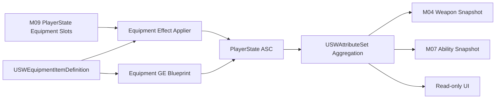

# M08 装备与属性修正设计文档

**状态：** Completed
**负责人：** `12456df`
**最后更新：** 2026-08-10
**建议分支：** `feature/m08-m09-equipment-economy-shop`
**建议提交：** `feat: add equipment ability modifiers`

## 1. 问题与目标

M07 已完成 `AttributeSet → Ability` 通道：主动技能在提交时读取 ASC 聚合后的属性，武器也读取弹匣和射速修正。当前缺少正式装备定义、装备效果应用/移除、叠加规则以及跨重生恢复契约。

M08 的目标是交付一个服务器权威、数据驱动且可由蓝图快速制作内容的装备层。装备只通过 Infinite Gameplay Effect 修改 `USWAttributeSet`，不直接持有或修改 Ability、武器或角色蓝图变量。M09 将在此基础上加入金币、六槽装备栏和商店交易。

本模块按独立开发规模收敛：只支持“购买即装备”的永久属性装备，不提前制作词条随机化、合成树、主动装备技能或复杂唯一被动系统。

## 2. 核心决策

1. 用户语境中的 “AS” 落实为 `USWAttributeSet`，不是 `UAbilitySystemComponent` 的任意内部状态。
2. `USWEquipmentItemDefinition` 是装备内容的唯一静态定义；运行时装备栏只保存稳定 `FPrimaryAssetId`，不复制 Data Asset 指针作为物品身份。
3. 每件装备引用一份或多份 Infinite Gameplay Effect Blueprint。GE 是属性与聚合操作的唯一真值；装备定义不再复制一份容易漂移的数值表。
4. 装备栏中的每个槽位独立应用自己的 GE，并保存对应 `FActiveGameplayEffectHandle`。出售时按槽移除准确的效果，不按 GE Class 批量删除其他装备。
5. 装备栏属于 M09；M08 提供定义、校验和“应用/移除一个槽位装备效果”的 C++ 契约，可先用权威测试入口验收。
6. 当前资源 `Health/Mana/Stamina` 不作为普通装备直接修改目标。装备修改最大值、恢复、攻防、武器或技能修正；当前资源在最大值降低时由 `USWAttributeSet` 统一 Clamp。
7. 装备不回溯重算已经提交的技能快照、正在恢复的冷却或已生成投射物；下一次技能/射击提交读取新聚合值，沿用 M07 规则。

## 3. 需求与边界

### 3.1 功能需求

- FR-01：每件装备必须具有稳定物品 Id、显示名、描述、图标、购买价、拥有上限（默认 1）和至少一项有效装备 GE。
- FR-02：服务器把装备加入有效槽位时，必须向 PlayerState ASC 应用该槽位配置的全部 Infinite GE；任一必需 GE 无法生成时不得留下半套效果。
- FR-03：服务器移除槽位装备时，必须移除仅属于该槽位的全部 Active GE，不影响同类装备、Buff 或等级初始化 GE。
- FR-04：装备 GE 必须能配置性修改既有 AttributeSet 属性，包括攻防、恢复、移动、武器和 M07 技能修正属性。
- FR-05：同一装备允许拥有多份不同作用的 GE；同一物品允许重复拥有时，各槽效果按 GAS 聚合规则叠加。
- FR-06：玩家死亡、Pawn 销毁与重生不得移除装备效果或重复应用效果；PlayerState ASC 与 M09 装备栏共同跨 Pawn 生命周期存活。
- FR-07：装备效果改变后，武器、技能栏充能快照和其他 Attribute 观察者必须通过既有 Attribute/ASC 委托收敛，不增加装备到消费者的直接通知链。
- FR-08：内容制作必须能完全在 Data Asset、GE Blueprint 和图标资产中完成；新增普通数值装备不得修改 C++。

### 3.2 非功能需求

- NFR-01：服务器是装备持有关系与 Gameplay Effect 应用/移除的唯一权威；客户端只读取复制后的装备槽和 GAS 状态。
- NFR-02：装备系统不得使用 Tick、逐帧扫描 ASC 或跨系统直接写属性。
- NFR-03：缺失 Id、重复 Id、无效价格/上限、非 Infinite GE、空 GE 列表和非法 Attribute 必须在资产校验或运行时留下可诊断错误。
- NFR-04：装备定义不得硬引用 Widget；图标使用软引用，Dedicated Server 不加载 UI 资产。
- NFR-05：装备效果应用/移除必须幂等，允许重生、晚绑定或恢复流程重复调用而不重复叠加。

### 3.3 明确不做

- 不实现随机词条、品质、耐久、掉落拾取、装备合成、商店折扣、消耗品或武器更换。
- 不实现主动装备 Ability、点击装备技能、光环、唯一被动、互斥标签或复杂套装效果。
- 不实现技能等级修改、Ability Spec 替换或直接改写 Ability Blueprint 默认值。
- 不制作最终商店/装备栏视觉；M09 交付可用最小界面，完整美术统一属于 M14。

## 4. C++ 与蓝图边界

| 领域 | C++ 负责 | 蓝图/资产负责 |
|---|---|---|
| 装备定义 | 稳定 Id、字段类型、约束、资产校验与查询 API | 创建 `DA_Equipment_*`，填写名称、描述、图标、价格、拥有上限和 GE |
| 属性效果 | 创建 Spec、来源上下文、原子应用/移除、句柄生命周期 | 创建 `GE_Equipment_*`，配置 Infinite Modifier、聚合操作和数值 |
| 适用性 | 允许修改的 Attribute 类别和非法配置拒绝规则 | 选择该装备实际修改哪些既有 Attribute |
| 叠加 | GAS 聚合顺序、拥有上限、按槽隔离和 Clamp | 选择 Additive/Multiplicative/Override；内容层避免无意覆盖 |
| UI 元数据 | 只读快照和软引用边界 | 图标、显示名、描述、属性说明文本与视觉样式 |
| 运行时状态 | 服务器持有槽位到 Active GE Handle 的映射 | 不在蓝图维护第二份装备列表或属性真值 |

蓝图不得通过 `SetNumericAttributeBase`、直接 Set PlayerState 金币或写 Ability 变量来实现装备效果。

## 5. 子系统、所有权与依赖

| 子系统 | 单一职责 | 依赖 | 拥有的数据 | 产生事件 |
|---|---|---|---|---|
| `USWEquipmentItemDefinition` | 定义一类装备内容 | Asset Manager、GE | 静态物品元数据、效果类 | 无 |
| M09 装备栏 | 持有六个运行时槽位 | Item Definition | 槽位 Item Id、购买价 | Inventory Changed |
| 装备效果应用器 | 将一个槽位投影为 Active GE | PlayerState ASC、Item Definition | 槽位到 GE Handle 的服务器映射 | Equipment Effects Rebuilt |
| `USWAttributeSet` | 聚合与约束最终属性 | GAS | 最终 Gameplay Attributes | Attribute Changed |
| M04/M07 消费者 | 在提交时读取最终属性 | ASC、AttributeSet | 本次行为快照 | Ability/Shot Result |



装备栏是持有关系的真值，Active GE 是可重建的派生状态；Ability 和武器只认识 AttributeSet，不认识装备。

## 6. 数据契约

### 6.1 `USWEquipmentItemDefinition`

建立 `UPrimaryDataAsset`：

```cpp
UCLASS(BlueprintType)
class POLYGONSCIFIWORLDS_API USWEquipmentItemDefinition : public UPrimaryDataAsset
{
    GENERATED_BODY()

public:
    UPROPERTY(EditDefaultsOnly, BlueprintReadOnly, Category="Equipment|Display")
    FText DisplayName;

    UPROPERTY(EditDefaultsOnly, BlueprintReadOnly, Category="Equipment|Display", meta=(MultiLine="true"))
    FText Description;

    UPROPERTY(EditDefaultsOnly, BlueprintReadOnly, Category="Equipment|Display")
    TSoftObjectPtr<UTexture2D> Icon;

    UPROPERTY(EditDefaultsOnly, BlueprintReadOnly, Category="Equipment|Economy", meta=(ClampMin="0"))
    int32 PurchasePrice = 0;

    UPROPERTY(EditDefaultsOnly, BlueprintReadOnly, Category="Equipment|Inventory", meta=(ClampMin="1", ClampMax="6"))
    int32 MaxOwnedCount = 1;

    UPROPERTY(EditDefaultsOnly, BlueprintReadOnly, Category="Equipment|Effects")
    TArray<TSubclassOf<UGameplayEffect>> EquippedEffectClasses;
};
```

规则：

- Primary Asset Type 固定为 `SWEquipmentItem`；资产名形成稳定 `FPrimaryAssetId`。
- 改名会改变 Id，进入正式内容后需要迁移记录；不以本地化显示名作为身份。
- `PurchasePrice` 与 `MaxOwnedCount` 在 M09 消费；上限不得超过六槽容量。
- `EquippedEffectClasses` 至少一项且不含空值；数组顺序不表达玩法优先级。
- `Icon` 只用于客户端表现；DS 的交易和 GE 应用不得解引用图标。

### 6.2 装备 Gameplay Effect 约束

每份装备 GE 必须满足：

- `DurationPolicy = Infinite`；无 Periodic、无 Execution Calculation、无 Gameplay Cue 权威副作用。
- 只使用 Modifier 修改既有 `USWAttributeSet` 属性。
- Effect Context 的 `SourceObject` 指向装备定义，便于调试；按槽移除仍以保存的 Active GE Handle 为准。
- 默认允许 Additive 与 Multiplicative；Override 只用于明确写入设计说明的装备，首批内容不使用。
- 不直接修改 `Health`、`Mana`、`Stamina`、`IncomingDamage`、`IncomingXP`。
- 百分比属性遵循现有语义：加成百分比以 0 为无修正；倍率属性以 1 为无修正。

首批可修改 Attribute：

| 类别 | Attribute |
|---|---|
| 最大资源 | `MaxHealth`、`MaxMana`、`MaxStamina` |
| 攻防 | `AttackPower`、`SpellPower`、护甲、穿透、暴击、韧性、物理吸血 |
| 恢复/移动 | 三种 Regeneration、`MovementSpeedMultiplier` |
| 武器 | `MagazineCapacityMultiplier`、`FireIntervalReductionPercent` |
| 技能 | `AbilityRangeBonusPercent`、`AbilityAreaBonusPercent`、`AbilityDurationBonusPercent`、`CooldownReductionPercent`、`AbilityChargeBonus` |

装备对“技能伤害”的修改通过 `AttackPower/SpellPower` 和各技能已有系数完成。M08 不增加一个会重复乘算所有技能的通用 `AbilityDamageMultiplier`。

### 6.3 聚合、上限与快照规则

GAS 按同一 Attribute 的聚合器处理多个装备效果。内容层采用以下规则：

```text
基础值/等级 GE → Additive 装备 → Multiplicative 装备 → AttributeSet/消费者安全 Clamp
```

- 加法和乘法的具体计算由 GAS 聚合语义决定，不手写第二套装备计算器。
- `CriticalChance`、穿透比例、冷却减免等最终上限沿用 AttributeSet/对应消费公式；装备不自行偷偷 Clamp。
- 最大资源降低后，当前资源只在现有 AttributeSet 不变量要求下 Clamp，不按比例补偿或扣除。
- 已提交的技能/射击使用提交时快照；装备改变只影响后续提交。
- `AbilityChargeBonus` 改变时，M07 技能栏立即刷新最大/当前充能，但不伪造或删除已有已消耗 Stack。

## 7. 公共契约

M08 不建立万能 Manager。由 M09 的 PlayerState 装备栏调用下列服务器内部服务：

| API | 输入 | 输出 | 副作用 | 前置条件 | 后置条件 |
|---|---|---|---|---|---|
| `ApplyEquipmentEffectsForSlotAuthority` | SlotIndex、Item Definition | 成功/失败、Handle 数组 | 向自身 ASC 应用 GE | Authority、槽有效、定义合法 | 成功时该槽全部 GE 生效；失败时零残留 |
| `RemoveEquipmentEffectsForSlotAuthority` | SlotIndex | 是否找到派生状态 | 从自身 ASC 移除已保存 Handle | Authority | 该槽效果全部移除；重复调用安全 |
| `RebuildEquipmentEffectsAuthority` | 六槽只读快照 | 成功/失败 | 清理旧句柄并按槽重建 | Authority、ASC 已初始化 | 每个非空槽恰好一套效果 |
| `ValidateEquipmentDefinition` | Item Definition | 错误集合 | 无 | Editor 或服务器 | 非法资产不能进入交易/应用 |

原子应用策略：先为该槽建立全部有效 Spec，再逐一应用；任何一步失败时移除本次已经生成的 Handle，并返回失败。调用者只有在成功后才提交装备栏状态。

## 8. 运行时数据流

### 8.1 装备生效

1. M09 服务器交易先验证目录、金币、拥有上限和空槽。
2. 服务器解析 `FPrimaryAssetId` 得到权威 Item Definition。
3. 装备效果应用器为目标槽创建全部 GE Spec，Context SourceObject = Item Definition。
4. 全部 GE 成功应用后，M09 提交金币与槽位状态。
5. GAS 聚合并复制 Attribute；武器、技能栏和 HUD 通过既有委托刷新。

### 8.2 出售/移除

1. M09 服务器按槽验证出售请求。
2. 按该槽保存的 Handle 移除全部装备 GE。
3. 清空槽位并增加退款金币。
4. Attribute 聚合收敛；不主动调用具体 Ability 或 Weapon。

### 8.3 重生与恢复

- 玩家 ASC 和装备栏都位于 PlayerState，普通死亡/重生不执行重建，也不移除装备效果。
- Avatar 重新绑定后继续读取同一 ASC 聚合值。
- 新 Pawn 的重生初始化会在装备等常驻 GE 已收敛后，将 Health、Mana、Stamina 恢复至对应的最终最大值；这不是重新叠加装备 GE。
- 若未来无缝旅行/重新加入恢复了装备栏但 Active GE 不存在，服务器在 ASC 初始化完成后调用一次幂等重建。

## 9. 边界情况

- EC-01：定义不存在、Id 不在本局目录或资产未加载时拒绝应用，不扣金币。
- EC-02：GE 非 Infinite、为空或 Spec 创建失败时整件装备应用失败并回滚本次已施加 Handle。
- EC-03：重复调用同一槽应用时先检测已有派生状态；不重复叠加。
- EC-04：出售时某个 Handle 已失效，仍清理其余 Handle；装备栏是真值，记录诊断后允许事务收敛。
- EC-05：两个槽持有同一 Item 时，只移除目标槽效果。
- EC-06：降低 MaxHealth/MaxMana/MaxStamina 时当前值不得超过新上限。
- EC-07：角色死亡时不移除装备；死亡期间装备 Attribute 仍在 ASC，但死亡 Tag 继续阻止能力。
- EC-08：Dedicated Server 缺少图标或本地化文本不影响交易和属性效果。

## 10. 实施顺序

| 顺序 | C++/配置 | 蓝图/资产 | 验证 |
|---:|---|---|---|
| 1 | 新建 Primary Data Asset 类型和 Asset Manager 类型约定 | 创建一个测试装备定义 | 稳定 Id、字段与软图标可解析 |
| 2 | 增加定义校验和允许 Attribute 规则 | 创建合法/非法测试 GE | 非 Infinite、空 GE、非法 Attribute 被拒绝 |
| 3 | 实现按槽原子应用、移除和 Handle 保存 | 创建两件修改不同属性的装备 | 单件生效、移除恢复、失败零残留 |
| 4 | 实现幂等重建 | 配置同物品重复拥有测试 | 重建不重复叠加，按槽移除准确 |
| 5 | 接入 M09 六槽与交易 | 创建首批装备内容 | 购买即生效、出售即移除 |
| 6 | 构建与 DS 双客户端验收 | 检查 UI 快照 | 所属客户端状态和 GAS 结果一致 |

## 11. 验收矩阵

| 需求 | 可重复验证 |
|---|---|
| FR-01、FR-08 | 新建装备 Data Asset + GE Blueprint，不改 C++ 即可成为有效内容 |
| FR-02～03 | 应用/移除单件、多 GE、失败 GE；核对 Active GE 数和 Attribute |
| FR-04～05 | 两个装备分别修改武器与技能属性；重复物品按上限和聚合规则生效 |
| FR-06 | 装备后死亡并重生两次；效果数量与最终 Attribute 不变 |
| FR-07 | 改变冷却减免、充能、弹匣和射速；既有 M04/M07 消费者自动刷新/下次提交生效 |
| NFR-01～05 | Authority、复制、Tick、软引用、非法资产和幂等审查 |

最低联网验收：Staged Dedicated Server + 两客户端，玩家 A 装备一件技能修正装备并重生，玩家 B 观察不到 A 的私有装备栏但能看到应有的权威技能/战斗结果；出售后属性与结果恢复。

## 12. 设计验证

- [x] 装备定义、运行时持有状态、Active GE 派生状态和 UI 元数据已分离。
- [x] 装备只通过 AttributeSet 影响 Ability/Weapon，不建立反向或循环依赖。
- [x] C++/蓝图职责、叠加顺序、快照与 Clamp 规则已明确。
- [x] 死亡、重生、重复应用、部分失败和按槽移除已有规则。
- [x] 范围符合独立开发，不提前实现随机词条、合成或主动装备。
- [x] 生产实现、资产配置、Editor/Game/Server Development Target 构建与 Staged DS 双客户端验收已完成。

## 13. 实现进度

### 2026-08-11：PlayerState 持久装备槽与常驻 GE

- `ASWPlayerState` 现在持有固定六槽的 OwnerOnly 复制快照；槽位仅保存 `FPrimaryAssetId`，死亡与 Pawn 重生不会清空。
- 蓝图通过 `StartingEquipmentDefinitions` 配置初始装备；首次 ASC Owner/Avatar 绑定后写入运行时槽位，之后不再因重生重置该状态。
- 每个槽位的 Infinite GE 仅在服务器上原子应用，并保存 `FActiveGameplayEffectHandle`；重生时若句柄仍存在则不重复叠加。
- `RebuildEquipmentEffectsAuthority` 用于未来旅行恢复或派生状态缺失后的幂等重建；购买/出售及槽位写入事务仍属于 M09 后续范围。
- 重生时不会重复应用装备 GE；`ASWCharacter_Base::RestoreVitalResourcesToMaximumAuthority` 在装备聚合完成后恢复三项当前资源，保证最大资源被装备提高时仍以最终上限满资源复活。
