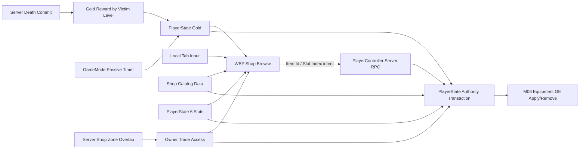

# M09 经济、六槽装备栏与商店设计文档

**状态：** Completed
**负责人：** `12456df`
**最后更新：** 2026-08-10
**建议分支：** `feature/m08-m09-equipment-economy-shop`
**建议提交：** `feat: add economy inventory and shop`

## 1. 问题与目标

项目已有等级、击杀经验、死亡/重生和 M08 装备属性效果，但还没有对局金币、击杀金币、被动收入、装备持有、购买/出售、交易区域或商店 UI。M09 需要形成“战斗/时间获得金币 → 进入商店区域购买装备 → AttributeSet 变强 → 出售调整构筑”的最小闭环。

系统必须适用于 Dedicated Server：客户端只发送购买/出售意图，服务器验证区域、商品、金币、拥有上限和槽位后一次性提交事务。金币与六槽装备栏位于 PlayerState，因此死亡不会掉金币、清空装备或丢失装备效果。

## 2. 核心决策与必要修正

1. 金币不是战斗 Attribute，不加入 `USWAttributeSet`。`ASWPlayerState` 持有服务器权威 `int32 Gold`，仅复制给所属客户端。
2. “角色掉落金币”实现为击杀者直接获得受害者的等级赏金，不生成物理金币 Actor。赏金不是从死者余额扣除，因此死亡金币不会掉。
3. `USWCombatantDefinition` 增加 `GoldRewardByLevel`，与现有 `XPRewardByLevel` 在同一死亡唯一提交点结算；自杀、同队击杀和无有效击杀者不奖励。
4. 被动金币由 `ASWGameMode` 的一个低频全局 Timer 发放，不给每个 PlayerState 创建 Tick。只在 `InProgress` 阶段发放；死亡中的有效玩家继续获得，晚加入者只获得加入后的未来收入。
5. 六个槽位就是已装备物品栏，布局固定为 2×3。购买自动进入第一个空槽并立即生效，不再建立未装备仓库、拖拽换装或堆叠背包。
6. 同一物品的拥有数量按六槽中出现次数计算，受 `MaxOwnedCount` 约束；默认 1。
7. 出售退款为该槽 `PurchasePricePaid × 70%` 向下取整。保存购买时实付价，而不是使用未来可能变化的目录价格，避免改价/折扣造成套利。
8. 商店可在任何地点打开浏览；只有服务器确认当前活着的 Pawn 位于有效商店区域时才能购买或出售。
9. Tab 只控制本地商店 UI，不发送“打开商店” RPC。购买/出售按钮才发送可靠 Server RPC，并且服务端重新验证全部条件。

## 3. 需求与边界

### 3.1 功能需求

- FR-01：PlayerState 必须持有非负金币，服务器唯一写入，所属客户端可事件驱动显示；死亡和重生不改变金币。
- FR-02：每类可战斗单位必须能按死亡时等级配置击杀金币；合法敌方击杀只结算一次并直接授予击杀者 PlayerState。
- FR-03：比赛进行中必须按数据配置的开始延迟、周期和每周期数量向所有有效玩家发放被动金币；死亡期间继续发放。
- FR-04：每名玩家必须拥有固定六个装备槽，以 2×3 显示；每槽为空或持有一个 `FPrimaryAssetId`。
- FR-05：购买时服务器必须依次验证交易区域、角色存活、目录商品、物品定义、金币、拥有上限、空槽和 M08 效果可应用性。
- FR-06：购买成功必须原子完成扣金币、写槽位和应用装备效果；失败不得扣金币、占槽或留下 GE。
- FR-07：出售时服务器必须验证区域和槽位，移除该槽装备效果、清空槽位，并返还实付价格的 70% 向下取整。
- FR-08：同一物品数量达到 `MaxOwnedCount` 或装备栏已满时拒绝购买。
- FR-09：商店区域必须支持多个/重叠区域；离开一个区域但仍处于另一个区域时，交易权限不得错误关闭。
- FR-10：玩家可在任意地点按 Tab 打开/关闭商店浏览；区域外购买/出售按钮禁用，但物品、价格、金币和装备栏仍可查看。
- FR-11：商店 UI 打开时必须阻止角色移动、视角、武器和主动技能输入；关闭后恢复原 Gameplay 输入与鼠标状态。
- FR-12：所属客户端必须收到金币、六槽和当前交易权限变化；其他客户端不接收私有金币与装备栏明细。
- FR-13：晚创建 UI、重生和普通网络重相关后必须从当前复制状态重建正确画面，不依赖曾经发生过的 RPC 或动画事件。

### 3.2 非功能需求

- NFR-01：所有交易和奖励都由服务器权威执行；RPC 参数只包含 Item Id 或 Slot Index，不传价格、退款额、属性值或区域布尔值。
- NFR-02：购买/出售使用可靠 Server RPC；持久状态使用属性复制/GAS 复制，不使用 NetMulticast。
- NFR-03：金币加减使用 `int64` 中间值并 Clamp 到 `0..MaxGold`，运行时存储保持 `int32`。
- NFR-04：六槽低频小集合使用 OwnerOnly RepNotify `TArray`，不引入 Fast Array；若未来背包扩容或高频变更再评估迁移。
- NFR-05：交易流程不得 Tick；被动金币使用一个全局 Timer，区域权限使用 Overlap 事件。
- NFR-06：非法 Item Id、越界 Slot、RPC 频率滥用、资产缺失和事务失败必须安全拒绝并留下限频诊断日志。
- NFR-07：Dedicated Server 不创建 Widget、加载图标或执行本地输入模式切换。

### 3.3 明确不做

- 不实现物理金币掉落/拾取、助攻金币、连杀赏金、团队平分或补刀金币。M12 已接入防御塔的最后一击奖励；水晶和其他地图目标奖励需要时另行扩展。
- 不实现跨对局货币、账号存档、断线重连恢复、交易历史数据库或玩家间交易。
- 不实现商店折扣、回购、撤销购买、合成树、消耗品、库存排序、拖拽换位或装备丢弃。
- 不实现正式商店美术、搜索、筛选、推荐构筑和手柄完整导航；M09 交付可用最小界面，M14 统一视觉。

## 4. C++ 与蓝图边界

| 领域 | C++ 负责 | 蓝图/资产负责 |
|---|---|---|
| 金币 | 存储、OwnerOnly 复制、Clamp、奖励/消费事务和委托 | 金币图标、数字格式与变化动画 |
| 击杀赏金 | 合法击杀判定、死亡幂等结算、等级曲线求值 | 在 Combatant Definition 配置赏金曲线 |
| 被动收入 | GameMode 全局 Timer、比赛状态门槛、批量发放 | 在 Economy Data 配置初始金币、周期与数量 |
| 装备栏 | 六槽结构、OwnerOnly 复制、数量/空槽查询和槽位写入 | 2×3 布局、槽位 Widget 与图标表现 |
| 商店目录 | 目录合法性、服务器解析和客户端只读入口 | 创建 Catalog Data，配置本局可售装备与显示顺序 |
| 商店区域 | 服务器 Overlap、多个区域计数、死亡/销毁清理 | 在地图放置/缩放 Shop Zone，制作区域表现 |
| 交易 | Reliable RPC、完整校验、原子提交、失败原因 | 点击按钮发送意图；按失败原因显示提示 |
| UI/输入 | 本地开关、输入模式、鼠标/焦点与只读 WidgetController | WBP_Shop 布局、动画、商品卡和提示文本 |

蓝图不能决定价格、退款、金币余额、物品拥有关系或服务器是否允许交易。

## 5. 子系统、所有权与依赖

| 子系统 | 单一职责 | 依赖 | 拥有的数据 | 产生事件 |
|---|---|---|---|---|
| `USWEconomyData` | 定义本局经济规则 | 无 | 初始金币、被动收入、退款率、金币上限 | 无 |
| `ASWGameMode` | 组织初始/被动金币和全局奖励规则 | GameState、PlayerArray | 被动金币 Timer | Passive Income Tick |
| `ASWPlayerState` | 持有玩家金币与六槽装备栏 | M08、Economy Data | Gold、Slots、交易权限 | Gold/Inventory/Trade Access Changed |
| `USWShopCatalogData` | 定义本局可售商品集合 | M08 Item Definitions | 有序 Item Id 列表 | 无 |
| `ASWShopZone` | 证明当前 Pawn 是否可交易 | Collision、PlayerState | 区域内 PlayerState 集合 | Enter/Leave Shop |
| `ASWPlayerController` | 本地 UI/Input 与客户端交易 RPC 入口 | Input Config、HUD、PlayerState | 本地 Shop Open 状态 | Purchase/Sell Intent |
| `USWShopWidgetController` | 把权威只读状态转换为 UI 快照 | PlayerState、GameState/Catalog | 本地 Delegate Handle | Shop Snapshot Changed |



数据所有权保持单向：GameMode 组织收入；PlayerState 唯一写金币/槽位；M08 只把槽位投影成 GE；UI 只读。

## 6. 数据契约

### 6.1 `USWEconomyData`

建立本局经济 Data Asset，并由 GameMode 发布到 GameState，方式与 `USWProgressionData` 一致：

| 字段 | 类型 | 默认/约束 | 规则 |
|---|---|---|---|
| `StartingGold` | `int32` | `TBD`，≥0 | PlayerState 首次加入本局时授予一次 |
| `PassiveGoldStartDelaySeconds` | `float` | `TBD`，≥0 | 从 `InProgress` 开始计算 |
| `PassiveGoldIntervalSeconds` | `float` | `TBD`，>0 | 全局 Timer 周期 |
| `PassiveGoldPerInterval` | `int32` | `TBD`，≥0 | 每个有效玩家同额获得 |
| `SellRefundRate` | `float` | 0.70，0..1 | M09 固定需求，数据化便于测试 |
| `MaxGold` | `int32` | `TBD`，>0 | 所有奖励饱和到该上限 |

初始金币、收入间隔/数量和上限尚未确定，保持 `TBD`，不阻塞架构实现。生产验收前必须配置测试值。

### 6.2 PlayerState 金币

```cpp
UPROPERTY(ReplicatedUsing=OnRep_Gold, VisibleAnywhere, Category="SW|Economy")
int32 Gold = 0;
```

- 使用 `DOREPLIFETIME_CONDITION_NOTIFY(..., COND_OwnerOnly, REPNOTIFY_Always)`。
- 公开 `GetGold()` 和只读变化 Delegate。
- 写入口保持服务器内部：`GrantGoldAuthority`、`TrySpendGoldAuthority`；蓝图不获得任意 Set。
- `TrySpendGoldAuthority` 只在完整交易已验证后调用；失败不改变余额。
- PlayerState 另有服务器内部 `bEconomyInitialized`。GameMode 在玩家首次进入本局时只初始化一次 StartingGold 和六槽；重生、重复 `PostLogin` 辅助流程或 ASC 重绑不得再次发放。

### 6.3 六槽装备栏

```cpp
USTRUCT(BlueprintType)
struct FSWEquipmentSlot
{
    GENERATED_BODY()

    UPROPERTY(BlueprintReadOnly)
    FPrimaryAssetId ItemId;

    UPROPERTY(BlueprintReadOnly)
    int32 PurchasePricePaid = 0;
};
```

PlayerState 持有固定长度为 6 的 `TArray<FSWEquipmentSlot>`：

- 索引 `0..5` 是唯一槽位身份；二维 2×3 仅为 UI 排布，不进入玩法数据。
- 空槽为无效 `ItemId` 且 `PurchasePricePaid = 0`。
- 数组 OwnerOnly RepNotify；构造/初始化和 OnRep 都修正到恰好 6 项。
- Active GE Handle 不复制，服务器用 `TMap<uint8, TArray<FActiveGameplayEffectHandle>>` 保存 M08 派生状态。
- `PurchasePricePaid` 由服务器目录价写入，客户端 RPC 不提供。

六槽规模小且低频变化，普通 RepNotify 数组的简单性高于 Fast Array 收益。未来若增加大背包、消耗品堆栈或频繁交换，再单独迁移。

### 6.4 击杀金币

`USWCombatantDefinition` 增加：

```cpp
UPROPERTY(EditAnywhere, BlueprintReadOnly, Category="Combatant|Rewards")
FScalableFloat GoldRewardByLevel;
```

在 `TryCommitDeathAuthority` 已有一次性死亡提交中，与经验使用相同的受害者等级和敌我判定。`GrantDeathRewardsAuthority` 分别结算 XP 与 Gold；某一奖励曲线无效不阻断另一项。

金币接收者只接受拥有 `ASWPlayerState` 的玩家击杀者。AI 击杀玩家不产生可持有金币；未来需要 AI 经济时另行建立所有者。

### 6.5 商店目录

`USWShopCatalogData : UDataAsset` 持有有序 `TArray<TObjectPtr<USWEquipmentItemDefinition>>`，并由 GameMode 发布到 GameState：

- 顺序只影响浏览显示，不影响交易。
- 服务器只允许购买目录内且通过 M08 校验的 Item Id。
- 重复 Item Id、空定义和非法装备使该条目不可购买并输出资产诊断。
- 客户端从已复制 Catalog Data 读取静态字段；图标按需异步加载。

垂直切片商品数量较小，使用本局目录 Data Asset，不引入运行时 Asset Registry 查询或远程商品服务。

### 6.6 交易权限

PlayerState 持有：

- 服务器内部 `TSet<TWeakObjectPtr<ASWShopZone>> ActiveShopZones`；
- OwnerOnly RepNotify `bool bCanTradeAtShop`，其值为有效区域集合非空且当前 Pawn 存活。

只有 `ASWShopZone` 的服务器 Overlap/EndPlay 清理流程能增减集合。客户端复制的布尔值只控制按钮表现；交易时服务器仍检查当前 Pawn、死亡状态和至少一个有效区域，不能信任旧布尔值。

## 7. 公共契约与失败原因

### 7.1 PlayerController 请求

| API | 输入 | 输出 | 服务器校验 | 可靠性 |
|---|---|---|---|---|
| `ServerRequestPurchaseItem` | `FPrimaryAssetId ItemId` | 无；状态经复制收敛 | RPC 频率、目录、区域、存活、定义、金币、上限、空槽、GE | Reliable |
| `ServerRequestSellEquipmentSlot` | `uint8 SlotIndex` | 无；状态经复制收敛 | RPC 频率、区域、存活、索引、非空槽、定义 | Reliable |

RPC 不携带价格、退款、拥有数量、金币或 GE Class。非法高频请求采用短时间窗口限频；正常点击不受影响。

### 7.2 交易结果

状态成功通过 Gold/Slots/GAS 复制；失败可用一个所属客户端可靠通知返回轻量枚举，便于 UI 提示，但不作为状态真值：

```cpp
UENUM(BlueprintType)
enum class ESWShopTransactionFailure : uint8
{
    None,
    NotInShopZone,
    Dead,
    InvalidItem,
    InsufficientGold,
    InventoryFull,
    OwnershipLimitReached,
    InvalidSlot,
    EquipmentApplicationFailed,
    RateLimited
};
```

### 7.3 购买原子事务

1. 解析本局 Economy/Catalog 和 Item Definition。
2. 验证角色活着且位于有效 Shop Zone。
3. 验证 `Gold >= PurchasePrice`、拥有数小于上限并找到首个空槽。
4. 让 M08 为候选槽原子应用全部装备 GE；失败则结束，Gold/Slot 不变。
5. 扣除金币并写入 `ItemId + PurchasePricePaid`。
6. 一次性广播/复制最终 Gold 与 Slots；若内部不变量异常，移除本次 GE 并拒绝提交。

实现时禁止在每个校验步骤提前广播 UI。所有前置条件通过后才产生最终状态。

### 7.4 出售原子事务

1. 验证区域、存活、Slot Index 和非空槽。
2. 计算 `Refund = floor(PurchasePricePaid × SellRefundRate)`，使用 `int64` 中间值。
3. 按槽移除 M08 Active GE；Handle 已部分失效时记录诊断并继续清理。
4. 清空槽位并饱和增加退款金币。
5. 广播/复制最终快照。

出售由装备栏真值驱动。派生 GE 已意外缺失时，不应把物品永久锁死在槽内。

## 8. 输入与 UI

### 8.1 Enhanced Input

- 新建 Bool `IA_ToggleShop`，在 `IMC_Gameplay` 映射 Tab，使用 `Started` 触发。
- `USWInputConfig` 增加直接 UI Action `ToggleShopAction`；这是 Controller 级、跨重生输入，不进入 GAS Ability Input Tags。
- `ASWPlayerController::SetupInputComponent` 绑定打开/关闭；不把 Tab 放入 Character。
- 打开只改变本地 UI 状态，不向服务器报告。

### 8.2 输入模式

打开商店：

- 创建/显示 `WBP_Shop`，设置键盘焦点；
- `FInputModeUIOnly`，显示鼠标；
- Widget 处理 Tab 和 Escape 关闭；Gameplay IMC 保留但 UIOnly 阻断 Pawn/GAS 输入。

关闭商店：

- 移除/隐藏 Widget；
- 恢复 `FInputModeGameOnly`、隐藏鼠标并把焦点还给视口。

死亡、Controller EndPlay 或 HUD 重建时必须关闭并恢复本地输入状态。Dedicated Server 跳过全部 UI 分支。

### 8.3 最小商店界面

M09 交付：

- 当前 Gold；
- 商品列表：图标、名称、价格、拥有数/上限；
- 商品详情与购买按钮；
- 固定 2×3 装备栏，每槽显示图标与出售按钮；
- 区域外“仅浏览，进入商店区域后可交易”提示；
- 失败原因提示。

`USWShopWidgetController` 订阅 PlayerState Gold、Slots、Trade Access 和 GameState Catalog，初次绑定立即广播完整快照，后续事件驱动更新。Widget 不每帧查询 PlayerState 或 ASC。

## 9. 运行时数据流

### 9.1 被动金币

1. `HandleMatchHasStarted` 读取 Economy Data 并创建一次延迟 Timer。
2. 到达开始延迟后，GameMode 以固定周期遍历 GameState `PlayerArray`。
3. 只对有效 TeamA/TeamB、非 Inactive 的 PlayerState 调用 `GrantGoldAuthority`；是否死亡不影响资格。
4. 比赛结束、GameMode EndPlay 或配置无效时清理 Timer。

### 9.2 击杀金币

1. 受害者首次成功提交死亡。
2. 复用现有 ASC/队伍关系，拒绝自身、同队或无效 Instigator。
3. 以受害者死亡时等级求 `GoldRewardByLevel` 并向下取整。
4. 找到击杀者 PlayerState，饱和增加 Gold；死者余额不变。

### 9.3 浏览与交易

1. 玩家任意地点按 Tab，本地显示 Catalog、Gold、Slots。
2. 区域外 `bCanTrade=false`，按钮禁用。
3. Pawn 在服务器进入 Shop Zone，PlayerState 区域集合增加并 OwnerOnly 复制权限。
4. 点击购买/出售发送最小意图 RPC；服务器完整校验并提交。
5. Gold/Slots/GAS 复制驱动 UI 和玩法收敛。

## 10. 边界情况

- EC-01：金币达到上限时奖励饱和；不溢出、不变负数。
- EC-02：被动 Timer 配置周期 ≤0 时不启动并输出错误，不能形成零间隔循环。
- EC-03：死亡发生在收入 Tick 同帧时仍可获得被动金币；死亡不改变余额。
- EC-04：自杀、环境死亡、同队击杀、重复死亡回调不授予击杀金币。
- EC-05：两个 Shop Zone 重叠时离开一个仍可交易；区域销毁会清理自己留下的资格。
- EC-06：Pawn 在区域内死亡/销毁时立即清理区域资格；重生后必须重新进入。
- EC-07：客户端界面显示可交易但服务器已判定离开区域时，请求被拒并通过复制/失败提示收敛。
- EC-08：购买与出售请求连续到达时服务器串行处理，以处理时最新 Gold/Slots 为准。
- EC-09：购买后装备效果失败时不扣金币、不占槽；出售时派生 GE 缺失仍允许清槽和退款。
- EC-10：背包满、达到拥有上限、价格为 0、退款为 0 均有确定结果；免费装备仍受槽位与上限约束。
- EC-11：晚创建 UI 先读取当前快照，不等待下一次金币或槽位变化。
- EC-12：商店打开期间死亡、重生或 HUD 替换不会永久锁住输入或鼠标。
- EC-13：经济初始化入口被重复调用时，`bEconomyInitialized` 保证不重复授予 StartingGold 或清空已有槽位。

## 11. 实施顺序

M08 与 M09 使用同一分支开发，但保持两个独立完成门槛和建议提交。

| 顺序 | C++/配置 | 蓝图/资产 | 验证 |
|---:|---|---|---|
| 1 | 完成 M08 Item Definition、GE 应用/移除 | 创建至少两件测试装备 | 装备属性闭环 |
| 2 | 新建 Economy/Catalog Data；GameMode → GameState 发布 | 配置测试经济和商品目录 | DS/客户端解析同一目录 |
| 3 | PlayerState 增加 Gold、六槽、OwnerOnly 复制与委托 | 无 | 初始值、Clamp、晚绑定 |
| 4 | Combatant 增加金币曲线；死亡链路结算 | 配置玩家/敌人赏金 | 敌方击杀一次奖励，死亡不扣款 |
| 5 | GameMode 增加被动收入 Timer | 配置开始延迟、周期与数量 | 仅 InProgress，死亡继续获得 |
| 6 | 实现 Shop Zone 与多区域权限 | 关卡放置 TeamA/TeamB 商店区域 | 进入/离开/死亡/重生权限正确 |
| 7 | 实现购买/出售 RPC 与原子事务 | 使用测试商品 | 全部成功/失败路径零部分提交 |
| 8 | 接入 Tab、本地输入模式与 Shop WidgetController | 制作最小 `WBP_Shop`、2×3 槽位 | 任意地点浏览、区域内交易 |
| 9 | 自动化、三 Target 构建、Staged DS 双客户端 | 完成测试地图配置 | 第 12 节全部通过 |
| 10 | 同步路线图、Systems 索引、GDD 与项目上下文 | 记录测试证据 | 文档与实现一致 |

## 12. 验收矩阵

| 需求 | 可重复验证 |
|---|---|
| FR-01 | 玩家获得金币后死亡/重生两次，余额不变；另一客户端不能读取私有余额 |
| FR-02 | 1/多等级敌人与玩家死亡；核对曲线、敌我、自杀和重复回调 |
| FR-03 | 配置短测试周期；活着/死亡/晚加入玩家的收入符合规则，比赛结束后停止 |
| FR-04、FR-08 | 连续购买到六槽、重复物品上限、满栏和免费物品 |
| FR-05～07 | 购买成功、金币不足、区域外、GE 失败、出售退款与按槽移除 |
| FR-09 | 两个重叠 Shop Zone 的进入、离开、销毁和 Pawn 死亡 |
| FR-10～11 | 区域外 Tab 浏览、区域内交易、Tab/Escape 关闭、游戏输入完全阻断与恢复 |
| FR-12～13 | OwnerOnly 复制、晚创建 Widget、重生、重相关和 HUD 重建 |
| NFR-01～07 | RPC 参数、Authority、复制、Timer/Tick、数组规模、日志与 DS UI 审查 |

最低联网验收：Staged Dedicated Server + 两客户端；两名玩家分别验证被动收入、敌方击杀赏金、区域外浏览、区域内购买、属性生效、死亡重生保留、出售 70% 退款以及区域外伪造 RPC 被服务器拒绝。

## 13. 待配置而非待架构决策

以下数值保持 `TBD`，在首批装备内容与平衡测试时填写，不阻塞生产实现：

- 初始金币、被动金币开始延迟、周期与数量；
- 金币上限；
- 各 Combatant 等级的击杀金币；
- 首批商品、价格与装备属性数值；
- 商店区域的最终尺寸、视觉和阵营摆放位置。

已确定且不再保持 TBD：六槽 2×3、购买即装备、默认拥有上限 1、出售返还实付价 70%、死亡不丢金币、区域外可浏览但不可交易、Tab 打开商店。

## 14. 设计验证

- [x] Gold、Slots、Active GE、Catalog 和 UI 各有唯一数据所有者。
- [x] 击杀赏金与现有死亡幂等点对齐，不创建第二套死亡监听。
- [x] 被动金币无 Tick，并明确比赛状态、死亡和晚加入规则。
- [x] 购买/出售的服务器校验、原子提交、失败和复制边界明确。
- [x] 六槽范围按独立开发收敛，不提前实现仓库、堆叠和合成。
- [x] Tab、本地 UI、区域权限和 Dedicated Server 边界明确。
- [x] 生产实现、资产配置、Editor/Game/Server Development Target 构建与 Staged DS 双客户端验收已完成。

## 15. 开发进度记录

### 2026-08-11 — 装备栏只读 UI 数据通道

- 新增 `USWEquipmentOverlayWidgetController`。它只在本地 HUD 创建，订阅 `ASWPlayerState::OnEquipmentSlotsChanged`，并把固定六槽解析为 `FSWEquipmentSlotSnapshot`。
- 首次绑定广播完整六槽快照；后续槽位复制变化后逐槽广播快照。六槽低频且当前 RepNotify 未携带差异索引，逐槽刷新比维护额外差异缓存更直接；未来购买/出售完成后，可保持 WBP 数据契约不变地优化为仅推送实际变更槽位。
- 快照包含槽位索引、Primary Asset Id、占用状态、名称、描述、软图标和目录标价。蓝图只负责 2×3 布局、图标和将来的点击详情/出售按钮，不写入金币、槽位或 GE。
- Asset Manager 的扫描路径已与实际资源目录统一为 `/Game/BlurPrints/Equipments`，保证装备可按 Primary Asset Id 被正确解析。

### 2026-08-11 — HUD 首次快照生命周期

- `ASWHUD` 创建 WidgetController 时只注入数据源并绑定其运行时委托，不在此时广播首份快照；此刻对应 UMG 蓝图尚未订阅委托。
- `USWUserWidget::SetWidgetController` 先触发 `BP_OnWidgetControllerSet`，使蓝图完成 Delegate 绑定，再请求 `BroadcastInitialValues`。该顺序适用于属性、武器、进度、技能、装备和诊断控制器，避免初始属性或重生后的最终属性必须等待下一次变化才显示。
- 当 PlayerState/Pawn 生命周期变化而 HUD 已存在时，`ASWHUD::RefreshOverlayWidgetControllers` 仍在重新绑定数据源后立即广播；此时 Widget 已订阅，属于正常的重连刷新路径。

### 2026-08-10 — PlayerState 金币与 Overlay 只读通道

- `ASWPlayerState` 新增服务器权威 `Gold`。奖励入口只接受正数并使用 `int64` 中间值饱和到 `MAX_int32`；消费入口拒绝负数和余额不足，零价格事务成功但不广播伪变化。
- `Gold` 使用 `COND_OwnerOnly + REPNOTIFY_Always`，服务器写入和所属客户端 `OnRep_Gold` 都广播 `OnGoldChanged`。金币不会复制给其他玩家，也不依附 Pawn，因此普通死亡和重生不会重置。
- 两个写入口仅供 C++ 权威奖励/交易流程调用，不向蓝图暴露任意 SetGold。后续 `USWEconomyData::MaxGold` 落地后，奖励入口将以该本局配置替换当前 `MAX_int32` 安全上限。
- 现有 `USWProgressionOverlayWidgetController` 是当前 HUD 中面向 PlayerState 长期数据的只读控制器；其 `FSWOverlayProgressionSnapshot` 现包含 Gold，并订阅/解绑 `OnGoldChanged`。蓝图只需从既有 `OnProgressionChanged` 刷新金币文本与表现，不建立第二份金币状态。
- 完整商店界面仍使用本文计划的 `USWShopWidgetController`；Overlay 中的 Gold 用于常驻 HUD 显示，两者未来读取同一个 PlayerState 真值。

### 2026-08-11 — 初始金币与等级被动收入

- 新增 `USWEconomyData`，配置 `StartingGold`、`PassiveGoldPerSecondByLevel` 与 `MaxGold`。GameMode 在服务器 BeginPlay 发布至 GameState；GameState 向客户端复制只读配置引用。
- GameMode 在玩家首次 `PostLogin` 时调用 PlayerState 的幂等经济初始化。`bEconomyInitialized` 仅存在服务器，保证普通重生、Avatar 重绑和重复登录辅助流程均不会重复授予初始金币。
- 比赛进入 `InProgress` 后，GameMode 使用唯一的一秒 Timer 遍历 GameState.PlayerArray，并按每名有效 TeamA/TeamB 玩家当前等级的 `PassiveGoldPerSecondByLevel` 发放金币；不检查 Pawn 或死亡状态。金币值保持整数，但 PlayerState 会保留小数收入残余，故低于 1 金/秒的曲线不会因逐秒取整而丢失。比赛结束与 GameMode 销毁时清理 Timer。
- `ASWPlayerState::ApplyGoldDeltaAuthority` 是唯一的金币写入入口：初始金币、被动收入、击杀奖励、购买扣费和出售退款均通过 `GrantGoldAuthority` / `TrySpendGoldAuthority` 间接进入该函数。它统一执行余额/上限约束，并通过 `BroadcastGoldChanged` 广播 UI；所属客户端的 `OnRep_Gold` 复用同一广播函数。

### 2026-08-11 — 等级击杀金币

- `USWCombatantDefinition` 新增 `GoldRewardByLevel`。`ASWCharacter_Base` 的死亡唯一提交点沿用经验奖励的合法性校验：仅服务器、非自杀、非同队且击杀者拥有有效 ASC 时结算。
- 经验仍通过击杀者 ASC 的 `IncomingXP` 链路结算；金币直接写入该 ASC Owner 对应的 `ASWPlayerState`，并经 `GrantGoldAuthority` 收敛到唯一金币写入/UI 广播入口。无效曲线、非玩家击杀者或零/负奖励均安全跳过。
