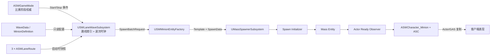
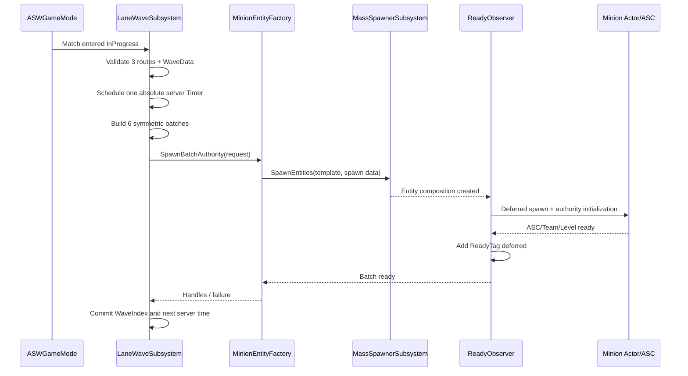
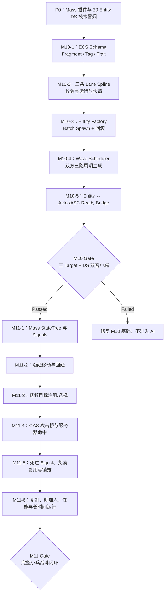

# M10 路线、波次与 Mass 生成基础设计文档

**状态：** Approved
**负责人：** `12456df`
**最后更新：** 2026-08-15
**建议分支：** `feature/m10-m11-mass-lane-minions`
**建议提交：** `feat: add lane and wave system`
**关联决策：** [ADR-0003](../ADR/ADR-0003-ServerMassActorGASMinions.md)

## 1. 问题与目标

项目已有服务器权威比赛阶段、队伍、GAS 战斗与经济，但地图还没有可验证的三路、周期波次和小兵生成。M10 需要建立 M11/M12 可复用的路线与批量生成底座，并把 Mass Entity 的学习范围收敛为清晰的 ECS 数据与生命周期问题。

M10 的可玩结果是：比赛进入 `InProgress` 后，服务器按同一份数据资产在 Top/Middle/Bottom 三路为 TeamA/TeamB 周期生成对称小兵；每个小兵都具有有效 Mass Entity、路线/队伍/波次身份和可复制 Actor/ASC 表现。M10 不要求小兵移动或攻击。

## 2. 已确认规则

1. 地图固定三路：`Top`、`Middle`、`Bottom`。
2. TeamA 与 TeamB 使用同一条路线，分别按 Spline 正向和反向推进，避免维护镜像路线副本。
3. 波次只由服务器生成；`WaitingToStart` 不出兵，`InProgress` 开始，比赛结束立即停止未来生成。
4. 波次间隔、首次延迟、每波编成、单位间隔、单位等级曲线与最大活动小兵数全部数据驱动。
5. 波次使用一个世界级 Timer 和批量 Spawn Request；禁止每个 Lane、每个小兵创建独立循环 Timer。
6. Factory 负责“把 Spawn Request 变成 Entity/Actor”，不决定何时出兵；Wave Subsystem 决定调度，不知道具体 Fragment 创建细节。
7. M10/M11 使用同一功能分支开发，但保留两个独立验收闸门和提交。

具体首次延迟、波次间隔、每波数量、单位类型比例、等级曲线和活动数量上限保持 `TBD`，进入资产验证前必须填写测试值。

## 3. 范围与需求

### 3.1 Functional

- FR-10-01：关卡必须恰好提供 Top/Middle/Bottom 三条有效路线，并能为两队计算相反方向的出生 Transform。
- FR-10-02：服务器在比赛进入 `InProgress` 后按配置启动且只启动一次波次调度；结束/World 销毁时对称清理。
- FR-10-03：一个全局波次必须为三路和两队构造对称 Spawn Batch，且 WaveIndex 单调递增。
- FR-10-04：Factory 必须通过 `UMassSpawnerSubsystem` 的 Entity Template/批量生成入口创建 Entity，并用 Spawn Initializer 写入每实体出生数据。
- FR-10-05：每个成功实体都具有有效的 Identity、Team、Lane、Wave 和 Transform 数据，以及一个服务器可战斗、客户端可见的 Actor/ASC 表现。
- FR-10-06：无效路线、定义、EntityConfig、Actor Class 或达到活动上限时必须拒绝该批次并留下可定位诊断，不能产生半初始化小兵。
- FR-10-07：服务器卡顿后只补发当前到期波次一次，并从当前服务器时间重新建立下一间隔；不压缩生成多个历史波次形成突发尖峰。
- FR-10-08：提供只读调试统计：当前 WaveIndex、活动 Entity 数、各队/各路线数量、最近一次失败原因。

### 3.2 Non-Functional

- NFR-10-01：Mass Processor、Wave Timer 和 Factory 只在 Server/Standalone 执行；客户端不能请求或决定生成。
- NFR-10-02：M10 不新增 Actor Tick、Entity 独立 Timer、AIController、BehaviorTree 或逐实体 RPC。
- NFR-10-03：一次批量生成要么全部达到 Ready，要么销毁本批次已创建对象并报告失败。
- NFR-10-04：MassGameplay/MassAI 接入后 Development Editor、Game、Server 均可构建，Dedicated Server 不加载 UI/音频依赖。
- NFR-10-05：`ActiveMinionHardCap` 必须是有效非零配置；达到上限时安全拒绝新批次，避免失控增长。

### 3.3 Edge Cases

- EC-10-01：同一 LaneId 出现 0 或多个 Route Actor 时，该路线不可生成，M10 地图验收失败。
- EC-10-02：Spline 长度过短、端点重叠或 Spawn Transform 被阻挡时，批次拒绝并记录 Lane/Team/Wave。
- EC-10-03：比赛开始回调重复触发、地图重载或 PIE 多 World 时，不能产生重复 Timer 或跨 World Entity。
- EC-10-04：比赛在单位间隔生成中结束时，取消未完成请求；已生成单位由比赛清理策略处理。
- EC-10-05：一侧配置失败时不生成另一侧的非对称波次；该全局波次保持失败并进入诊断。
- EC-10-06：Entity 创建成功但 Actor/ASC 初始化失败时，Factory 回滚 Entity 与 Actor 链接。

### 3.4 Out of Scope

- 沿线移动、索敌、攻击、死亡回收（M11）。
- 塔、水晶、兵营阻断和路线推进门槛（M12）。
- 完整赛后清场、重开与 Travel（M13/M15）。
- ZoneGraph、NavMesh、MassCrowd、Smart Object、MassReplication、ISM LOD 和对象池。

## 4. UE 5.7 技术基线

- `MassEntity` 已是 Engine Runtime 模块；**不启用 deprecated 的 `MassEntity.uplugin` 空壳**。
- M10 启用 `MassGameplay`；M11 使用 Mass StateTree 时再启用 `MassAI`。`StateTree`、ZoneGraph 等传递依赖由插件声明带入，但本模块不使用 ZoneGraph。
- 初始预计依赖 `MassEntity`、`MassCommon`、`MassSpawner`、`MassActors` 与必要的 `MassRepresentation`；最终 Build.cs 只保留实际 include 所需模块。
- MassGameplay/MassAI 属于需谨慎使用的功能，先执行 20 Entity 的 Editor/Game/Server + DS 技术冒烟，再进入生产资产。

官方参考：

- [Mass Entity Overview](https://dev.epicgames.com/documentation/unreal-engine/overview-of-mass-entity-in-unreal-engine?application_version=5.7)
- [Mass Gameplay Overview](https://dev.epicgames.com/documentation/unreal-engine/overview-of-mass-gameplay-in-unreal-engine?application_version=5.7)
- [MassActors API](https://dev.epicgames.com/documentation/en-us/unreal-engine/API/Plugins/MassActors?application_version=5.7)

## 5. ECS 学习模型

| 概念 | M10 中的实际用途 | 约束 |
|---|---|---|
| Entity | 一个小兵的轻量身份 | Entity Handle 不作为持久存档 ID |
| Fragment | Team、Lane、Wave、Transform 等原子数据 | 只存数据，不写行为函数 |
| Tag | Ready/Dead 等组成状态 | 结构变化通过 Deferred Command |
| Archetype | 相同 Fragment 组成的小兵集合 | 不以每个单位类型复制 Processor |
| Trait | 为 EntityConfig 组合 Fragment/Processor 需求 | 蓝图资产只能配置，不写权威流程 |
| Processor | 批量初始化/统计/后续移动与战斗 | 查询声明访问模式；Actor/ASC 访问限 Game Thread |
| Observer | 对 Entity 创建、Ready、Dead 的组成变化作一次性处理 | 不用 Tick 模拟生命周期事件 |

### 5.1 M10 Fragment 与 Tag

| 类型 | 内容 | 所有者/写入时机 |
|---|---|---|
| `FSWMinionIdentityFragment` | UnitId、WaveIndex、SpawnOrdinal | Factory Initializer，只写一次 |
| `FSWMinionTeamFragment` | `ESWTeamId` 查询缓存 | Factory Initializer，只写一次 |
| `FSWMinionLaneFragment` | `ESWLaneId`、方向、初始 Distance | Factory Initializer；M11 只写 Distance |
| `FMassActorFragment` | 引擎提供的 Entity ↔ Actor 弱引用/桥接信息 | Factory 建立；Game Thread 访问 |
| `FSWMinionArchetypeSharedFragment` | 同类单位的移动/索敌/攻击数值快照 | Trait 构建 Const Shared Fragment |
| `FSWMinionReadyTag` | Entity 与 Actor/ASC 均初始化完成 | Factory 在桥接完成后添加；Ready Observer 校验 |
| `FSWMinionDeadTag` | M11 死亡桥使用 | M10 只预留，不写入 |

`TeamFragment` 是为了 Mass Chunk 查询的出生缓存；真正可变的 TeamId 仍属于小兵 Actor/ASC。M10 不在 Fragment 中放 Health、Damage、Gold 或 XP。

## 6. 子系统、数据所有权与依赖

| 子系统/类型 | 单一职责 | 拥有的数据 | 依赖 |
|---|---|---|---|
| `ASWLaneRoute` | 关卡路线编辑与启动时校验 | LaneId、Spline 几何、两队端点规则 | `USplineComponent` |
| `USWMinionWaveData` | 静态波次规则 | Delay、Interval、Composition、HardCap | `USWMinionDefinition` |
| `USWMinionDefinition` | 一个单位原型的静态配方 | EntityConfig、ActorClass、CombatantDefinition、等级/行为参数 | M05 数据资产、Mass EntityConfig |
| `USWLaneWaveSubsystem` | 服务器路线索引与唯一波次时钟 | Route Snapshot、WaveIndex、NextWaveTime、活动句柄集合 | Match State、WaveData、Factory |
| `USWMinionEntityFactory` | 将已验证请求原子转换为 Entity/Actor | 无长期玩法状态；仅模板缓存 | MassSpawner、Actor Bridge |
| `USWMinionSpawnInitializerProcessor` | 将 Batch SpawnData 写入 Fragment | 无 | Spawn Request |
| `USWMinionActorReadyObserver` | 校验已就绪 Entity 的 Actor/ASC 链接 | 无 | Actor、ASC、MassActorSubsystem |
| `ASWGameMode` | 只转发比赛开始/结束事实 | 不持有波次列表或 Entity | LaneWaveSubsystem |



依赖方向保持 `GameMode → LaneWaveSubsystem → Factory → Mass/Actor Bridge`。Actor、Processor 和 Data Asset 都不反向查找或写入 GameMode。

## 7. 数据资产与关卡配置

### 7.1 `ESWLaneId`

固定值：`None`、`Top`、`Middle`、`Bottom`。`None` 只表示未初始化，不是可生成路线。

### 7.2 `USWMinionDefinition`

蓝图/资产可配置：

- 稳定 `UnitId`；
- `UMassEntityConfigAsset`；
- `ASWCharacter_Minion` Blueprint Class；
- `USWCombatantDefinition`；
- `CombatLevelByWave`；
- 移速、索敌范围、攻击距离、攻击 Ability/GE 等 M11 静态参数；
- Mesh、AnimBP、Montage、VFX、SFX 由 Actor Blueprint/引用资产决定。

资产不保存当前生命、当前目标、当前波次或 Entity Handle。

### 7.3 `USWMinionWaveData`

- `InitialWaveDelaySeconds`
- `WaveIntervalSeconds`
- `UnitSpawnSpacingSeconds`
- `ActiveMinionHardCap`
- 有序 `WavePattern`；允许配置重复周期，但运行时 WaveIndex 永不回绕
- 每个 Pattern Entry：MinionDefinition、Count、FormationOffset

首版同一份 Pattern 同时用于六个 Lane/Team Batch，保证对称。未来若确需不对称事件波次，新增显式规则，不在蓝图临时分支。

### 7.4 `ASWLaneRoute`

- 每张对局地图恰好放置 Top/Middle/Bottom 各一条。
- TeamA 使用 Spline `0 → Length`；TeamB 使用 `Length → 0`。
- Spline 端点就是两队该路基础出生锚点，具体队形使用相对偏移。
- BeginPlay 只采集一次不可变路线快照；运行时不允许蓝图移动控制点。

## 8. Factory 契约

```text
SpawnWaveBatchAuthority(FSWMinionSpawnBatchRequest) -> FSWMinionSpawnBatchResult
```

请求包含：WaveIndex、LaneId、TeamId、MinionDefinition、Count、SpawnTransforms。结果包含成功 Entity Handles 或结构化失败原因。

前置条件：Authority、InProgress、有效路线/定义/模板、数量大于 0、未超过 HardCap、所有 Spawn Transform 可用。

副作用：一次调用通过 `UMassSpawnerSubsystem` 批量创建同 Archetype Entity；Initializer 写 Fragment；Observer 建立 Actor/ASC；成功后才向 WaveSubsystem 登记活动句柄。

后置条件：成功时请求数量全部达到 `Ready`；失败时本批次没有残留 Actor、Entity 或活动计数。

禁止：Factory 自己设置周期 Timer、决定下一 WaveIndex、修改 Gold/XP、在客户端生成，或把具体 Blueprint 路径硬编码进 C++。

## 9. 运行时生成流程



## 10. C++ 与蓝图边界

### C++

- Mass Fragment/Tag/Trait/Initializer/Observer 和 Entity 查询。
- LaneId、路线校验、两队方向换算、波次唯一 Timer、HardCap 与卡顿规则。
- Factory 原子生成/回滚、Entity ↔ Actor 生命周期桥、服务器权限和诊断。
- `ASWCharacter_Minion` 的延迟出生初始化契约：Team、CombatLevel、CombatantDefinition 必须在 `FinishSpawning` 前写入。

### 蓝图与资产

- 在地图摆放三条 Lane Spline，并调整路线几何与 Spawn 端点。
- 创建 EntityConfig、MinionDefinition、WaveData 和小兵 Actor Blueprint。
- 选择 Mesh、AnimBP、Montage、VFX、SFX 与 M05 Combatant/GE 资产。
- 只配置参数和表现；不启动波次、不创建 Entity、不写 WaveIndex/Team/Level。

## 11. M10/M11 联合开发流程图



这是本模块的唯一执行流程，不再额外维护冗长的生产流程表。

## 12. 实施顺序与学习检查点

| 顺序 | 交付 | 学习重点 | 验证 |
|---:|---|---|---|
| 0 | 插件/模块接入与 20 Entity Spike | Entity、Archetype、EntityConfig | 三 Target + DS 启动 |
| 1 | Fragment/Tag/Trait 与自动化结构测试 | 组合优于继承 | Archetype 组成正确 |
| 2 | Lane Route 与三路校验 | Actor 配置 → 不可变运行时快照 | 方向/端点/重复路线 |
| 3 | Batch Factory + Spawn Initializer | Template、SpawnData、Observer、Deferred Command | 成功与原子回滚 |
| 4 | Wave Subsystem | 单一时钟、绝对服务器时间、HardCap | 只在 InProgress 周期生成 |
| 5 | Actor/ASC Ready Bridge | Entity/Actor 两种生命周期 | Team/Level/ASC/Handle 一致 |
| 6 | M10 联机闸门 | 服务器权威与 Actor 复制 | DS + 两客户端 + 多波 |

## 13. 验收矩阵

| 需求 | 可重复验证 |
|---|---|
| FR-10-01 | 对三条正确路线和缺失/重复/零长度路线分别运行地图校验 |
| FR-10-02/03 | WaitingToStart 观察零生成；InProgress 观察六个对称 Batch；结束后不再增加 |
| FR-10-04/05 | Mass Debugger 检查 EntityConfig、Fragment、Archetype 与 Ready Tag；客户端检查 Actor/Team/ASC |
| FR-10-06 | 注入空定义、无效 ActorClass、阻挡端点和 HardCap，确认无半初始化残留 |
| FR-10-07 | 人为暂停服务器跨过一个 Interval，确认只生成一波并重建节奏 |
| FR-10-08 | 对照世界 Actor、Mass Entity 与调试统计数量 |
| NFR-10-01/02 | 客户端无 Spawn API；源码检查无 Actor Tick、独立循环 Timer、AIController/BT |
| NFR-10-03～05 | 故障注入回滚、三 Target 构建、Staged DS 两客户端连续多波运行 |

### M10 完成闸门

- [x] ADR-0003 经确认后改为 `Accepted`
- [x] M10 文档改为 `Approved`
- [x] 三路、两队、多个波次在 DS 上对称生成
- [x] 每个小兵 Entity/Actor/ASC/Team/Level 关联一致
- [x] 所有失败路径无残留 Entity/Actor/Timer
- [x] Editor、Game、Server Development 构建通过
- [x] Staged DS + 两客户端通过生成与晚加入相关状态验证
- [x] 项目上下文、风险、路线图和提交记录同步
