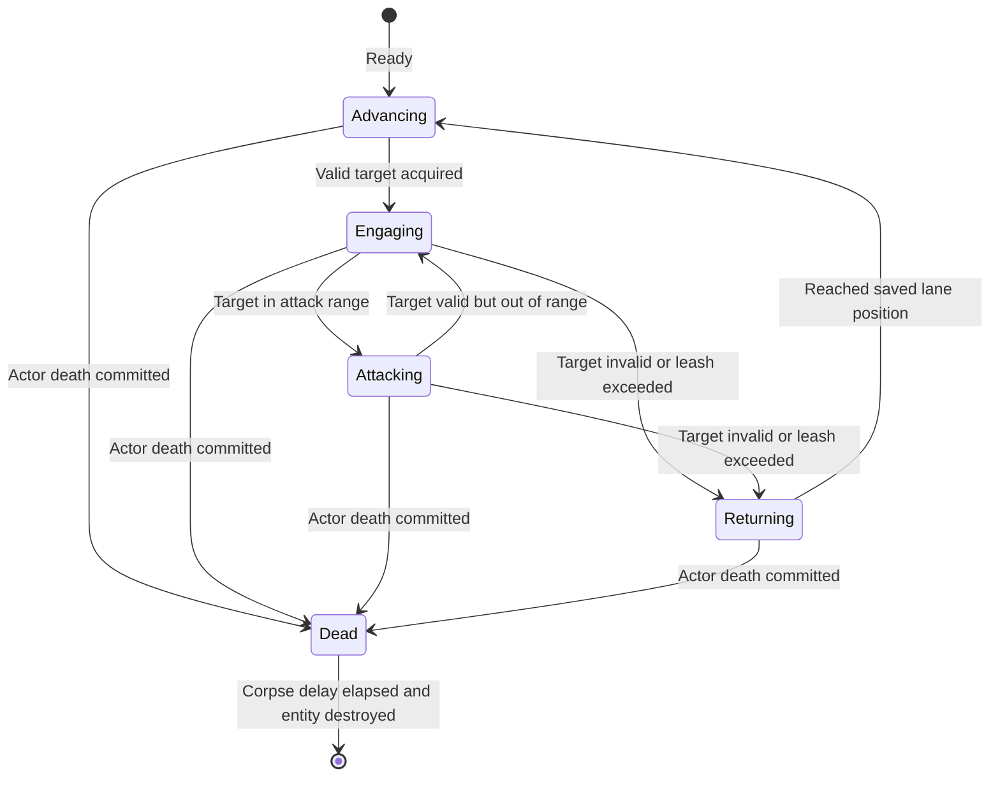
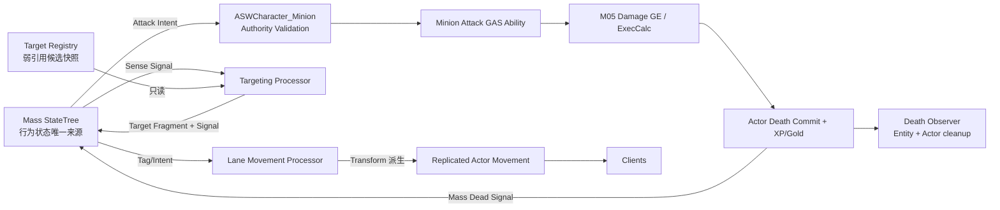
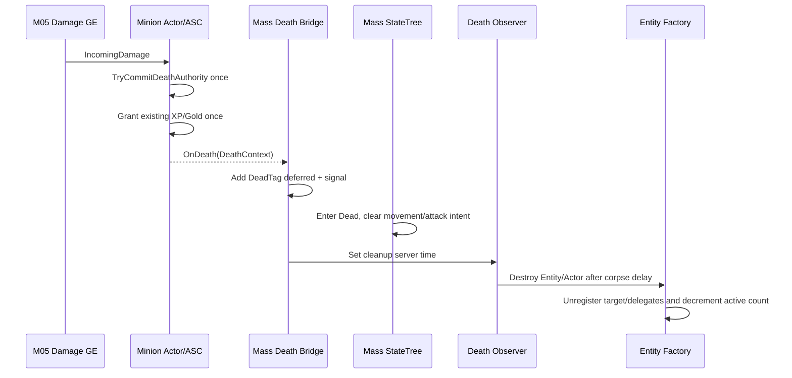

# M11 Mass 小兵 AI 与战斗设计文档

**状态：** Approved
**负责人：** `12456df`
**最后更新：** 2026-08-15
**建议分支：** `feature/m10-m11-mass-lane-minions`
**建议提交：** `feat: add networked minion AI`
**依赖：** M05、M10、[ADR-0003](../ADR/ADR-0003-ServerMassActorGASMinions.md)

## 1. 问题与目标

M10 只生成带路线身份和 Actor/ASC 表现的 Mass Entity。M11 需要让这些小兵在服务器上沿路推进、低频选择合法目标、进入攻击范围后通过现有 GAS 战斗链攻击，并在死亡后正确发奖与销毁。客户端只接收 Actor/GAS 的必要复制，不执行小兵决策。

M11 的目标不是一次覆盖全部 Mass 技术栈，而是完成一个可解释的 ECS 行为闭环：StateTree 负责状态选择，Signals 负责唤醒，Processors 批量执行，Actor/ASC 负责碰撞、GAS、伤害、死亡和表现。

## 2. 行为规则

### 2.1 状态机

StateTree 是状态的唯一编排者。它通过 Mass Tag/Fragment 输出 Processor 意图；Processor 不私自维护第二套状态枚举。

### 2.2 目标规则

合法目标必须：实现现有 Combat/Team 契约、未死亡、与自己为 Enemy、处于目标可用状态并在 AcquisitionRange 内。

默认优先级：

1. 保留当前仍合法且未超 Leash 的目标，避免每次感知抖动。
2. 最近一次合法伤害来源可触发反击优先级，但仍必须满足 Leash。
3. 同优先级内最近的敌方小兵。
4. 敌方玩家。
5. M12 接入的敌方塔/水晶；只有附近无可攻击单位时才选择结构。

同一优先级和距离相同时按稳定 TargetId 排序，避免帧顺序造成非确定抖动。优先级表和 Range 为数据配置，不在蓝图 Event Graph 中分支。

### 2.3 路线与追击

- `Advancing` 沿出生 Lane 的方向推进，不动态换线。
- 发现目标时保存当前 `LaneDistance` 作为 Leash Anchor。
- 追击不能超过配置的 `LeashDistance`，超出或目标失效立即 `Returning`。
- `Returning` 回到 Lane Anchor 后恢复沿线推进，不沿历史追击路径回放。
- 首版不使用 NavMesh 绕障；关卡必须保证 Lane Corridor 无静态阻挡。局部队形使用生成偏移和简单同队分离，不做 MassCrowd。

### 2.4 攻击与伤害

- Mass 只产生“尝试攻击某目标”的意图，不计算最终伤害、不扣 Health。
- `ASWCharacter_Minion::TryActivateMinionAttackAuthority(Target)` 重新校验 Authority、死亡、队伍、距离和 ASC，再激活配置的 Minion Attack Ability。
- Ability 负责攻击行为生命周期、Cost/Cooldown（若配置）和 Damage GE；现有 `USWExecCalc_Damage`、AttributeSet、死亡提交、XP/Gold 奖励保持不变。
- 服务器伤害时点使用 Ability/Data 中的 `AttackWindupSeconds`，不依赖 Dedicated Server 上的动画 Notify。Montage/Notify 只同步表现并必须与权威时点对齐。
- 同一次攻击序列只能产生一次伤害提交；Ability 取消、目标死亡或离开范围时不得晚到命中。

## 3. 范围与需求

### 3.1 Functional

- FR-11-01：Ready 小兵由 Mass StateTree 进入 Advancing，并沿其 Lane/Direction 前进。
- FR-11-02：服务器以配置的低频感知周期批量选择目标；不得为每个小兵每帧执行 World Overlap。
- FR-11-03：当前目标、反击、优先级、距离、Team 和 Leash 规则必须产生稳定且可测试的唯一结果。
- FR-11-04：小兵到达攻击范围后通过 GAS Attack Ability 攻击；伤害接入 M05 统一 ExecCalc/死亡链。
- FR-11-05：目标失效、死亡、变友军、离开 Leash、Actor 销毁或 Ability 取消时，小兵能回线且无悬空引用。
- FR-11-06：小兵首次死亡提交后停止移动/索敌/攻击，复用 M05 结算合法 XP/Gold，并在数据配置的尸体延迟后原子销毁 Entity/Actor。
- FR-11-07：客户端和晚加入者能看到正确的小兵 Team、Transform、Health/Death Tag、攻击与死亡表现，但不能运行或改写 AI。
- FR-11-08：调试视图能显示 Entity Id、Lane、Wave、State、Target、LaneDistance、Leash 和最近一次失败原因。

### 3.2 Non-Functional

- NFR-11-01：AI StateTree/Processor `ExecutionFlags` 只允许 Server/Standalone。
- NFR-11-02：无 AIController、BehaviorTree、per-Actor Tick、per-Entity Timer 或每帧目标 Overlap。
- NFR-11-03：Target Scan Frequency、攻击范围、Leash、速度、Windup、Cooldown、Corpse Delay 与 HardCap 均数据驱动。
- NFR-11-04：访问 Actor/ASC/World Object 的 Processor 明确限定 Game Thread；纯 Fragment Processor 才允许并行。
- NFR-11-05：连续多波运行结束后，活动 Entity 数、Actor 数、Death Delegate 和 Timer 数必须收敛，无持续增长。
- NFR-11-06：Editor、Game、Server 三 Target 与 Staged DS + 两客户端通过；网络结果最终一致，不用 Multicast 保存死亡或生命状态。

### 3.3 Edge Cases

- EC-11-01：双方小兵同帧互相致死时，各自死亡最多提交一次，已开始但未结算的攻击按 Ability 取消规则结束。
- EC-11-02：Target Actor 被 World 销毁而未正常死亡时，弱引用失效并触发重新选取/回线。
- EC-11-03：Entity 已标 Dead 后到达的 Target/Attack Signal 被忽略。
- EC-11-04：Actor 死亡成功但 Entity 结构变更延迟到帧尾时，Actor 的 `bDead`/ASC Tag 立即阻止再次攻击。
- EC-11-05：死亡小兵没有合法击杀者、由同队伤害或环境导致时不授予 XP/Gold；尸体仍正常清理。
- EC-11-06：比赛结束时取消新攻击与感知；是否立即清除存量小兵由 M13 最终赛后流程决定，M11 至少保证不再产生权威伤害。
- EC-11-07：Lane Route 运行时失效属于不可恢复地图错误；停止该路线实体处理并输出一次聚合错误，不能每 Entity 刷屏。
- EC-11-08：玩家重生后是新 Avatar，旧目标引用失效；下次感知可选择新 Avatar，不依赖旧 PlayerState/Pawn 历史。

### 3.4 Out of Scope

- 补刀判定、助攻、最后一击金币、仇恨表、技能型小兵、远程弹道兵和 Boss 波。
- 动态换线、绕路、NavMesh、ZoneGraph、Smart Object、MassCrowd 完整避障。
- 塔仇恨和水晶攻击规则（M12）；本文只预留 Target Category。
- 客户端预测 AI、MassReplication、低精度 ISM 表现与对象池。

## 4. 子系统与数据所有权

| 类型 | 单一职责 | 拥有的数据 | 不拥有 |
|---|---|---|---|
| Mass StateTree | Advancing/Engaging/Attacking/Returning/Dead 状态选择 | 当前行为状态 | Health、Damage、Cooldown 数值 |
| `USWMinionTargetRegistrySubsystem` | 注册可战斗 Actor 并提供低频候选快照 | Actor 弱引用索引、TargetId、空间/路线桶 | Team/Health 真值 |
| Targeting Processor | 按规则写当前 Target Fragment | 当前 Target 弱引用、LastSenseTime | Actor 生命周期 |
| Lane Movement Processor | 写 Mass Transform/LaneDistance | LaneDistance、DesiredVelocity | Actor Health/GAS |
| Actor Sync Processor | 将 Mass Transform 派生到服务器 Actor | 无长期状态 | 目标/行为决策 |
| `ASWCharacter_Minion` | 小兵世界碰撞、ASC、战斗桥和复制 | TeamId、CombatLevel、Health、bDead、ASC | WaveIndex、Lane 调度 |
| Minion Attack Ability | 一次攻击生命周期 | 激活状态、Cooldown/Cost GE | Target 选择策略 |
| Death Bridge Observer | Actor Death → Mass Dead Signal → 延迟销毁 | Corpse cleanup deadline | 奖励计算 |

`USWMinionTargetRegistrySubsystem` 是只读索引，不是 Combat Manager。Combat Actor 仍拥有自己的 Team/Health/Death；Registry 只保存弱引用并在查询时复核接口。

## 5. Mass 数据组成

在 M10 Fragment 基础上增加：

| 类型 | 内容 | 写入者 |
|---|---|---|
| `FSWMinionTargetFragment : FObjectWrapperFragment` | Target 弱引用、稳定 TargetId、上次有效时间 | Targeting Processor |
| `FSWMinionIntentFragment` | DesiredVelocity、AttackRequested 等纯意图 | StateTree Task/Processor |
| `FSWMinionLeashFragment` | AnchorLaneDistance、最大追击距离 | 进入 Engaging 时写入 |
| `FSWMinionTimingFragment` | NextSenseServerTime、CleanupServerTime | Target/Death Processor |
| `FSWMinionAdvanceTag` | 执行沿线推进 | StateTree 派生 |
| `FSWMinionEngageTag` | 执行追击/保持距离 | StateTree 派生 |
| `FSWMinionAttackTag` | 尝试激活攻击 | StateTree 派生 |
| `FSWMinionReturnTag` | 返回 Lane Anchor | StateTree 派生 |
| `FSWMinionDeadTag` | 禁止其他 Processor 并进入清理 | Death Bridge Deferred Command |

Tag 的添加/移除在 Processor 执行中必须使用 Deferred Command。目标弱引用只在 Game Thread 解引用。

## 6. Target Registry 与选择契约

### 注册

`RegisterTarget(AActor&) -> FSWTargetRegistrationHandle`

前置条件：Actor 实现 Combat/Team Interface 且在服务器 World。后置条件：Registry 为其分配稳定的本局 TargetId，并加入空间/路线候选索引。重复注册幂等。

`UnregisterTarget(Handle)` 在 EndPlay/销毁时调用；查询仍会清理失效弱引用，防止遗漏注销造成崩溃。

### 查询

`FindBestTarget(FSWMinionTargetQuery) -> FSWMinionTargetResult`

输入：Source Actor/Team、Lane、WorldLocation、CurrentTarget、LastDamageSource、Range、Leash、PriorityPolicy。输出：一个弱引用和原因；纯选择，不修改 Target Actor。

Targeting Processor 按 `NextSenseServerTime` 对到期 Entity 执行，默认频率由 Definition 配置并加入稳定 EntityId 相位偏移，避免所有小兵同一帧同时扫描。

## 7. Movement 与 Actor 同步

1. M10 在启动时把 Spline 转成不可变 Lane Runtime Snapshot。
2. `Advancing` 根据速度和 DeltaTime 更新 LaneDistance，并从 Snapshot 求 Transform。
3. `Engaging` 在 Lane Corridor 内朝 Target 移动；超过 Leash 转 `Returning`。
4. `Returning` 向 Anchor Transform 移动，达到容差后恢复推进。
5. Actor Sync 在服务器 Game Thread 将 Mass Transform 写入 `ASWCharacter_Minion`；该 Actor 的 CharacterMovement 不运行自主 AI，使用 Actor Movement Replication 派生到客户端。

首版同队小兵不进行物理阻挡，队列宽度由 FormationOffset 与轻量分离修正控制；敌我停止距离由 AttackRange 决定。若实际地图必须绕静态障碍，先修正 Lane，再评估后续 ZoneGraph/NavMesh ADR。

## 8. GAS 攻击桥

### `ASWCharacter_Minion::TryActivateMinionAttackAuthority`

| 输入 | 输出 | 前置条件 | 后置条件 |
|---|---|---|---|
| Target Actor | Accepted/Failure enum | Authority、双方有效、敌对、存活、距离合法、ASC Ready | 成功时最多激活一个攻击 Ability；不直接扣血 |

失败原因至少覆盖：InvalidTarget、Dead、SameTeam、OutOfRange、AbilityUnavailable、Cooldown、ActorNotReady。

### Ability/资产边界

C++ Ability 基类负责：服务器验证、Windup Timer、取消、目标弱引用、Damage Spec 调用和恰好一次命中标记。

Blueprint/资产负责：Attack Montage、音效、VFX、Damage GE Class、Windup、Recovery、Cooldown 和角色美术。蓝图不能直接 Apply Damage、Set Health 或决定 Team。

## 9. 死亡与清理流程

Death Bridge 不再次计算奖励，也不调用玩家 Respawn。小兵后续生命由新 Wave 生成的新 Entity/Actor 表示。

## 10. 网络模型

| 数据 | 服务器真值 | 客户端到达方式 |
|---|---|---|
| AI State、Target、LaneDistance | Mass Entity | 默认不复制；仅调试可选 |
| Transform | Mass → Minion Actor | Actor Movement Replication |
| Team、CombatLevel、bDead | Minion Actor | 属性复制/RepNotify |
| Health/Tag/Cue | ASC/AttributeSet | AI ASC `Minimal` + Attribute 复制 |
| 攻击/死亡表现 | Ability/Cue + 持久状态 | Cue/表现事件；晚加入以 Actor/GAS 状态收敛 |
| XP/Gold | 击杀者 PlayerState/ASC | 现有 M05/M09 复制 |

客户端不创建权威 Mass AI Processor，不上传 Target/Move/Attack 结果，也不使用 Multicast 代替 Health/Dead 持久状态。

## 11. C++ 与蓝图边界

### C++

- StateTree Task/Evaluator/Condition 的稳定契约与所有 Mass Processor/Signals。
- Target Registry、优先级、Team/Range/Leash 验证、Actor 生命周期和服务器线程边界。
- Mass Transform → Actor 同步、Attack Ability 基类、死亡桥和幂等清理。
- 自动化测试、调试统计与聚合日志。

### 蓝图与资产

- `ST_Minion_Default` 的状态编排，只使用 C++ 提供的窄 Task/Condition。
- MinionDefinition 数值、Attack Ability Blueprint、GE、Montage、AnimBP、VFX/SFX。
- 受击/攻击/死亡表现与调试颜色。
- 不实现 Target 选择算法、权威移动、伤害、奖励或销毁。

## 12. 实施顺序

| 顺序 | C++/配置 | 蓝图/资产 | 验证 |
|---:|---|---|---|
| 1 | MassAI/StateTree 接入、行为 Tag/Signal/Task 契约 | `ST_Minion_Default` 空状态骨架 | Server-only 执行 |
| 2 | Lane Movement/Actor Sync | 移动速度、队形配置 | 双向沿线、无 Actor Tick |
| 3 | Target Registry/低频 Target Processor | Priority Policy 测试值 | 稳定选择、错峰扫描、回线 |
| 4 | Minion Attack Ability/Actor Bridge | Attack GE、Montage、Windup/Recovery | 一次攻击一次权威伤害 |
| 5 | Death Bridge/Observer/Cleanup | Death 表现、Corpse Delay | XP/Gold 一次、无残留 |
| 6 | 塔/水晶 Target Category 占位验证 | 无 M12 实体 | API 不依赖具体类 |
| 7 | 自动化、性能、三 Target、Staged DS 双客户端 | 多波测试资产 | 长时间收敛、晚加入一致 |

## 13. 验收矩阵

| 需求 | 可重复验证 |
|---|---|
| FR-11-01 | 两队三路小兵从相反端点沿正确方向移动，状态显示 Advancing |
| FR-11-02/03 | 同时放置多个 Minion/Player，核对错峰 Sense、Priority、Target Retention 与稳定 Tie Break |
| FR-11-04 | 小兵进入范围激活 Ability；同队/超距/死亡 Target 不受伤 |
| FR-11-05 | Target 死亡、销毁、玩家重生和超 Leash 后重新选取或回线 |
| FR-11-06 | 物理/魔法伤害击杀小兵；XP/Gold 按等级一次结算，尸体延迟后 Entity/Actor 同时消失 |
| FR-11-07 | DS + 两客户端观察 Transform/Team/Health/Attack/Death；晚加入恢复当前状态 |
| FR-11-08 | Mass Debugger/自定义统计可定位任一小兵的 State/Target/Lane/Wave |
| NFR-11-01～04 | ExecutionFlags、源码 Tick/Timer/RPC/线程访问审查 |
| NFR-11-05/06 | 连续多波长时间运行，结束后计数收敛；三 Target + Staged DS 验收 |

### M11 完成闸门

- [ ] M10 已完成并提交
- [ ] M11 文档状态为 `Approved`
- [ ] 三路双方小兵完成推进 → 索敌 → 攻击 → 死亡 → 回收闭环
- [ ] M05 XP、M09 Gold 按小兵等级正确奖励且恰好一次
- [ ] 无 AIController/BehaviorTree/per-Actor Tick/per-Entity Timer/双重 Health 或 Damage 真值
- [ ] 长时间多波运行无 Entity/Actor/Delegate/Target 弱引用持续泄漏
- [ ] Editor、Game、Server Development 构建通过
- [ ] Staged DS + 两客户端通过移动、战斗、死亡、晚加入与比赛结束验证
- [ ] 项目上下文、路线图、风险与提交记录同步

## 14. 后续技术引入条件

| 技术 | 当前结论 | 只有满足以下条件才引入 |
|---|---|---|
| ZoneGraph | 暂不使用 | 固定 Spline 无法处理真实路线分叉/动态封路 |
| NavMesh/MassNavMesh | 暂不使用 | 追击必须绕过实际静态障碍且修图不能解决 |
| MassCrowd/Avoidance | 暂不使用 | 队形偏移/轻量分离无法满足密度与视觉目标 |
| MassReplication | 暂不使用 | Actor 网络成为已测量瓶颈，且能取消同状态 Actor 复制 |
| ISM/Representation LOD | 暂不使用 | 远距离小兵数量达到性能压力，且 ASC/碰撞降级契约已设计 |
| Object Pool | 暂不使用 | Spawn/Destroy 被采样证实为显著瓶颈，且 ASC/Delegate 重置测试齐全 |
| EQS/Smart Object | 暂不使用 | 出现非路线目标搜索或复杂交互需求 |
