# M12 防御塔与水晶设计文档

**状态：** Draft
**负责人：** `12456df`
**最后更新：** 2026-08-21
**建议分支：** `codex/m12-m13-structures-match-flow`
**建议提交：** `feat: add towers and team crystals`
**依赖：** M05、M10、M11

## 1. 问题与目标

M10/M11 已完成服务器权威的三路兵线、小兵目标注册、Mass/StateTree 决策和 GAS 战斗闭环，但地图中还没有可攻击、可推进且能触发胜负的固定结构。M12 需要建立一套由防御塔和水晶共同复用的静态结构框架：结构在地图中预放置，服务器使用行为树驱动攻击，通过现有 GAS 结算生命与死亡，并用显式的前置结构关系约束推进。

本设计保留“防御塔与水晶逻辑一致”的目标，但不把二者视为语义完全相同：它们共享 Actor、ASC、目标选择、行为树、攻击、受击和死亡生命周期；只有 `StructureKind` 决定死亡后的目标规则——塔更新推进和计分，水晶向 GameMode 报告比赛结束候选。

### 1.1 已确认规则

1. 防御塔与水晶均由同一个 `ASWDefenseStructure` C++ 基类和同一套行为树运行，不复制两套战斗代码。
2. 结构在游戏运行前由关卡设计者摆放；M12 不在运行时生成或重生结构。
3. 当前目标只要仍存活且位于攻击范围内就保持，不因后续单位进入而切换。
4. 无当前目标时，优先选择最早进入范围的合法敌方单位；首版单位类别仅为 Minion/Player，结构之间不互相攻击；同一帧进入时以稳定 TargetId 破平局。
5. 当前目标因死亡失效时，先从范围内小兵中选择最早进入者；没有小兵才选择最早进入的其他敌人。
6. 当前目标离开范围或失去合法性时，按普通规则选择最早进入的剩余敌人，不额外触发“死亡后小兵优先”。
7. 结构只接受敌方来源、`Damage.Type.Physical`、且来源 Avatar 在该结构战斗半径内的伤害；魔法、真实、友军、自身、范围外来源均造成 0 伤害。
8. 合法物理伤害先经过现有护甲/穿透/暴击，再乘结构减伤：`Applied = DamageAfterCombatFormula * (1 - DamageReductionPercent)`。
9. `DamageReductionPercent` 是结构静态配置，首版限制为 `[0, 1]`；只有将来确有 Buff/装备动态修改需求时才升级为 Attribute。
10. 锁定推进阶段的结构不可被选为攻击目标，并通过现有 `State.Invulnerable` 形成最终受击门槛。

## 2. 需求

### 2.1 Functional

- FR-12-01：地图中的每个结构必须具有唯一 `StructureId`、有效 `TeamId`、`StructureKind`、路线身份和结构定义。
- FR-12-02：结构必须自持 ASC/AttributeSet，使用 Minimal 复制，并通过已有初始化 GE 按固定等级初始化生命、护甲等属性。
- FR-12-03：结构 AI 只在服务器运行；客户端不得拥有或执行 AIController、Blackboard 和 Behavior Tree。
- FR-12-04：结构进入 `InProgress` 后才开始索敌和攻击；比赛结束后立即停止新攻击。
- FR-12-05：目标选择必须实现“保持当前目标 → 首入优先 → 当前目标死亡后小兵优先”的确定性规则。
- FR-12-06：攻击必须由 GAS Ability 发起；行为树只编排目标与激活，不直接扣血、生成伤害或维护冷却。
- FR-12-07：攻击 Ability 在实际执行前必须重新验证目标存活、敌对、可选中和仍在范围内。
- FR-12-08：结构只接受范围内敌方 Avatar 发起的物理伤害，并应用结构减伤参数；所有入口都必须经过同一服务器伤害策略。
- FR-12-09：结构死亡只能提交一次；死亡后停止 AI、关闭攻击范围、取消攻击 Ability，并保留残骸供客户端表现和晚加入同步。
- FR-12-10：结构推进依赖必须由服务器统一计算；前置结构未毁时，后续塔/水晶保持不可选中和无敌。
- FR-12-11：小兵必须能通过 M11 目标注册表发现已解锁的敌方结构，并保持“小兵 → 玩家 → 结构”的既有优先级。
- FR-12-12：塔死亡更新攻击方推塔数并解锁依赖结构；水晶死亡只报告权威目标事件，最终胜负由 M13 GameMode 裁决。

### 2.2 Non-Functional

- NFR-12-01：结构 Actor 不使用 Tick；范围变化依赖服务器 Overlap，行为树只做事件唤醒或低频兜底验证。
- NFR-12-02：每个结构只复制表现必需的 `TeamId`、死亡、易伤状态和 GAS 状态；候选目标列表、进入顺序、Blackboard 不复制。
- NFR-12-03：所有选择排序都有稳定破平局规则；同一服务器输入必须得到相同目标。
- NFR-12-04：结构数量按当前地图固定规模设计，不引入 Mass Entity、全局逐帧扫描或新的编译模块。
- NFR-12-05：Dedicated Server + 两客户端下，伤害、死亡、解锁与目标切换只有服务器产生一次权威结果。

### 2.3 Edge Cases

- EC-12-01：同帧多个敌人进入范围时，按注册 TargetId 升序确定先后，禁止依赖 `TSet`/Overlap 返回顺序。
- EC-12-02：当前目标死亡和另一目标进入发生于同帧时，死亡原因触发的小兵优先规则先执行，再以进入序号排序。
- EC-12-03：目标离开后立刻重新进入，获得新的 `EntrySequence`，视为一次新的进入。
- EC-12-04：来源在攻击时位于范围内、命中时已离开时，以服务器实际结算伤害时的位置为准，拒绝本次伤害。
- EC-12-05：投射物的 EffectCauser 可为 Projectile，但范围检查必须读取受信任 EffectContext 中的 Source Avatar，不以 Projectile 位置或客户端位置为准。
- EC-12-06：来源 Actor 已失效、没有有效 Team、没有项目 EffectContext、伤害类型非法或数值非有限时拒绝伤害。
- EC-12-07：减伤为 1 时合法攻击造成 0 伤害；越界配置在加载验证中报错，运行时仍 Clamp 到 `[0, 1]`。
- EC-12-08：前置结构引用缺失、重复 ID、循环依赖、同队水晶数量不是 1 时，服务器记录 Error 并使地图验收失败；不得猜测修复。
- EC-12-09：结构在 BeginPlay 时范围内已有敌人，服务器执行一次初始 Overlap 收集并按稳定规则建表。
- EC-12-10：结构死亡与比赛结束重复通知必须幂等，不能重复计分、解锁或触发胜负。
- EC-12-11：敌方结构碰撞体即使与攻击范围重叠也不加入候选；塔/水晶不能彼此开火。

### 2.4 Out of Scope

- 塔皮肤、升级、修复、重生、占领、可移动炮塔和玩家建造。
- 仇恨值、攻击者伤害排行、英雄强制拉塔仇恨、塔下保护等更复杂 MOBA 规则。
- 塔/水晶击杀金币与经验；首版沿用 `USWCombatantDefinition` 的零奖励配置，新增奖励规则为 TBD。
- 完整结算 UI、计分板和目标 HUD（M14）。
- Session、Lobby、跨地图匹配与断线重连（M15）。

## 3. C++ 与蓝图边界

| C++ 负责 | 蓝图/资产负责 |
|---|---|
| 结构基类生命周期、ASC/AttributeSet 所有权、复制和死亡幂等 | `BP_DefenseTower`、`BP_TeamCrystal` 的 Mesh、材质、碰撞体组装和视觉层级 |
| 服务器范围候选集、进入序号、目标合法性与确定性选择 | 攻击/受击/死亡/解锁的动画、音效、Niagara、材质变化 |
| AIController、Blackboard Key 契约、BT Task 与 GAS Ability 激活 | BT/Blackboard 资产按已定义 Key 组装，不在节点中写伤害规则 |
| 伤害接收策略、物理/敌我/范围校验、减伤顺序 | 结构定义资产中的半径、减伤、攻击 Ability、初始 GE 和表现配置 |
| 结构依赖图、易伤状态和目标事件 | 在关卡实例上设置 Team、Lane、StructureId 和前置 StructureId |
| Data Validation、日志、自动化/多人验证钩子 | 关卡中预放置结构、摆放攻击原点/枪口与范围预览 |

蓝图事件只能消费已经确定的状态，不得调用 `ApplyDamage`、直接写 Health、直接设置 `bDead`/`bVulnerable`、改写 Team 或决定胜负。

## 4. 子系统与数据所有权

| 子系统/类型 | 单一职责 | 唯一拥有的数据 | 依赖 |
|---|---|---|---|
| `ASWDefenseStructure` | 静态结构世界实体、ASC、复制、死亡和表现入口 | `TeamId`、`bDead`、复制的 `bVulnerable` 投影 | GAS、Team/Combat Interface |
| `USWStructureTargetingComponent` | 维护本结构范围候选及进入顺序，选择当前目标 | 候选弱引用、`EntrySequence`、当前目标（仅服务器） | Sphere Overlap、Combat/Team |
| `ASWStructureAIController` | 运行 BT、把目标组件结果写入 Blackboard、响应 GameState 阶段事件 | Blackboard（仅服务器） | Structure、Behavior Tree、GameState 只读事件 |
| `USWStructureAttackGameplayAbility` | 重验目标、提交冷却、生成权威攻击并结束 | 单次 Ability 执行状态 | ASC、统一伤害入口 |
| `ISWDamageReceiverPolicyInterface` | 让特殊目标附加统一伤害接收规则 | 无；只读目标状态并返回决策 | EffectContext、Gameplay Tag |
| `ISWTargetableInterface` | 为可锁定性提供可选扩展门槛 | 无 | Combat/Team Interface |
| `USWStructureObjectiveSubsystem` | 验证并维护结构依赖 DAG，计算解锁并上报目标事件 | 依赖图、已毁 StructureId 集合 | World、GameMode |
| `USWCombatTargetRegistrySubsystem` | 全局可战斗目标身份索引；供小兵查询与结构取得稳定身份 | Actor→稳定 TargetId/类别索引 | 可选 Targetable Interface |
| `ASWGameMode` | 记录推塔、消费水晶毁灭报告 | 比赛裁决 | GameState、Objective Subsystem |

`USWStructureObjectiveSubsystem` 是易伤规则的唯一写入者；`ASWDefenseStructure::bVulnerable` 只是服务器设置并复制给客户端的状态投影。结构不得自行根据邻居 Actor 猜测解锁。

```mermaid
flowchart LR
    Overlap["服务器范围 Overlap"] --> Targeting["StructureTargetingComponent"]
    Targeting -->|目标事件| AI["StructureAIController + BT"]
    AI -->|激活请求| GA["Structure Attack GA"]
    GA -->|统一伤害入口| GAS["GAS Damage Pipeline"]
    GAS -->|首次死亡| Structure["DefenseStructure"]
    Structure -->|StructureId 死亡事件| Objective["StructureObjectiveSubsystem"]
    Objective -->|唯一写入易伤投影| Structure
    Objective -->|塔/水晶报告| GM["SWGameMode"]
```



依赖方向固定为 `GameMode ← Objective Subsystem ← Structure ← Targeting/AI/Ability`；GameMode 不遍历并直接改写结构内部状态。

## 5. 数据与配置

### 5.1 `USWStructureDefinition`

这是静态、可复用的结构战斗配置，不保存运行时状态。

| 字段 | 类型 | 规则 |
|---|---|---|
| `CombatantDefinition` | `TObjectPtr<USWCombatantDefinition>` | 复用 M05 初始化 GE、生命、护甲和可选奖励曲线 |
| `CombatLevel` | `int32` | 默认 1，固定结构不在局内升级 |
| `CombatRadius` | `float` | 大于 0；同时用于索敌与伤害来源范围校验 |
| `DamageReductionPercent` | `float` | `[0,1]`；在普通物理结算后应用 |
| `AttackAbilityClass` | `TSubclassOf<USWStructureAttackGameplayAbility>` | 非空；攻击数值、冷却和攻击表现由 Ability/CDO 配置 |
| `BehaviorTree` | `TObjectPtr<UBehaviorTree>` | 塔和水晶默认指向同一资产；开局必需资产使用硬引用，避免首次开战时同步加载 |

`StructureMesh`、`AttackOrigin` 与受击 Primitive 组件身份由 C++ 基类固定；具体 Mesh、材质、Socket 局部位置与死亡表现由结构蓝图配置，避免 DataAsset 与 Blueprint 双重拥有同一视觉事实。

### 5.2 关卡实例字段

| 字段 | 说明 |
|---|---|
| `StructureId` | 关卡内稳定唯一 `FName`，用于依赖和诊断，不使用运行时 Actor 名称 |
| `StructureKind` | `Tower` 或 `Crystal` |
| `TeamId` | 只能是 TeamA/TeamB |
| `LaneId` | 复用 `ESWLaneId`；Tower 必须为 Top/Middle/Bottom，Crystal 必须为 None（表示不属于单一路线） |
| `PrerequisiteStructureIds` | 防御塔的全部前置被毁后解锁；水晶任一前置被毁后解锁；空数组表示开局可攻击 |
| `Definition` | 指向结构静态定义 |

塔数量、各路层级和水晶前置塔数量均由地图配置决定，当前不硬编码；这些具体布局在制作关卡时确定，未配置前保持 TBD。

### 5.3 `USWStructureAttackGameplayAbility` 蓝图可配项

首版使用服务器生成 Projectile 的攻击交付，不额外实现结构 Hitscan。C++ Ability 暴露并验证：

| 字段 | 用途 |
|---|---|
| `DamageEffectClass` | 必须是项目统一 `USWDamageGameplayEffect` 子类 |
| `RawDamageByLevel` | 结构等级对应的基础伤害；默认固定等级 1 |
| `DamageType` | 默认 `Damage.Type.Physical`，必须是项目三种合法伤害 Tag 之一 |
| `CooldownEffectClass` | 射速真值；BT 不另存攻击间隔 |
| `AttackWindupSeconds` | 服务器攻击前摇；目标在发射前失效则取消 |
| `ProjectileClass` | `ASWStructureAttackProjectile` 的蓝图子类；结构是 APawn，可直接作为权威 Instigator，蓝图选择 Mesh/VFX/速度等表现配置 |
| `AttackCueTag` | 非权威开火/枪口表现 |

塔和水晶可以选择不同的 Ability 蓝图子类或 Projectile 蓝图，但继续复用同一个 C++ 执行与校验契约。

## 6. Actor、组件与初始化生命周期

`ASWDefenseStructure` 继承 `APawn`，因为 Behavior Tree 需要由 `AAIController` Possess；它不包含移动组件，也不依赖 NavMesh。

默认组件：

- `USceneComponent` Root。
- 结构碰撞/受击 Primitive Component，由蓝图配置形状但必须使用项目 Structure Collision Profile。
- `USphereComponent` CombatRange，`QueryOnly`，只在服务器生成 Overlap 事件。
- `USceneComponent` AttackOrigin，供攻击 Ability 读取。
- `USWAbilitySystemComponent`，Owner/Avatar 均为结构，Minimal 复制。
- `USWAttributeSet`。
- `USWStructureTargetingComponent`。

生命周期：

1. 构造函数创建固定组件、启用复制，设置 `AutoPossessAI = PlacedInWorld`，不启用 Tick。
2. `OnConstruction` 只更新编辑器范围预览，不注册、不应用 GE、不产生权威状态。
3. `PostInitializeComponents` 绑定本 Actor 内部组件委托；允许重复调用安全解除/重绑。
4. `BeginPlay` 在所有端初始化 ASC ActorInfo；服务器验证配置、设置 Team Tag、应用初始化 GE、授予攻击 Ability、注册 M11 Target Registry 和 Objective Subsystem。
5. Objective Subsystem 完成全图依赖验证后，统一设置初始 `bVulnerable` 与 `State.Invulnerable`。
6. 服务器 AIController 订阅 GameState 的本地阶段委托；`InProgress` 启动 Behavior Tree，`WaitingPostMatch` 停止 Brain/Ability。订阅后立即读取一次当前阶段，兼容初始化顺序。
7. `EndPlay` 解除死亡/Overlap/比赛委托并从两个 Registry 注销，禁止延迟回调访问失效 Actor。

## 7. 目标选择与行为树

### 7.1 候选记录

每个合法进入者记录：

```text
Actor weak reference
Stable TargetId（通过 M11 Registry 新增的只读查询取得）
EntrySequence（本结构单调递增，仅服务器）
TargetCategory（Minion / Player / Structure）
```

进入时先验证 Actor 实现 Combat/Team、Category 为 Minion/Player、未死亡、敌对且 `ISWTargetableInterface` 允许被本结构选中；退出、死亡、EndPlay 或不可选中时移除。选择时始终再次复核，Overlap 只作为候选加速，不作为最终权威证明。M11 Registry 增加 `TryGetRegisteredTargetInfo` 只读入口以返回已有 TargetId/Category，不改变其目标所有权或小兵查询策略。

### 7.2 选择算法

```text
if CurrentTarget 仍合法:
    保持当前目标
else if InvalidReason == Dead:
    选 (Minion 优先, EntrySequence, TargetId) 最小者
else:
    选 (EntrySequence, TargetId) 最小者
```

这意味着“先进入者优先”是普通规则，“击杀后优先小兵”只在当前目标死亡时生效。若希望未来加入“英雄攻击塔后强制转火英雄”，应新增明确 Aggro Policy，而不是修改进入序号。

### 7.3 Blackboard 与 Behavior Tree

最小 Blackboard Key：

| Key | 类型 | 写入者 | 说明 |
|---|---|---|---|
| `TargetActor` | Object/Actor | AIController | 当前权威目标；不复制 |
| `CombatEnabled` | Bool | AIController | 仅 InProgress 且结构存活/可运行 |

推荐树：

```text
Root Selector
├─ Sequence [CombatEnabled && TargetActor IsSet, Observer Aborts Both]
│  ├─ BTTask_FaceStructureTarget
│  └─ BTTask_ActivateStructureAttackAbility（等待 Ability 完成/取消）
└─ Wait（事件唤醒，低频兜底）
```

- TargetingComponent 在进入、退出、目标死亡和易伤变化时通知 AIController；Controller 更新 Blackboard 并请求树重新执行。
- `ASWGameState` 在引擎的 `HandleMatchHasStarted/Ended` 回调中广播本地阶段委托；结构 Controller 只读订阅，不由 GameMode 遍历或直接改写。
- 可保留 `0.25~0.5s` 的 BT Service 只做失效兜底，间隔由资产配置；禁止每帧扫描全世界。
- BT Task 不计算射速、伤害或冷却。它按 Ability Tag/Spec 激活 `USWStructureAttackGameplayAbility`，监听结束委托后 Success/Fail。
- Ability 负责 Commit、攻击前摇、生成服务器 Projectile/命中结算和取消。客户端只播放复制的 GameplayCue/Actor 表现。

## 8. 受击策略与结算顺序

### 8.1 可选伤害接收接口

在 `USWExecCalc_Damage` 的共同入口增加可选 `ISWDamageReceiverPolicyInterface`：普通角色和小兵没有该接口时沿用现有逻辑；结构实现接口并返回 `FSWDamageReceptionResult`。

查询必须来自服务器已有数据：

```text
FSWDamageReceptionQuery
- SourceAvatar
- TargetActor
- DamageType
- ServerSourceLocation

FSWDamageReceptionResult
- bAccepted
- PostMitigationMultiplier
- RejectionReason（仅诊断，不复制）
```

结构按以下顺序判断：

1. 比赛处于 `InProgress`（最终全局门槛由 M13 补齐）。
2. 结构存活且 `bVulnerable == true`。
3. Source Avatar 有效，Team 有效且与结构敌对。
4. DamageType 严格等于 `Damage.Type.Physical`。
5. `DistSquared2D(SourceAvatar, Structure) <= CombatRadius²`。
6. 返回 `1 - Clamp(DamageReductionPercent, 0, 1)`。

`USWExecCalc_Damage` 的最终顺序：

```text
原始伤害
→ 现有同队/死亡/无敌/类型校验
→ 结构接收策略（拒绝则结束）
→ 物理护甲与穿透
→ 暴击
→ 乘结构 PostMitigationMultiplier
→ IncomingDamage
→ 基于实际 AppliedDamage 结算物理吸血
```

所有武器、投射物、Hitscan、小兵和 Ability 已统一走该 ExecCalc，因此不能在某个塔蓝图的 `AnyDamage` 或 Overlap 中另建旁路。

## 9. 路线推进与目标状态

`USWStructureObjectiveSubsystem` 在服务器 World 初始化后收集全部结构并建立 `Prerequisite → Dependent` DAG：

1. 无前置项的外层结构在开局时可攻击。
2. 某结构首次死亡后将其 `StructureId` 加入已毁集合。
3. 防御塔仅在全部 `PrerequisiteStructureIds` 都已毁时进入 Vulnerable；水晶在任一前置已毁时即可进入 Vulnerable。
4. 不可 Vulnerable 的结构实现 `ISWTargetableInterface` 并返回 false，同时 ASC 持有 `State.Invulnerable`。
5. 塔死亡向 GameMode 报告“摧毁方 TeamId”，更新其 `TowerDestroyCount`。
6. 水晶死亡向 GameMode 报告“被摧毁方 TeamId”；M13 在下一服务器 Tick 统一裁决。

`bVulnerable` 只控制该结构能否被敌方选中和受伤，不关闭它自己的防守攻击；因此尚未解锁的内层塔/水晶仍会攻击进入其范围的敌方单位。若未来希望某类目标在解锁前完全休眠，应增加独立的 `bDefenseEnabled` 规则，不能复用 Vulnerable 含义。

结构 Actor 在死亡后不销毁；复制的 `bDead`、`bVulnerable` 和 ASC 状态足以让晚加入客户端重建最终表现。死亡 Actor 可在完成最终复制后进入 Dormancy，解锁时先 `FlushNetDormancy` 再更新状态。

## 10. 公开契约

| 所有者 | API/事件 | 输入 | 输出/副作用 | 关键不变量 |
|---|---|---|---|---|
| Structure | `SetVulnerableAuthority` | Bool | 更新复制投影和 Invulnerable Tag | 仅 Objective Subsystem 调用 |
| Structure | `TryCommitDeathAuthority` | DeathContext | 一次死亡、停 AI、广播 StructureDeath | 幂等；不直接裁决胜负 |
| Targeting | `HandleCandidateEntered/Exited` | Actor | 更新候选与必要的目标事件 | 仅服务器；稳定序号 |
| Targeting | `SelectTarget` | InvalidReason | 当前目标结果 | 活目标黏着；死亡后小兵优先 |
| Structure Attack GA | `ActivateAbility` | Blackboard 目标 | 一次合法服务器攻击 | 执行前重验；冷却由 GAS 拥有 |
| Damage Policy | `EvaluateDamageReceptionAuthority` | Query | Accepted + Multiplier | 不写 Health，不产生表现 |
| Objective Subsystem | `RegisterStructure` | Structure | 建图候选 | ID 唯一，弱引用 |
| Objective Subsystem | `HandleStructureDeath` | Structure + DeathContext | 更新依赖、报告塔/水晶 | 每 StructureId 只消费一次 |
| GameMode | `ReportTowerDestroyed` | DestroyingTeamId | 队伍塔计数 +1 | 仅 InProgress、有效队伍 |
| GameMode | `ReportCrystalDestroyed` | DestroyedTeamId | 缓存裁决候选 | M13 决定最终结果 |

## 11. 网络与碰撞

- `ASWDefenseStructure`：Replicates，静态摆放，MovementReplication 关闭；结构对全体玩家相关。
- ASC：Minimal；AttributeSet 复制生命等已有属性，GameplayCue/Tag 走 GAS。
- `TeamId`、`bDead`、`bVulnerable`：服务器唯一写，RepNotify 必须幂等并兼容晚加入。
- AIController、Blackboard、候选表、EntrySequence、Objective DAG：只存在服务器，不复制。
- CombatRange：独立自定义 Object/Trace 配置，`QueryOnly`；服务器开启 GenerateOverlapEvents，客户端可关闭范围 Overlap。
- 受击 Primitive：阻挡项目 Projectile/命中查询；物理伤害能否生效仍以 ExecCalc 为最终门槛。
- 不使用客户端 RPC 报告“进入塔范围”“命中塔”“塔死亡”或“水晶死亡”。

## 12. 实现顺序

| 步骤 | C++/资产 | 验证重点 |
|---:|---|---|
| 1 | 结构枚举、Definition、`ISWTargetableInterface`、Damage Policy 契约 | Data Validation、接口不写他人状态 |
| 2 | `ASWDefenseStructure` + ASC/AttributeSet + placed lifecycle | Editor/Game/Server 编译；双端 ASC 初始化 |
| 3 | Objective Subsystem 和依赖 DAG | 重复/缺失/循环 ID；初始解锁 |
| 4 | TargetingComponent、范围 Collision Profile、M11 Registry 兼容 | 首入、退出、死亡、小兵优先、稳定破平局 |
| 5 | AIController、Blackboard、Behavior Tree 与 BT Task | 只在服务器运行；无 Tick/全局扫描 |
| 6 | Structure Attack GA、Projectile/Cue | Ability 重验、冷却、取消、远端表现 |
| 7 | ExecCalc 可选接收策略和结构减伤 | 物理/魔法/真实、敌我、范围边界、吸血实际值 |
| 8 | `BP_DefenseTower`、`BP_TeamCrystal` 与地图预放置 | 唯一 ID、Team/Lane、前置关系、范围预览 |
| 9 | 塔/水晶死亡报告接入 M13 | 同一死亡只报告一次 |

### 12.1 实施记录

- 2026-08-21：已完成步骤 1 的原生契约基础：`ESWStructureKind`、`USWStructureDefinition`、无行为实现的 `USWStructureAttackGameplayAbility` 类型契约、`ISWTargetableInterface` 与 `ISWDamageReceiverPolicyInterface`。Definition 在编辑器中验证战斗定义、等级、战斗半径、减伤、攻击 Ability 和行为树；接口只产生只读决策，不直接写入 Attribute 或其他系统状态。
- 后续步骤才创建具体结构 Actor，并在步骤 7 将伤害接收策略接入统一 `ExecCalc`；本步骤不改变现有角色、小兵或伤害结算行为。
- 2026-08-21：已完成步骤 2 的 `ASWDefenseStructure` 基础。它是无 Tick、无移动复制、全客户端相关的静态 `APawn`，自身持有 Minimal ASC 和 AttributeSet；所有端初始化 Owner/Avatar 为自身，服务器应用结构 Definition 的初始化 GE，并复制 TeamId 与一次性死亡状态。范围组件已作为后续目标选择入口创建，但当前不生成 Overlap，也未接入 AI、攻击或 Objective 规则。
- 2026-08-21：已完成步骤 3 的 `USWStructureObjectiveSubsystem`。它只在 Authority World 创建，等待预放置结构的 BeginPlay 注册后以 NextTick 一次性验证唯一 ID、Team、Kind/Lane、前置引用、循环依赖与每队唯一水晶；图无效时所有结构维持锁定与 `State.Invulnerable`。有效图以已毁 StructureId 集合计算 `bVulnerable`，死亡事件幂等更新后继结构；Subsystem 自身不复制。
- 2026-08-21：已完成步骤 4 的服务器端 `USWStructureTargetingComponent` 与全局 `USWCombatTargetRegistrySubsystem` 的只读兼容入口。该 Registry 从原 M11 的小兵专属目录与命名迁移至 `Combat/Targeting`，但保留小兵专属查询结构的 Minion 前缀；结构 CombatRange 仅在 Authority 端以 QueryOnly/Pawn Overlap 维护候选。候选保存弱引用、稳定 TargetId、类别与单调进入序号，并在选择时重新验证死亡、敌我、Targetable 门槛、Registry 身份和当前范围。当前目标仍合法时保持；当前目标死亡时以小兵优先、进入序号、TargetId 选择，否则以进入序号、TargetId 选择。组件只广播服务器本地目标事件，尚未接入 AIController/BT；最终项目 Collision Profile 在步骤 8 配置。
- 2026-08-21：已完成步骤 5 的服务器端 AI 基础。`ASWStructureAIController` 由预放置结构自动 Possess，仅订阅目标组件、结构死亡和 `ASWGameState` 的本地 MatchState 委托，并将其投影为 Blackboard 的 `TargetActor` 与 `CombatEnabled`；只有 InProgress 才启动 BehaviorTree，其他阶段停止 Brain 并取消本结构攻击 Ability。`USWBTTask_ActivateStructureAttackAbility` 只把 Blackboard 目标请求给已授予的攻击 GA，不保存冷却、前摇或伤害。`Event.Combat.StructureAttack` 是该 Task 与步骤 6 GA 的稳定服务器事件契约；具体 BT/Blackboard 资产仍在蓝图侧配置。
- 2026-08-22：已完成步骤 6 的服务器权威结构攻击基础。`USWStructureAttackGameplayAbility` 由 `Event.Combat.StructureAttack` 触发，先复核当前目标并 Commit 冷却，再以非 Tick 的服务器前摇 Timer 生成追踪火球；火球命中继续复用统一 Damage GE。`ASWStructureAttackProjectile` 继承通用 `ASWProjectile`，但使用独立 `StructureProjectile` Object Channel，明确忽略 `ShieldBarrier` 且不实现可被屏障吸收，因此玩家 Shield 不会拦截防御塔攻击。具体 Damage GE、Cooldown GE、火球蓝图、速度、半径和 Cue 仍由结构攻击 Ability 蓝图配置。
- 2026-08-22：已完成步骤 7 的统一伤害接收策略接入。`ASWDefenseStructure` 实现 `ISWDamageReceiverPolicyInterface`，由 `USWExecCalc_Damage` 在服务器上读取受信任的 Source Avatar、伤害类型与位置后调用；结构只接受范围内敌方物理伤害，并在既有护甲/穿透/暴击后应用 `DamageReductionPercent`。接口不写 Attribute，`IncomingDamage` 仍仅由 ExecCalc 写入，物理吸血继续以 AttributeSet 中的实际扣血结果结算。普通角色与小兵未实现该接口，结算行为不变。
- 2026-08-23：新增 `sw.Structure.Diagnostics` 服务器/Standalone 只读诊断命令。它列出已注册结构的 Actor 名称、StructureId、队伍、类型、路线、前置关系、死亡状态与 `Vulnerable` 状态，并同时输出结构图是否通过验证及验证错误；该命令不改写推进、属性或目标状态。

## 13. 需求追踪与验收

| 需求 | 主要契约 | 验收 |
|---|---|---|
| FR-12-01/02 | Structure + Definition | 地图验证通过；DS/客户端生命与 Team 一致 |
| FR-12-03/04 | AIController + MatchState | 客户端无 AI 逻辑；准备/赛后不攻击 |
| FR-12-05 | TargetingComponent | 脚本化进入顺序、死亡与退出矩阵全部符合规则 |
| FR-12-06/07 | BT Task + Attack GA | BT 不直接伤害；失效目标不产生攻击 |
| FR-12-08 | Damage Policy + ExecCalc | 仅范围内敌方物理伤害生效，减伤顺序正确 |
| FR-12-09 | Death Commit | 重复伤害/同帧命中只死亡并报告一次 |
| FR-12-10 | Objective Subsystem | 外塔→内塔→水晶按地图 DAG 解锁 |
| FR-12-11 | M11 Registry | 小兵无单位目标时攻击已解锁结构，不攻击锁定结构 |
| FR-12-12 | GameMode Reports | 塔计分与水晶候选报告正确分离 |

Dedicated Server + 两客户端最终验收：

- [ ] 两队塔/水晶均在开局前存在，Team、生命、易伤和死亡对双客户端一致。
- [ ] 结构按首入目标持续攻击；目标死亡后优先范围内小兵；目标退出后正确换目标。
- [ ] 友军、范围外、魔法、真实伤害均为 0；范围内敌方物理伤害按护甲和结构减伤生效。
- [ ] 锁定结构不可被玩家/小兵选中且不可受伤，前置塔死亡后只解锁一次。
- [ ] 比赛结束后结构停止新攻击；晚加入/重新相关仍呈现正确残骸和解锁状态。
- [ ] Development Editor、Game、Server Target 编译成功，无客户端权威 RPC、无新增 Tick。

## 14. 设计结论

- **接受行为树，但限定职责。** BT 非常适合表达 Idle/Attack 和中断；目标候选、伤害、冷却与胜负仍由组件、GAS 和 GameMode 管理。
- **塔与水晶共享实现，不共享目标后果。** 一个基类和一棵树足够；`StructureKind` 只路由死亡事件。
- **结构范围既是攻击范围，也是当前受击许可范围。** 首版使用同一个 `CombatRadius`，避免两个几乎相同的半径产生难以解释的边界；未来出现设计需求再拆分。
- **结构减伤先保持静态数据。** 当前没有运行时修改者，新增 Attribute 只会增加复制与初始化复杂度。
- **路线拓扑由地图数据决定。** 不硬编码“三座塔”等尚未确认的数量，依赖 DAG 能覆盖三路和基地门槛。
