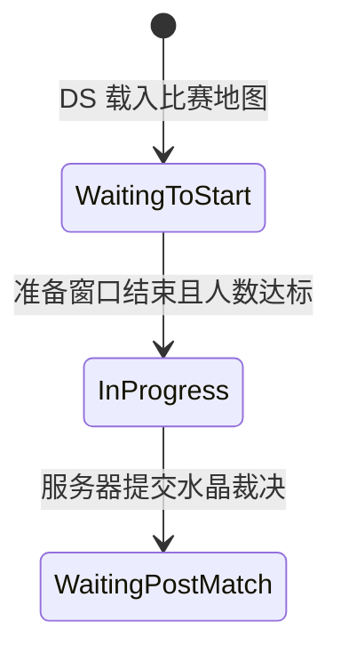
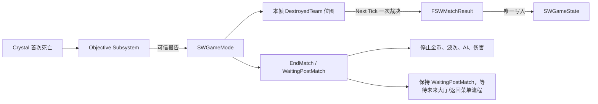

# M13 完整比赛流程设计文档

**状态：** Draft
**负责人：** `12456df`
**最后更新：** 2026-08-22
**建议分支：** `codex/m12-m13-structures-match-flow`
**建议提交：** `feat: complete authoritative match flow`
**依赖：** M02、M12

## 1. 问题与目标

M02 已建立 `WaitingToStart → InProgress → WaitingPostMatch` 的基础骨架，M10/M11 会随比赛开始/结束启停兵线与小兵，M12 将提供真实的塔和水晶死亡事件。当前缺口是：水晶报告仍立即按调用顺序决定胜方，同帧双水晶毁灭没有确定规则；赛后也没有完整的玩法停机与结算状态契约。

M13 由 `ASWGameMode` 继续担任服务器唯一裁判，以 `ASWGameState` 复制持久比赛结果。水晶结算后服务器停留在 `WaitingPostMatch`，等待未来 M15 的大厅/返回菜单会话流程；M13 不自动重开当前地图，也不创建大厅占位实现。

## 2. 已确认的比赛规则



| 阶段 | 允许 | 禁止/停止 |
|---|---|---|
| `WaitingToStart` | 加入、分队、生成、移动、镜头、UI；交易是否允许沿用 M09 现有规则 | 波次、被动金币、结构 AI、权威伤害 |
| `InProgress` | 波次、小兵/结构 AI、伤害、死亡、重生、经济和目标推进 | 重复开局 |
| `WaitingPostMatch` | 结果/统计读取、角色和镜头的纯表现 | 新伤害、新攻击、波次、被动金币、重生、再次裁决 |
| `LeavingMap` | 引擎 Travel | 所有新玩法写入 |

### 2.1 同帧双水晶规则

水晶首次死亡时 GameMode 不立即 `EndMatch()`，而是把被毁队伍写入本服务器帧的候选位图，并用 `SetTimerForNextTick` 安排一次裁决：

- 只有 TeamA 水晶被毁：TeamB 获胜。
- 只有 TeamB 水晶被毁：TeamA 获胜。
- TeamA 与 TeamB 水晶都在裁决前被报告：平局。
- 已提交结果后到达的任何报告均被忽略。

这是对 M02 `TBD` 的正式结论。它避免结果依赖 Actor Tick/伤害回调的偶然执行顺序，也不人为指定队伍优先级。

## 3. 需求

### 3.1 Functional

- FR-13-01：比赛阶段迁移只能由服务器 `ASWGameMode` 发起，客户端只读 `ASWGameState`。
- FR-13-02：准备窗口结束且达到最低人数后只开始一次；开局时间使用同步服务器时钟。
- FR-13-03：只有 `InProgress` 允许权威伤害；ExecCalc 必须是最终阶段门槛，不能仅依赖 UI/Ability/AI 停止。
- FR-13-04：水晶死亡报告必须聚合到下一服务器 Tick 裁决，并支持明确的 TeamAWin、TeamBWin、Draw。
- FR-13-05：比赛结果必须只提交一次并复制给所有当前客户端及赛后加入的相关客户端。
- FR-13-06：进入 `WaitingPostMatch` 后停止被动金币、波次、小兵新攻击、结构 AI、新伤害和玩家重生。
- FR-13-07：赛后保持 `WaitingPostMatch`，直到未来大厅/返回菜单流程显式发起 Travel 或断开；不得自动重开当前地图。
- FR-13-08：M14 UI 可以只通过 GameState/Controller 的只读事件获得阶段和比赛结果。

### 3.2 Non-Functional

- NFR-13-01：不新增 Match Manager 单例、赛后自动 Timer 或逐帧状态复制。
- NFR-13-02：阶段处理和结果提交必须幂等；重复事件、延迟包和同帧回调不能产生第二次奖励、结算或 Travel。
- NFR-13-03：Dedicated Server + 两客户端必须从加入完整运行到水晶结算，并稳定停留在赛后状态。

### 3.3 Edge Cases

- EC-13-01：裁决排队后、下一 Tick 前同一水晶重复报告只保留一个队伍位。
- EC-13-02：平局结果中 `WinningTeam == None`，但 `Outcome == Draw`；不得把它解释为“尚未结算”。
- EC-13-03：结果已提交后发生的投射物命中、周期 GE Tick 或死亡回调不产生伤害、计分和新目标事件。
- EC-13-04：赛后最后一名玩家退出不改变已提交结果或触发地图重开；DS 保持赛后状态，等待未来会话流程处理。
- EC-13-05：客户端在结果复制前收到 MatchState 变化时，UI 必须允许稍后由结果 RepNotify 补齐；两个 OnRep 都要幂等。

### 3.4 Out of Scope

- 大厅、Session 创建/发现、断线重连、迁移到下一张地图和服务器进程编排（M15）。
- 结算面板、动画、计分板视觉、投票重开和返回大厅 UI（M14/M15）。
- 投降、比赛时限、加时、暂停、观战和断线判负。
- 跨局金币、装备、等级、技能等级或账号持久化。

## 4. 数据所有权与子系统

| 类型 | 单一职责 | 拥有/写入的数据 | 客户端可见方式 |
|---|---|---|---|
| `ASWGameMode` | 阶段迁移、水晶候选聚合、结果提交 | 待裁决位图、裁决 Timer（仅服务器） | 不复制、不被客户端访问 |
| `ASWGameState` | 持久公共比赛快照和本地阶段变化通知 | `MatchResult`、开始时间、队伍统计（GameMode 友元写） | Replicated/RepNotify + 本地委托 |
| `USWStructureObjectiveSubsystem` | 产生可信水晶死亡事件 | 已毁 StructureId | 经 GameMode 报告，不复制自身 |
| `USWMinionLaneWaveSubsystem` | 响应开始/结束启停波次 | 当前波次状态 | M10 既有 Actor/Mass 表现 |
| 小兵/结构/Ability | 响应阶段，停止行为或拒绝激活 | 自身瞬态执行状态 | Actor/GAS 既有复制 |
| `USWExecCalc_Damage` | 对所有伤害执行最终比赛阶段门槛 | 无 | 只产生合法 IncomingDamage |

GameState 是结果的复制载体，但 GameMode 是唯一规则写入者；客户端蓝图不得提供 SetOutcome、SetWinningTeam 或 EndMatch RPC。



## 5. 比赛结果契约

### 5.1 类型

```text
ESWMatchOutcome
- Undecided
- TeamAWin
- TeamBWin
- Draw

ESWMatchEndReason
- None
- CrystalDestroyed

FSWMatchResult
- Outcome
- EndReason
- WinningTeam（Draw/Undecided 时为 None）
- ResolvedServerTime
```

`WinningTeam` 保留是为了兼容现有 UI/查询，但不能再单独表示是否已结算；唯一判断应为 `Outcome != Undecided`。

### 5.2 GameState 时间

| 字段 | 含义 |
|---|---|
| `MatchStartServerTime` | 正式开局服务器时间，已有 |
| `MatchResult.ResolvedServerTime` | 裁决产生时间 |

M13 没有赛后自动倒计时；未来大厅流程若需要倒计时，应在拥有 Travel 决策权的会话系统中另行定义。

## 6. 核心契约

| 所有者 | API/事件 | 前置条件 | 后置条件 |
|---|---|---|---|
| GameMode | `ReportCrystalDestroyed(DestroyedTeamId)` | Authority、InProgress、有效队伍、可信结构事件 | 将队伍加入候选位图；至多安排一个 NextTick 裁决 |
| GameMode | `ResolvePendingCrystalDestructionsAuthority()` | 已排队且结果未提交 | 生成 Win/Draw，写 GameState，调用一次 EndMatch |
| GameMode | `HandleMatchHasStarted()` | 引擎迁移到 InProgress | 清旧结果，启动金币、波次和结构 AI |
| GameMode | `HandleMatchHasEnded()` | 结果已经写入 GameState | 停金币/波次/AI/重生并保持赛后状态 |
| GameState | `SetMatchResultAuthority` | 仅 GameMode、Authority、当前 Undecided | 写一次结果并触发本地/复制委托 |
| GameState | `OnSWMatchStateChanged` | 引擎 `HandleMatchIsWaitingToStart/Started/Ended/LeavingMap` | 在服务器和客户端本地广播当前 MatchState；订阅者只读响应 |
| Damage ExecCalc | `IsDamageAllowedForMatch` | Authority | 只有 MatchState InProgress 返回 true |
| Gameplay Ability | `bRequiresMatchInProgress` | Ability 配置 | 非 InProgress 时拒绝激活；伤害门槛仍由 ExecCalc 兜底 |

`USWGameplayAbility::bRequiresMatchInProgress` 默认 false，避免把移动、瞄准、换弹等系统能力错误绑定到比赛阶段。开火、伤害技能、小兵攻击和结构攻击设为 true。已激活的伤害效果即使未及时取消，也会被 ExecCalc 的最终门槛拒绝。

## 7. 阶段数据流

### 7.1 开局

```text
首名有效玩家加入
→ GameMode 设置 WarmupEndServerTime
→ ReadyToStartMatch 检查时间和人数
→ StartMatch / HandleMatchHasStarted
→ 写 MatchStartServerTime，清赛后状态
→ 启动被动金币、LaneWaveSubsystem
→ GameState 阶段委托使 Structure AI 在服务器启动
```

### 7.2 水晶结算

```text
物理伤害 → Crystal 首次死亡提交
→ Objective Subsystem 消费一次 StructureId
→ GameMode 记录 DestroyedTeam bit
→ Next Tick 聚合裁决
→ GameState 写 FSWMatchResult
→ GameMode::EndMatch
→ WaitingPostMatch
```

结果必须先写 GameState，再调用 `EndMatch()`，保证赛后状态对应一个已存在的权威结果。

### 7.3 赛后停留

```text
HandleMatchHasEnded
→ 清被动金币/玩家重生 Timer
→ StopWavesAuthority
→ 停止小兵攻击；GameState 阶段委托使结构 BT 停止
→ 保持 WaitingPostMatch
→ 未来大厅/返回菜单会话流程显式决定 Travel 或断开
```

M13 不拥有“下一局”或“回大厅”的决策权，因此不调用 `RestartGame`、`ServerTravel` 或 `OpenLevel`。未来会话系统确定目标大厅或下一局后，必须显式定义 Travel 时的跨局数据策略，不能在本模块提前假设地图重载规则。

## 8. C++ 与蓝图边界

| C++ 负责 | 蓝图/UI 负责 |
|---|---|
| 阶段迁移、胜负/平局裁决、幂等、Timer | 读取 GameState，播放开局/胜负/平局表现 |
| MatchResult/开始时间复制和 RepNotify 委托 | M14 Widget 绑定，不自行推断胜方 |
| Damage ExecCalc 阶段门槛、Ability 激活门槛 | 为具体攻击 Ability 勾选 RequiresInProgress |
| 启停金币、波次、小兵和结构系统 | 赛后镜头、音效、输入提示 |
| 停止赛后玩法写入和 DS 测试入口 | 不调用 OpenLevel/ServerTravel/EndMatch |

## 9. 网络、顺序与可靠性

- 使用 GameState 的持久复制属性表达结果，不用 Multicast 作为结果真值；晚收到或重新相关的客户端仍能恢复状态。
- MatchState 与 MatchResult 可能以不同顺序到达，UI Controller 必须分别缓存并通过同一个 `RefreshMatchPresentation()` 幂等刷新。
- GameMode 内的候选位图和 Timer 不复制；客户端没有报告水晶死亡的 RPC。
- 裁决使用服务器下一 Tick 聚合，而不是墙钟毫秒窗口；规则可重复测试且没有额外网络延迟配置。
- M13 不调用 `RestartGame()`，也不在赛后进行任何 Travel；`WaitingPostMatch` 是稳定的终局状态。
- M15 再决定 Session 对外可发现性、重连、回大厅和下一局的跨地图策略，并在届时定义 PlayerState/ASC、金币、装备和等级的跨局重置或持久化契约。

## 10. 实现顺序

| 步骤 | C++/资产 | 验证重点 |
|---:|---|---|
| 1 | `ESWMatchOutcome`、`ESWMatchEndReason`、`FSWMatchResult` 与 GameState 复制 | Undecided 与 Draw 不混淆；OnRep 幂等 |
| 2 | GameMode 水晶位图、NextTick 裁决和结果唯一提交 | 单边胜利、同帧平局、重复报告 |
| 3 | ExecCalc InProgress 最终门槛、Ability 可选激活门槛 | 准备/赛后无权威伤害 |
| 4 | GameState 阶段委托；HandleMatchHasStarted/Ended 统一启停 M09/M10/M11，M12 Controller 只读响应 | 无双向依赖、重复 Timer、攻击或重生 |
| 5 | 赛后终局收敛：不安排自动重开或 Travel | DS 与两客户端稳定停留在 `WaitingPostMatch` |
| 6 | `USWMatchOverlayWidgetController` 只读快照与事件 | 游戏时间、双方击杀数/摧毁防御塔数、阶段和结果可被现有 Overlay 消费 |
| 7 | 后续会话/大厅模块 | 明确由会话系统决定离开赛后状态的路径 |

## 11. 需求追踪与验收

| 需求 | 主要契约 | 验收 |
|---|---|---|
| FR-13-01/02 | GameMode MatchState | 准备窗口到期开局一次，客户端只读 |
| FR-13-03 | ExecCalc + MatchState | Waiting/AfterMatch 的所有伤害通道为 0 |
| FR-13-04/05 | Pending bitmask + MatchResult | A 胜、B 胜、同帧 Draw、重复报告矩阵 |
| FR-13-06 | HandleMatchHasEnded | 金币、波次、AI、伤害、重生全部停止 |
| FR-13-07 | WaitingPostMatch 终局状态 | DS 与两客户端不自动重开、不发生意外 Travel |
| FR-13-08 | Match Overlay Controller | UI 不访问 GameMode，只读游戏时间、双方击杀/推塔数、阶段与结果 |

最终验收：

- [ ] WaitingToStart 不产生伤害、波次、被动金币和结构攻击；InProgress 同步启用。
- [ ] 两方分别毁晶时正确胜负；同一服务器帧双晶毁灭稳定为 Draw。
- [ ] 结果、阶段和开始时间在 DS + 两客户端一致；赛后不会自动重开或 Travel。
- [ ] 赛后残余 Projectile/周期 GE/AI 不再造成伤害或重复得分。
- [ ] 赛后保持 `WaitingPostMatch`，不自动重开或 Travel；后续由 M15 会话系统决定回大厅或下一局。
- [ ] Development Editor、Game、Server Target 编译成功；Staged DS + 两客户端完整验证。

## 12. 设计结论

- **同帧双水晶为平局。** 这是最不依赖回调顺序、也最容易测试的服务器规则。
- **结果使用显式 Outcome。** `WinningTeam=None` 不能同时代表“未结算”和“平局”。
- **重置使用 Restart Travel。** 对独立开发者而言，它比为每个系统增加 Reset 接口更可靠、更省维护。
- **行为停止不是安全边界。** AI/Ability 会主动停止，但 ExecCalc 仍按 MatchState 拒绝任何迟到伤害。
- **M13 不扩张到 Session。** 当前地图重开属于比赛生命周期；大厅、发现和断线重连仍由 M15 负责。

## 13. 实施记录

- 2026-08-22：已完成步骤 1 的比赛结果复制契约。新增 `ESWMatchOutcome`、`ESWMatchEndReason` 与 `FSWMatchResult`；`ASWGameState` 以 `MatchResult` 作为胜负/平局的唯一复制真值。服务器提交和客户端 `OnRep_MatchResult` 均广播同一个本地只读委托。旧 `SetWinningTeam` 仅保留为内部兼容包装，不再拥有独立状态。
- 2026-08-22：已完成步骤 2 的水晶聚合裁决。`USWStructureObjectiveSubsystem` 在水晶首次死亡时仅向 `ASWGameMode` 报告被毁队伍；GameMode 用本帧队伍位图和 `SetTimerForNextTick` 聚合报告，唯一提交 TeamAWin、TeamBWin 或 Draw 的 `MatchResult`，随后调用 `EndMatch()`。重复报告、已结算报告和非 InProgress 阶段报告均被拒绝。
- 2026-08-22：已完成步骤 3 的比赛阶段伤害门槛。`USWExecCalc_Damage` 在目标服务器 ASC 上确认当前权威 GameMode 为 `InProgress` 后才输出 `IncomingDamage`，覆盖迟到 Projectile、周期 GE 与 AI 攻击；`USWGameplayAbility` 新增可选 `bRequiresMatchInProgress`，主动技能、开火、小兵攻击和结构攻击在 C++ 默认开启，移动、瞄准与换弹保持不受限制。
- 2026-08-22：已完成步骤 4 的阶段启停收敛。`HandleMatchHasStarted()` 清理旧赛后瞬态并只启动被动金币与波次；`HandleMatchHasEnded()` 清理金币和全部重生 Timer，停止后续波次，并冻结现存 Mass 小兵的移动、索敌、攻击意图及已激活攻击 Ability。结构 AI 继续只订阅 `ASWGameState::OnSWMatchStateChanged`，由阶段变化自行启停 BehaviorTree 和结构攻击，不反向依赖 GameMode。
- 2026-08-22：根据已确认的产品规则，步骤 5 收敛为赛后终局而非自动重开。移除了 `PostMatchEndServerTime`、赛后 Timer 与 `RestartGame()`；`HandleMatchHasEnded()` 完成玩法停机后保持 `WaitingPostMatch`。回大厅、下一局和任何 Travel 均留待 M15 会话流程明确实现，M13 不创建占位大厅。
- 2026-08-22：已完成步骤 6 的最小比赛 Overlay 数据入口。`USWMatchOverlayWidgetController` 只读订阅 GameState 的阶段、结果与队伍统计；快照只提供游戏完整秒数、双方击杀数和摧毁防御塔数及保留的结果字段。游戏时间通过本地每秒 Timer 刷新，不使用 Widget Tick 或逐秒复制；队伍统计改为 RepNotify，并在服务器写入时立即广播本机事件。具体 UMG 布局、颜色和文本格式仍由蓝图处理。
