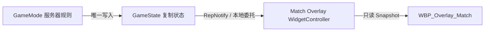
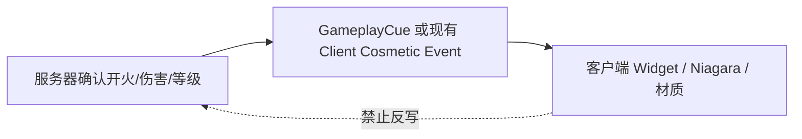

# M14 对局 HUD 与游戏润色设计文档

**状态：** Completed
**负责人：** `12456df`
**最后更新：** 2026-08-27
**建议分支：** `codex/m14-ui-polish`
**建议提交：** `feat: complete match HUD and gameplay polish`
**依赖：** M05、M07、M08、M09、M13

## 1. 问题与目标

M05～M09 已随功能实现完成生命/蓝量/体力、弹匣、等级/经验/金币、技能/冷却、六槽装备、商店、准星和伤害数字 UI。M13 也已完成比赛阶段、双方击杀/推塔统计、比赛时间与结果的 C++ 只读通道。M14 不应重做这些系统，而应完成两个收尾目标：把尚未显示的对局公共信息接入现有 Overlay，并在不改变权威玩法的前提下，为射击、命中、升级和目标事件补充高价值视觉反馈。

本模块把“对局 HUD”作为完成门槛；润色项按视觉收益排序，开发者可选择实现，不要求为了完成 M14 全部制作。音效明确不在本轮范围内。

## 2. 当前基线核验

### 2.1 已完成 UI

- `WBP_Overlay` 根 HUD。
- 生命、蓝量、体力与状态 Overlay。
- 弹匣/武器 Overlay 与准星。
- 等级、经验、金币 Overlay。
- Skill1/2/3、技能等级、升级按钮、冷却/充能显示。
- 六槽装备栏与完整商店页面。
- 浮动伤害数字与网络诊断 UI。

### 2.2 已完成但尚未接入蓝图的对局数据

`USWMatchOverlayWidgetController` 已输出 `FSWMatchOverlaySnapshot`：

- `MatchState`
- `ElapsedMatchSeconds`
- `TeamAKillCount` / `TeamBKillCount`
- `TeamATowerDestroyCount` / `TeamBTowerDestroyCount`
- `MatchResult`

它已订阅 GameState RepNotify/委托，并仅在 `InProgress` 使用每秒一次的本地 Timer 刷新时间。因此 M14 不新增比赛状态、复制字段、RPC、Widget Tick 或第二套计时器。

### 2.3 已存在的表现契约

| 契约 | 当前状态 | M14 用法 |
|---|---|---|
| `GameplayCue.Weapon.Fire` | 武器配置和服务器执行入口已存在 | 制作枪口闪光 Cue 资产 |
| `GameplayCue.Projectile.Impact` | Projectile 已传 Location/Normal | 制作通用弹丸命中 Cue 资产 |
| `GameplayCue.Combat.Hit` | Native Tag 已存在，尚无统一触发点 | 可选受击 VFX 补口 |
| `GameplayCue.Combat.Death` | Native Tag 已存在，尚无统一触发点 | 可选死亡 VFX 补口 |
| `BP_ShowDamageNumber` | 已接收服务器确认的实际伤害 | 同时触发本地准星命中确认 |
| `OnLevelChanged` | PlayerState 已广播最终等级 | 本地 UI 升级动画 |
| `GameplayCue.Player.LevelUp` | 服务器在等级实际提高后经玩家 ASC 执行一次，参数附着当前 Avatar Root | 世界升级 Niagara/音效；缺失 Cue 资产时安全跳过 |

## 3. 需求

### 3.1 Functional

- FR-14-01：本地 HUD 必须在屏幕顶部同时显示 TeamA/TeamB 的击杀数、摧毁防御塔数和当前比赛时间。
- FR-14-02：对局信息必须只消费 `USWMatchOverlayWidgetController` 快照，不直接读取 GameMode、不自行累计计分。
- FR-14-03：比赛时间必须格式化为 `MM:SS`；超过一小时后显示 `H:MM:SS`，不截断或回绕。
- FR-14-04：`WaitingToStart` 显示 `00:00`；`InProgress` 每秒更新；`WaitingPostMatch` 保留结束时最后一次快照，不继续增长。
- FR-14-05：赛后必须显示最小结果 Banner：`Team A Victory`、`Team B Victory` 或 `Draw`；不要求完整结算面板。
- FR-14-06：对局 HUD 必须在常见 16:9、16:10 和 21:9 分辨率保持顶部居中、安全区内可读，不遮挡准星和技能栏。
- FR-14-07：开火、命中、升级等润色只能消费已确认的表现事件或 GameplayCue，不得改变伤害、弹药、等级、比赛结果或碰撞。
- FR-14-08：所有 Niagara/Widget 表现只在客户端或本地视口运行；Dedicated Server 不创建表现对象。

### 3.2 Non-Functional

- NFR-14-01：Widget 不使用 Tick、UMG Property Binding 或逐帧 Cast；只在 Controller 委托到达时更新文本和动画。
- NFR-14-02：对局信息不增加网络流量；继续复用 GameState 已复制统计和服务器同步时钟。
- NFR-14-03：一次成功射击至多产生一次枪口 Burst 和一次命中 Burst；一次性 Niagara 使用 AutoRelease/池化并允许 Scalability Cull。
- NFR-14-04：纯表现事件允许丢失，不能使用 Reliable RPC 或持久复制状态保证每个粒子都播放。
- NFR-14-05：缺失 Widget、Cue、Niagara 或材质资产时玩法仍可正常运行，不崩溃、不阻止攻击或升级。

### 3.3 Edge Cases

- EC-14-01：Widget 在 GameState/PlayerState 之后创建时，`SetWidgetController` 必须在蓝图完成委托绑定后广播当前快照。
- EC-14-02：MatchState 与 MatchResult 复制顺序不同也能刷新；结果未解析时不显示错误的胜方。
- EC-14-03：首次收到等级快照只初始化显示，不播放“升级”动画；只有之后 `NewLevel > PreviousLevel` 才播放一次。
- EC-14-04：一次经验跨多级时只播放一次升级表现并显示最终等级，避免连续堆叠多个 Niagara/弹窗。
- EC-14-05：伤害数字 RPC 丢失时只缺少本次命中确认，不影响伤害；同一 Payload 不生成第二份玩法结果。
- EC-14-06：Projectile 命中世界但未造成伤害时仍可播放表面 Impact；准星命中确认只在服务器实际扣除生命后播放。
- EC-14-07：本地玩家死亡、重生或 HUD 控制器重绑后，委托不重复绑定，旧 Widget 不继续接收更新。
- EC-14-08：低画质或远距离 Cull VFX 时不得影响弹丸销毁、命中、死亡或 Ability 结束。

### 3.4 Out of Scope

- 本轮不配置任何音效、音乐、语音、混音或音频衰减。
- 不实现完整 Tab 计分板、KDA/助攻/玩家名单、聊天、击杀播报和小地图。
- 不实现大厅、回到菜单、下一局按钮和赛后 Travel（M15）。
- 不重构现有技能、商店、装备、属性和伤害数字 UI。
- 不承诺完成本文全部润色候选；只有第 4 节核心 HUD 属于 M14 必须完成项。

## 4. 核心 HUD 设计

### 4.1 屏幕布局

新增 `WBP_Overlay_Match`，嵌入现有 `WBP_Overlay` 顶部中央：

```text
┌──────── Team A ────────┬──── Match ────┬──────── Team B ────────┐
│  Kills  12   Towers  3 │     18:42     │  Towers  2   Kills  9  │
└────────────────────────┴───────────────┴────────────────────────┘
```

- TeamA 使用项目 TeamA 色，左到右排列；TeamB 镜像排列，降低扫视成本。
- 中间时间字号最高；击杀数次之；推塔数配合小型塔图标。
- 根容器 `HitTestInvisible`，不拦截射击、技能或商店输入。
- 使用 Top-Center Anchor、Safe Zone、SizeBox 最小/最大宽度和 DPI Scale；不按固定屏幕坐标摆放。
- 数值更新时仅做 0.15～0.25 秒的轻量缩放/发光动画，不让整个 HUD 重播 Construct 动画。

### 4.2 WidgetController 接入

在 `WBP_Overlay` 初始化时：

```text
Get Owning Player
→ Get HUD / BP_SWHUD
→ GetMatchOverlayWidgetController
→ WBP_Overlay_Match.SetWidgetController
→ BP_OnWidgetControllerSet 绑定 OnMatchOverlayChanged
→ 基类自动 BroadcastInitialValues
```

`WBP_Overlay_Match` 保存上一次快照，只用于判断哪项数值发生变化并选择动画；它不是比赛数据所有者。

### 4.3 时间格式

蓝图纯函数 `FormatMatchTime(ElapsedSeconds)`：

```text
Seconds = Max(0, ElapsedSeconds)
Hours   = Seconds / 3600
Minutes = (Seconds / 60) % 60
Seconds = Seconds % 60

Hours == 0 → MM:SS
Hours > 0  → H:MM:SS
```

使用 `ToText(Integer)` 的最少两位数选项格式化分钟/秒，禁止把倒计时逻辑复制到 Widget。

### 4.4 最小比赛结果

新增或嵌入 `WBP_MatchResultBanner`：

- 默认 `Collapsed`。
- 仅在 `MatchState == WaitingPostMatch && MatchResult.Outcome != Undecided` 时显示；`IsResolved()` 是 C++ 便捷函数，不假设它可直接作为蓝图节点调用。
- TeamAWin/TeamBWin/Draw 分别使用队伍色或中性色。
- 只显示结果和双方最终击杀/推塔数；不提供离开、重开或 Travel 按钮。
- MatchState 与 MatchResult 任意顺序更新时均调用同一个 `RefreshResultPresentation`，保证幂等。

## 5. 游戏润色推荐清单

以下优先级只表示视觉收益与实现成本，不属于额外流程门槛。

### 5.1 高优先级：最能改善“射击是否有反馈”

| 项目 | 推荐实现 | C++ 需求 | 理由 |
|---|---|---|---|
| 枪口闪光 | `GCN_Weapon_Fire` 从 Character 读取 CurrentWeapon/Muzzle Transform，生成一次性 Niagara | 无；复用现有 Cue | 开火反馈最直接，成本低 |
| Projectile 通用命中火花 | `GCN_Projectile_Impact` 使用 Cue Location/Normal 生成 World Space Niagara | 无；入口已完成 | 让弹丸与世界/角色接触可读 |
| 准星命中确认 | 在现有 `BP_ShowDamageNumber` 表现链同时触发 Crosshair Hit 动画；暴击使用不同颜色/尺寸 | 无 | 直接确认“实际造成了伤害”，比碰撞火花更可靠 |
| 敌方高亮与准星聚焦 | Local PlayerController 为敌方 Mesh 写入本地 Overlay Material；准星射线首个命中的敌方单位使用更强的 Overlay 实例 | 最小本地 C++ 投影；Overlay 材质和实例在蓝图配置 | 不复制视觉状态；基于 Mesh 深度绘制，不会投射到前景遮挡物上 |
| 受击目标头顶血条 | 服务器仅在实际扣血后通知攻击者所属客户端；角色或防御塔目标组件读取已复制 Health/MaxHealth，并在本地定时隐藏 | C++ 提供 WidgetComponent、GAS 监听与客户端事件；WBP 只负责 ProgressBar/动画 | 只有“我造成的实际伤害”显示，不向旁观者复制纯表现状态 |
| 等级提升 UI | Progression Widget 比较前后等级，播放等级文本放大、闪光和技能点提示 | 无 | 低频但重要，现有数据完整 |
| 最小结果 Banner | 使用 Match Snapshot 显示胜方/平局与最终比分 | 无 | M13 赛后目前缺少玩家反馈 |

核心对局 HUD/结果完成后，高优先级润色建议全部实现；它们基本只需蓝图/Cue/Niagara 资产，不改变玩法 C++。如果时间有限，润色顺序为：**枪口闪光 → 准星命中确认 → 敌方高亮 → Impact → 升级动画**。

敌方高亮使用半透明、Unlit 的 Mesh Overlay 材质。`ASWPlayerController` 只在所属客户端每 0.05 秒为敌方 Mesh 投影常规材质，并为 `WeaponTrace` 首个命中的敌方投影更强的材质实例；它保留并在目标失效、超出 2500 cm、重生或 Controller 结束时恢复组件原有的 Overlay 状态。Overlay 由真实 Mesh 参与深度测试，因此不会把轮廓绘制到目标前方的遮挡物上；穿墙可见须作为未来侦察类技能的独立规则，不能由本地高亮默认提供。

### 5.2 中优先级：提升战斗层次

| 项目 | 推荐实现 | 最小补口 |
|---|---|---|
| 世界升级环/光柱 | `GameplayCue.Player.LevelUp` 在服务器等级真正提高后对玩家 ASC 执行一次；Cue 附着 Avatar | 已提供 Native Tag + 一处权威触发 |
| 技能升级确认 | Skill Slot 的 Spec Level 提高时播放等级数字跳动、边框脉冲和升级加号收起动画 | 无；复用 Skill Controller 快照 |
| 统一受击闪光 | 实际 `AppliedDamage > 0` 后执行 `GameplayCue.Combat.Hit`；Niagara/短时材质参数由 Cue 负责 | AttributeSet/伤害结果处一处触发 |
| 死亡 Burst/溶解 | 首次死亡提交后执行 `GameplayCue.Combat.Death`，角色/小兵/结构选择不同 Cue 子 Tag | 死亡共同契约增加 Cue 路由；表现资产在蓝图 |
| Hitscan Tracer 与 Impact | 将 `FSWResolvedShot` 的 Muzzle、TraceEnd、Hit Location/Normal 写入 Cue Parameters | Weapon 服务器结果增加纯表现 Cue 参数 |
| 结构受击与摧毁 | 塔受击短闪、易伤状态光罩、死亡能量坍缩 | 复用 M12 的 `BP_OnVulnerableStateChanged`、`BP_OnDeathStateChanged`，通常无 C++ |
| 技能冷却完成闪光 | Skill Slot 由冷却从 `>0` 变为 `0` 时播放边框闪光 | 无；复用 Skill Controller 快照 |

世界升级、受击和死亡 Cue 是跨角色复用的稳定表现协议，适合最小 C++ Tag/触发点；具体 Niagara、颜色、尺寸和时序继续留在蓝图。

### 5.3 低优先级：内容量较大或依赖美术调校

- 按 Physical Material 区分金属、能量盾、地面和角色 Impact。
- 弹壳、枪口烟雾、持续枪管热度和地面 Decal。
- 受伤方向屏幕边缘提示、低血量 Vignette。
- 暴击专属 Impact、伤害数字拖尾与轻量 Camera Shake。
- 重生传送/护盾 VFX、无敌期间角色轮廓。
- 小兵死亡消散、塔攻击预警线、水晶低血量阶段表现。
- 商店购买成功、装备生效、技能升级按钮的统一 UI Transition。
- 更完整的 HUD 入场/退场动画和不同分辨率的视觉精修。

这些项目不应阻塞 M14；在实际试玩中发现反馈缺口后再选做。

### 5.4 仓库内可优先预览的候选资产

以下只作为内容制作起点，具体是否合适必须在编辑器中预览确认；不要直接修改供应商原始资产，优先复制/派生到项目自己的 `/Game/BlurPrints/VFX/` 或 `/Game/BlurPrints/UI/` 目录：

- `/Game/SciFiPackV1/Particles/NiagaraSystems/NS_ScifiImpactE01`～`06`：通用 Impact 候选。
- `/Game/SciFiPackV1/Particles/NiagaraSystems/NS_ScifiLoot01`～`05`：角色升级环/能量 Burst 候选。
- `/Game/SciFiPackV1/Particles/NiagaraSystems/NS_ScifiShield01`～`11`：无敌、护盾或结构易伤状态候选。
- `/Game/ScifiHUD/UISciFiSoldierHUD/Widgets/Timed/HUD_SciFiSoldier_GameTime_01`：比赛时间布局参考。
- `/Game/ScifiHUD/UISciFiSoldierHUD/Widgets/Popups_Notifications/HUD_SciFiSoldier_Event_LevelUp_01`：本地升级通知参考。

这些资源是候选而非已确认配置；最终派生资产仍需检查透明材质、Bounds、Local/World Space、循环状态和 Niagara Effect Type。

## 6. C++ 与蓝图边界

| C++ 负责 | 蓝图/资产负责 |
|---|---|
| 已复制比赛统计、MatchResult、同步时间和 WidgetController 委托 | Match Widget 布局、颜色、图标、文本格式和动画 |
| 新增时只提供稳定 GameplayCue Tag、服务器确认触发点和必要参数 | GameplayCue Notify、Niagara、材质、Camera Shake、Widget 动画 |
| 保证 Dedicated Server 不依赖 Viewport/Niagara；缺资产安全失败 | 资产选择、User 参数、Effect Type、Scalability 和视觉迭代 |
| 实际伤害/等级/开火结果的唯一权威 | 依据已确认 Payload 播放反馈，不反写玩法状态 |

禁止为单个 Niagara 创建专用 Manager、复制 Actor 或 Reliable Multicast。若一个效果只服务一个蓝图事件且没有跨系统复用，不新增 C++ 类。

## 7. 数据流与网络边界

### 7.1 对局 HUD



### 7.2 战斗表现



- 持久状态继续使用复制/GAS；一次性枪口、Impact、升级和命中标记允许丢失。
- GameplayCue Notify 不执行伤害、不生成权威碰撞、不扣弹、不修改等级。
- Dedicated Server 上不创建 Widget；Niagara Spawn 返回空时安全跳过。
- 当前 Niagara 仅在蓝图/Cue 资产中使用，因此 M14 核心不需要给 Runtime Build.cs 新增 `Niagara` 依赖；未来 C++ 直接调用 Niagara API 时再添加。

## 8. Niagara 与视觉资产约束

- 一次性效果使用 Burst + Auto Destroy/AutoRelease；不要为每次开火创建永久组件。
- 高频枪口和 Impact 复用 `UNiagaraEffectType` 配置距离 Cull、实例上限和画质层级。
- 枪口效果使用 Local/Attached Space；命中火花、地面残留使用 World Space。
- 运行时需要修改的参数统一暴露为 `User.*`，首批建议：`User.TeamColor`、`User.HitNormal`、`User.Intensity`、`User.bCritical`。
- 不使用 Niagara Fluids，不读取 GPU 粒子结果决定玩法，不要求多客户端粒子逐帧完全一致。
- 商业资产可以在私有项目中复用，但最终选择和派生资产继续遵守仓库授权规则。

## 9. 实现顺序

| 步骤 | 文件/资产 | 验证 |
|---:|---|---|
| 1 | `WBP_Overlay_Match`：时间、双方击杀/推塔 | 初始快照、计分更新、赛后冻结 |
| 2 | 接入 `WBP_Overlay` 与 Match WidgetController | 重生/晚绑定不重复委托，DS 不创建 UI |
| 3 | `WBP_MatchResultBanner` | TeamAWin、TeamBWin、Draw、复制顺序 |
| 4 | `GCN_Weapon_Fire` + 通用 Impact Cue | 本地/远端可见，单次触发，无玩法副作用 |
| 5 | Crosshair Hit Confirm + 本地 LevelUp UI 动画 | 只在实际伤害/真实升级后播放 |
| 5a | Enemy Mesh Overlay Highlight | 常规敌方与准星聚焦敌人分别使用两个 Overlay 材质实例；2500 cm 外不显示；只在本地视口可见 |
| 5b | Damaged Target Health Bar | 实际伤害只通知攻击者客户端；角色或防御塔目标头顶 Widget 在 4 秒无后续伤害后隐藏 |
| 6 | 从中优先级清单选择实际需要的项目 | 每项单独完成双客户端视觉验证 |
| 7 | 分辨率、画质、DS 和两客户端回归 | 无 Tick、无新增权威差异、无明显 VFX 泄漏 |

## 10. 需求追踪与验收

| 需求 | 实现入口 | 测试 |
|---|---|---|
| FR-14-01～04 | Match Controller + `WBP_Overlay_Match` | 双队计数、时间格式、阶段转换 |
| FR-14-05 | MatchResult + Result Banner | A 胜、B 胜、平局 |
| FR-14-06 | Anchor/SafeZone/DPI | 16:9、16:10、21:9、窗口缩放 |
| FR-14-07 | GameplayCue/BP Cosmetic Event | 禁止修改玩法状态 |
| FR-14-08 | Local HUD + Cue/Niagara | DS 无 Widget/Niagara，双客户端可见 |

M14 核心完成门槛：

- [x] 屏幕顶部正确显示双方击杀数、推塔数和 `MM:SS`/`H:MM:SS` 比赛时间。
- [x] 比赛阶段切换、计分变化、赛后结果和晚绑定均能通过同一快照正确刷新。
- [x] TeamAWin、TeamBWin、Draw 都有最小结果 Banner，且不提供未实现的 Travel 按钮。
- [x] 现有技能、属性、武器、装备、商店、伤害数字和准星 UI 无回归。
- [x] 用户本轮选中的润色项通过对应验证；未选择的候选不阻塞 M14，也不伪装成已完成。
- [x] Widget 无 Tick/Property Binding；表现不产生权威副作用。
- [x] Development Editor/Game/Server 构建通过，Staged DS + 两客户端验证完成。

## 11. 设计结论

- **M14 不新增第二套 UI 架构。** 继续使用 `HUD → WidgetController → USWUserWidget/WBP`，不在此阶段引入 Common UI 或 MVVM。
- **比赛 C++ 通道已经完成。** 对局信息主要是蓝图资产工作，除发现实际缺口外不修改 GameState/Controller。
- **结果 Banner 纳入核心，完整结算页不纳入。** 这与 M13 的稳定 `WaitingPostMatch` 相匹配，也不越界到 M15。
- **润色先解决动作反馈。** 枪口、命中、准星确认和升级比大量低频装饰更能提升当前可玩切片。
- **GameplayCue 是跨客户端表现协议。** Niagara 只负责视觉，不成为射击、伤害、死亡或等级真值。
