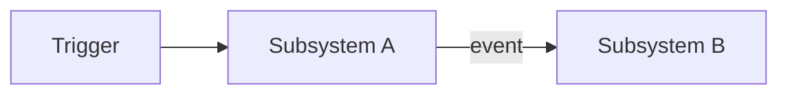

# [系统名称]设计文档

**状态：** Draft
**负责人：** TBD
**最后更新：** YYYY-MM-DD

## Problem Statement

用一个段落说明：谁遇到了什么问题，以及为什么值得解决。

## Requirements

### Functional

- FR-01：系统应当……（必须具有通过/失败标准）

### Non-Functional

- NFR-01：性能、规模、平台或可靠性约束。

### Edge Cases

- EC-01：无效、缺失或极端输入的处理规则。

### Out of Scope

- 本系统明确不支持：TBD

## Subsystem Map

| 子系统 | 单一职责 | 依赖 | 拥有的数据 | 产生事件 | 消费事件 |
|---|---|---|---|---|---|
| TBD | TBD | TBD | TBD | TBD | TBD |

## Contracts

### [Subsystem A]

| API/事件 | 输入 | 输出 | 副作用 | 前置条件 | 后置条件 |
|---|---|---|---|---|---|
| TBD | TBD | TBD | TBD | TBD | TBD |

## Data Flow

明确每条边是只读访问还是事件；禁止跨系统直接写入他人拥有的数据。

## Implementation Order

| 优先级 | 文件/资产 | 依赖 | 测试 | 集成点 |
|---:|---|---|---|---|
| 1 | TBD | None | TBD | TBD |

## Requirement Traceability

| 需求 | 子系统/API | 测试 | 状态 |
|---|---|---|---|
| FR-01 | TBD | TBD | Not Started |

## Validation

- [ ] 每项 FR 都能追踪到子系统、契约和测试
- [ ] 每项 NFR 都有可测量指标
- [ ] 每个边界情况都有明确规则
- [ ] 依赖图不存在循环依赖
- [ ] 每份状态数据只有一个所有者
- [ ] 每个事件只有一个生产者且至少有一个消费者
- [ ] 实现顺序符合依赖关系
- [ ] 所有可调参数均为数据驱动
