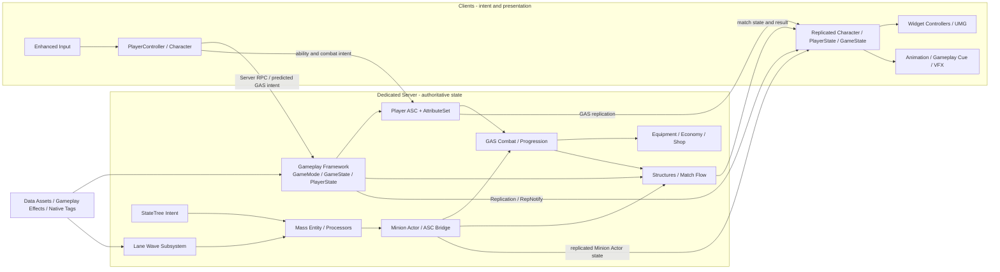

# ScifiWorlds

> 基于 Unreal Engine 5.7 的服务器权威多人第三人称技能射击与三路推进项目。

ScifiWorlds 是一个面向 Dedicated Server 的个人 UE5 C++ 项目。项目以 Gameplay Ability System（GAS）承载技能、属性与效果，以 Mass Entity + StateTree 承载服务器侧小兵模拟，并围绕明确的数据所有权、网络边界和 C++/Blueprint 职责划分持续迭代。

当前已完成 M01-M14：从工程与多人框架、GAS、战斗、装备经济，一直到三路兵线、防御结构、比赛结算和 HUD。Development Editor、Game、Server Target 以及 Staged Dedicated Server + 两客户端验证均已完成。M15 性能与网络优化正在进行中。

## 项目概览

| 项目 | 内容 |
|---|---|
| 引擎 | Unreal Engine 5.7.4 源码构建 |
| 语言 | C++、Blueprint |
| 联机模型 | Dedicated Server、Server Authority、Replication、GAS Prediction |
| 核心框架 | Gameplay Framework、GAS、Enhanced Input、UMG |
| 批量模拟 | Mass Entity、MassSpawner、MassActors、MassAI、StateTree |
| 数据配置 | Data Asset、Primary Data Asset、Gameplay Effect、Native Gameplay Tags |
| 平台 | Windows（当前开发与验证平台） |
| 开发方式 | 个人开发，Git + Git LFS，短生命周期功能分支 |

## 核心能力

- **服务器权威对局**：分队、出生、战斗、资源、交易、结构推进、比赛阶段与胜负均由服务器决定；客户端提交意图并接收复制结果。
- **GAS 玩法框架**：玩家 ASC 由 PlayerState 持有，Character 作为 Avatar；技能、属性、消耗、冷却、Gameplay Tag 与 Gameplay Cue 通过统一链路协作。
- **数据驱动内容**：角色、伤害、成长、技能、装备、经济、小兵、波次和结构配置通过 Data Asset、Gameplay Effect 等资产管理。
- **Mass 小兵模拟**：Mass Entity 与 StateTree 只在服务器或 Standalone 运行；客户端不维护第二套 AI 真值，只接收 Minion Actor、ASC 与必要表现状态。
- **可验证开发流程**：每个模块先定义问题、需求、契约、数据流与验收条件，再完成 Editor/Game/Server 构建和 Dedicated Server 双客户端验证。

## 技术架构



### 数据所有权

| 数据 | 权威所有者 | 客户端如何获得 |
|---|---|---|
| 队伍分配、出生与比赛规则 | `ASWGameMode`（Server Only） | 通过 PlayerState、GameState 和 Pawn 的复制状态观察结果 |
| 比赛阶段、队伍统计与结果 | `ASWGameState` | Replication / RepNotify |
| 玩家成长、经济、装备与玩家 ASC | `ASWPlayerState` | OwnerOnly 或面向相关客户端的复制 |
| 角色移动、战斗表现与 Avatar 状态 | `ASWCharacter_Base` 及其组件 | Character Movement、Actor Replication、GAS |
| 属性、Gameplay Effect 与 Gameplay Tag | ASC / `USWAttributeSet` | GAS 复制模式与属性 RepNotify |
| 小兵决策和 Entity 数据 | 服务器 Mass Entity / StateTree | 不直接复制 Entity；通过 Minion Actor / ASC Bridge 表现 |
| 可调配置 | Data Asset、Gameplay Effect、项目设置 | 加载后由权威系统读取，不作为第二份运行时真值 |

### C++ 与 Blueprint 边界

**C++** 负责稳定框架、数据所有权、GAS/网络契约、服务器校验、Mass/StateTree 运行时逻辑以及需要复用或验证的代码。

**Blueprint** 负责角色与技能配置、动画、VFX、音频、UI 布局和关卡组装，不决定伤害、资源、交易或胜负等权威结果。

## 已完成模块

| 模块 | 状态 | 结果 |
|---|---|---|
| M01-M04 | Completed | 工程基线、Dedicated Server、多人 Gameplay Framework、GAS、输入移动和固定武器 |
| M05-M07 | Completed | 战斗生命循环、服务器权威命中结算、主动技能框架 |
| M08-M09 | Completed | 数据驱动装备修正、经济、背包与商店事务 |
| M10-M11 | Completed | 三路波次、Mass Entity 生成、StateTree 小兵 AI 与战斗回收 |
| M12-M14 | Completed | 防御塔与水晶、比赛阶段与胜负、HUD 与 Gameplay Cue 表现 |
| M15 | In Progress | 使用 Unreal Insights、统计命令和网络诊断建立基线后再优化 |
| M16-M17 | Planned | 会话与 DS 部署、可发布的多人垂直切片与加固 |

完整路线图见 [`Docs/07_DevelopmentRoadmap.md`](Docs/07_DevelopmentRoadmap.md)，各系统设计与验证记录见 [`Docs/Systems/`](Docs/Systems/README.md)。

## 目录结构

```text
Config/                         项目与引擎配置
Content/                        Blueprint、地图、UI 与内容资产
Docs/                           项目 SSOT、ADR、系统设计和路线图
Scripts/Build/                  Editor / Game / Server 构建与 Cook 脚本
Scripts/Run/                    本地 Dedicated Server 启动脚本
Scripts/Profiling/              M15 性能采样脚本
Source/PolygonScifiWorlds/      Runtime C++ 模块
```

`Source/PolygonScifiWorlds` 按领域拆分为 `AbilitySystem`、`Character`、`Combat`、`Economy`、`Equipment`、`Mass`、`Structures`、`Team`、`UI`、`Weapon` 等目录。

## 获取与运行

### 1. 环境要求

- Windows 10/11
- Visual Studio 2022，安装 **Desktop development with C++** 与 **Game development with C++**
- Unreal Engine 5.7.4 源码构建，项目当前基线为 `5.7.4-release` commit `260bb2e1c5610b31c63a36206eedd289409c5f11`
- Git LFS
- `BpGeneratorUltimate` 仅用于本地 Editor 工具链，不是 Game/Server Runtime 依赖；未安装时可在本地禁用该 Editor 插件

### 2. 获取 LFS 资产

```powershell
git lfs install
git lfs pull
```

仓库中的部分内容来自第三方/Fab 资产。运行前需要自行拥有对应授权；本仓库不授予第三方资产的再分发许可。

### 3. 生成工程文件

```powershell
& "<EngineRoot>\Engine\Build\BatchFiles\GenerateProjectFiles.bat" `
  -project="$PWD\PolygonScifiWorlds.uproject" -game -engine
```

### 4. 构建三个 Target

```powershell
.\Scripts\Build\BuildTargets.ps1 -EngineRoot "<EngineRoot>"
```

脚本依次构建：

- `PolygonScifiWorldsEditor Development Win64`
- `PolygonScifiWorlds Development Win64`
- `PolygonScifiWorldsServer Development Win64`

构建日志位于 `Saved/Logs/Build/`。

### 5. 启动 Editor

```powershell
& "<EngineRoot>\Engine\Binaries\Win64\UnrealEditor.exe" `
  "$PWD\PolygonScifiWorlds.uproject"
```

默认 Editor/Game/Server 地图为 `/Game/PolygonSciFiWorlds/Maps/GameMap`。

### 6. Cook 并启动本地 Dedicated Server

Server Archive 必须位于仓库外部：

```powershell
.\Scripts\Build\CookServer.ps1 `
  -EngineRoot "<EngineRoot>" `
  -ArchiveDirectory "D:\Builds\ScifiWorldsServer" `
  -Map "/Game/PolygonSciFiWorlds/Maps/GameMap"
```

找到 Archive 中生成的 `PolygonScifiWorldsServer.exe` 后启动：

```powershell
.\Scripts\Run\StartLocalDS.ps1 `
  -ServerExecutable "<ServerArchive>\...\PolygonScifiWorldsServer.exe" `
  -Map "/Game/PolygonSciFiWorlds/Maps/GameMap" `
  -Port 7777 `
  -WaitForPort
```

客户端在控制台执行以下命令连接本地服务器：

```text
open 127.0.0.1:7777
```

> Archive 的实际子目录可能随 UE 版本与 UAT 输出布局变化；请以 `CookServer.ps1` 生成结果中的 Server 可执行文件为准。

## 验证范围

截至 M14，以下内容已在 Development Editor/Game/Server 与 Staged Dedicated Server + 两客户端环境验证：

- 客户端加入、分队、出生、移动、射击与 GAS 初始化
- 属性、弹药、技能、装备、经济与比赛状态同步
- 死亡、重生、临时保护与晚加入状态恢复
- 三路多波小兵的服务器 Mass/StateTree 决策、战斗、死亡与回收
- 防御结构推进、水晶胜负裁决、比赛结果与 HUD 表现

这不是已发布商业游戏；当前目标是完成一个可运行、可测试、可解释的多人 Gameplay 垂直切片。

## 演示

[](https://www.youtube.com/watch?v=pCafivdskvw)

▶ [在 YouTube 观看 ScifiWorlds Gameplay 演示](https://www.youtube.com/watch?v=pCafivdskvw)

视频展示 ScifiWorlds 的实际运行效果；项目的服务器权威边界、模块设计与 Dedicated Server 双客户端验证范围见上文说明。

## 文档与开发规范

- 项目文档入口：[`Docs/README.md`](Docs/README.md)
- 技术开发规范：[`Docs/Engineering/TechnicalStandards.md`](Docs/Engineering/TechnicalStandards.md)
- 架构决策记录：[`Docs/ADR/`](Docs/ADR/README.md)
- 贡献与分支规则：[`CONTRIBUTING.md`](CONTRIBUTING.md)

## 许可与资产声明

项目代码、原创文档与第三方资产的权利归属可能不同。Synty、Fab、Marketplace 或其他商业资产仍归原权利人所有；未经对应许可，不得复制、再分发或用于超出授权范围的用途。
